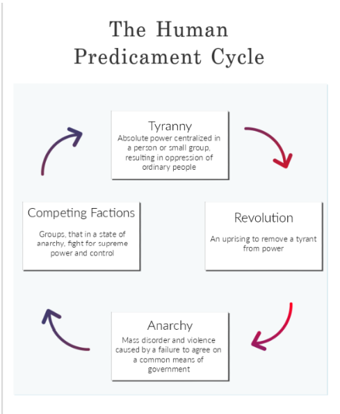

# A HTG 100 Notes Fall 2021, Prof. Jeremy C. Pope
# <u>Act I: The Ingredients of a Founding</u>
## 8/30 - Why Study a Founding?
We are studying the founding of The United States of America as a case study of how a revolution / founding could go. There are both strengths and weaknesses to the way it happened in America and we’ll go over them. The context may be American, but the deeper subject is universal.
How do we get to a good society? A just society?

Central Course Questions:
- How can we foster a society that resolves conflicting interests and fosters beneficial cooperation while maintaining both order *and* liberty?
  - How should we design a government for this society ? Should it be powerful or weak? Centralized or decentralized?
  - When and where does a market — something very decentralized — serve our needs? When does it not serve those needs?
  - How have the different types of power — centralized and decentralized — turned out in society?

## 9/1 - The Hope of a Good Society

### The Magna Carta
Also referred to as the Great Charter, a constitutional document aiming to limit the power of King John (kings in general) in 1215. Had very little practical significance at the time, but it carried symbolic significance throughout the centuries.

### The Human Predicament
#### Definitions
* **Tyranny** is the organized expression of the will of an individual or small group. It will generate fear of the state or the dictator or dictators.
  * E.g. the Taliban & treatment of women.
* **Anarchy** is the chaotic expression of individual or small group will. It will generate fear or disorder. The opposite of Tyranny.
* Governments of all kind require **sovereignty**, the ultimate political power and final say over an issue.
  * This inherently carries with it the risk of *tyranny*. However, in it's absence, the way is made for *anarchy*.
* **Regime**

*Which is better?*

***The human predicament cycle:***
```
Tyranny -> Revolution -> Anarchy -> Competing Groups -> Tyranny
```

> In the unlikely event that the leaders of those groups are virtuous, it might be
possible to escape this predicament and move toward creating a Good Society. Unfortunately,
history suggests that the winning faction will institute a new form of tyranny. - Pope, Jeremy

How do we decide what a good society means? What do we value in a good society?
 * Liberty?
 * Equality?
 * Community?
   * community provides a feeling of mutuality
 * Prosperity?
 * Something else?
 * How much **liberty** should be permitted?
 * **equality** vs **equity**.

### The Constitution of Knowledge
* Checks and balances - no one has unlimited control over ideas.
* Any hypothesis can be "floated" (think witch trials).
* *Public* Knowledge is defined by a community and is *decentralized*.
* Authorities cannot control knowledge.

Constitution of Knowledge Notes:
> … think of the constitution of knowl-edge as a funnel. At the wide end, millions of people float millions of hypotheses every day. Only an infinitesimal fraction of new ideas will be proven true. To find them, we run the hypotheses through a mas-sive, socially distributed error-finding process. Only a tiny few make it to the narrow end of the funnel. There, often years later, a kind of social valve — call it prestige and recognition — admits the surviving propo-sitions into the canon of knowledge. People who successfully bring a proposition into the canon are greeted with publication, professorships, promotions, and prizes. Those who follow the rules without scoring a breakthrough receive honorable mention. Those who flout the rules are simply ignored.

* Checks and Balances = Peer Review and Replication
* Not limited to scholars and scientists
* Also includes journalism, the courts, law enforcement, and the intelligence community
* intelligence community: all evidence-based professions that require competing hypotheses to be tested and justified. It’s members hold each other accountable.
* Separation of Powers = Specialization
* Governing Institutions = Scientific Societies and Professional Bodies
* Voting = Citations and Confirmations
* Civic virtues = Submit your beliefs for checking if you want to be taken seriously
* The members of the community that supports and up-holds the constitution of knowledge do not have to agree on facts; the whole point, indeed, is to manage their disagreements.
* Rules of the Constitution of Knowledge:
	* Any hypothesis can be floated - free speech.
	* A hypothesis can “join reality” only insofar as it persuades people after withstanding vigorous questioning and criticism - social testing
	* Only propositions which are broadly agreed to have withstood testing over time qualify as knowledge.
	* Even that which has been agreed to is only considered knowledge so long as testing consistently verifies it.
* By living with this constant verification, we provide ourselves space to work through disagreement without authoritarian oversight. There have been 3 main results:
1. The epistemic constitution disseminated knowledge at a staggering rate. (SO MUCH KNOWLEDGE ALL THE TIME)
2. By insisting on validating truths through a decentralized, non-coercive process, we have ended the practice of killing ideas by killing their proponents. (ideas are bulletproof).
3. The dethroning intellectual authoritarianism and commits liberal society foundationally to intellectual pluralism and freedom of thought.


What makes a government legitimate??
  * Whatever we choose will need to have institutions (a government and a set of laws and rules) and *public* knowledge that are seen as **legitimate** -- in part because we are unlikely to all agree all of the time.

#### Conclusion
The **Good Society**:
  * The **Good Society** is the alternative to anarchy, competition, and a gradual (or sudden) slide towards tyranny.
  * It's an aspiration
  * How centralized should the government be for that society?
  * Real knowledge requires some degree of liberty to build a kind of Constitution of Knowledge.
> *John Rawls* (1921-2002) *argued that the best way to think about the Good Society and how to get a bit closer to it is to imagine a “veil of ignorance.” Suppose that humans could design a society without knowing anything about who they, in particular, were. For example, they didn’t know their gender, race, social status, or wealth.*

Prompt for **Constitution of Knowledge** assignment:
  * Give an example of how the Constitution of Knowledge works in the real world. You example can come from any media type including print, video, and social media. The response should show how the process of knowledge creation works, though the response need not settle the underlying question at issue in the example.

## 9/3 - (LAB) Introductions, Good Societies, and the Nature of Truth

Examples of the Constitution of Knowledge (a floated hypothesis filtered through a decentralized network of people to be accepted as "truth").
 * Covid originated in the Wuhan lab
   * this was initially pushed back by public opinion
   * Revised claim/futher evidence:
      * News organizations are quietly correcting last year's dismissive reports as more evidence comes up.
 * "Not one court has looked at the evidence and said that Biden legally one. Not one."
   * Verdict: state and federal judges - some appointed by Trump - dismissed more than 50 lawsuits brought by Trump or his allies alleging election fraud and other irregularities.

## 9/8 - Human Nature and Collective Action
### Reading Notes
 * KP Ch. 2
 * Plato's Republic
    * To be just > to be unjust ?
        * Socrates argues to be just is among the highest of goods
        > among those  goods which he who would be happy desires both
for their own sake and for the sake of their results.

    * How do we define justice and injustice?
    * Doing injustice vs suffering injustice
        * wherever anyone thinks they can be unjust without consequence, he will be - Glaucon
        * The greatest injustice is to be deemed just when you are unjust (and visa versa)
        > When both have reached the uttermost extreme, the one of justice and the
other of injustice, let judgment be given which of them is the happier of the two. - Glaucon

     * Censorship of art for youth.

 * Little Speech on Liberty, Winthrop
     * two forms of liberty:
         * natural
         * civil / federal

## Lecture Notes
* Remember: we're designing this for actual human beings, not sainted Relief Society presidents or hardened criminals
### Human Nature and Social Design
* Our design of government (or of any social institution) follows from our beliefs
	* The Greeks thought that human nature is innately good
	* the story of Gyges (with the ring of power) - people are inherently bad
	* Plato argues that government should push virtue of some sort... "the tales which the young first hear should be models of virtuous thoughts".
* Which virtues do we pick? Christian virtues vs greek virtues
	* wisdom, temperance, courage, justice
	* meekness, humility, long suffering, patience
* David Hume
	* Man is self-regarding. That's what matters. Human beings care about themselves.
* Gross Generalizations of Human Nature:
	* **Economists**: individuals are motivated by self-interest
	* **Psychologists**: individuals are motivated by subconcious desires and biases (not fully aware of and may not even be able to explain)
	* **Biologists**: Humans are a product of their genetic endowment
	* **Marxists**: Individuals are controlled by their class or environment
	* **Optimists** & **Pessimists**
	* **Self Interest** vs **Virtue**
		* people are a complex amalgam of both interests and virtue - remember the cake on the train story
* Just saying that things are complex is useless so let's do better.

### Collective Action
* Definition: Can the two farmers work together?
	* unless the farmers can be **trusted** to collectively act to generate a collective benefit, it is more in their self interest to not work.

* Is there any solution?
	* In some sense, the rest of the class isabout solutions for cooperation, but here are some **key** ones in politics.
		* Selective incentives
		* rip i didn't get the rest of them and he switched the slide

### Centralized vs Decentralized
* John Winthrop
	* Human beings have such a dark side that we can only give them civil liberty (not natural liberty).
* What mechanism controls society?
	* self-control through public virtue
	* coercion by government to control self-interest
	* structures or institutions that use self-interest or virtue for the common good
* What do you now believe is the best and most useful basis for designing institutions like government and public policy?

## 9/10 - (LAB) Human Beings in Collective Action

## 9/13 - The First Colonial Communities
### Jamestown
* founded in 1607
* The prototypical "corporate community"
* Captain John Smith
	* reaaally liked himself
	* was a hero of the colonies
	* the marriage of sugmacock's daughter with an englishman kept peave for a while (until 1622 whose war lasted a decade).
* Choices by the Powhatan
	* raid or trade?
		* initially more trading than raiding, but there's always tension
* Native tribes needed thousands more acres than European Immigrants did.
	* this is because of agricultural developments and differences in how they viewed the world (the *nature* of the world if you will).

### Infant industries
* Glassblowing - really dumb idea
* Tobacco - Makes the colonies RICH because the natives love it and they don't have to ship it across the ocean.
	* starts generating revenue for people back in london
	* "Corporate Model" for a society
* Idea that society can be governed by a social contract in contrast to a "state of nature" thought experiment
	* birthed the Mayflower Compact
	* create an elected authority
	* What really moves people are ideas that they take *into* their souls. Says in the mayflower compact AND in Alma. I don't remember the exact chapter.
* God's Elect
	* John Calvin preached a morality of hard work and constant moralism
	* Predestination
	* Calvinists
		* can't be sure that God has "predestined" you.
		* focus on money and success as a sign that you've been chosen
* Moral Self-Governance
	* the puritans looked for every family to govern themselves -- and watch their neighbors.
* The irony of Jamestown - House of Burgesses (1619)
	* Birthplace of American democracy
	* Birthplace of American slavery
	* may not have been completely representative and just, but it was more democratic than any other place on the planet at the time.
* Decentralized: "Open Lands"
	* The fact that there was a lot of open space served as a constraint
* Models of Authority and **Centralization** in the "New" World
	* Centralized from London: corporate governance
	* Decentralized from London (but locally centralized): social compacts
	* Local Democracy - House of Burgesses & New England town meetings
	* Slaveholding - as locally centralized, and dehumanizing, as things could get
* First attempts at European community
	* The first colonial communities are experiments in what and how much to centralize
	* Though they are *very* .. and he switched the slide yay


## 9/14 - Mr. Smith Goes to Washington (FILM)

## 9/15 - Mr. Smith Goes to Washington (FILM) & English Principles and Revolutions
* John Locke's 2nd something

* Rule of Law

* King James
	* he did the bible (well his scholar ppl did)
	* came to the throne after the death of queen elizabeth the first
	* was king of scottland
	* doesn't like parliament
	* The law said that he could request a ship in times of need.
		* But really he could do it whenever he wanted
	* He used "ship money" - when ppl couldn't provide ships, he said they could do money instead
		* used it to evade parliament
		* they didn't like it so they killed him
		* "KING IS SUBJECT TO PARLIAMENT"
	* parliament rule lasts a while, but ultimately craps itself
	* 1649 - behead charles *
	* 1653 - 1659 - oliver cromwell rules the commonwealth
	* 1660 - charles II, charles I's son.
		* continues contest
	* 1685 James II--a catholic-- succeeds his uncle charles II
		* ppl don't like catholics
		* so parliament said if you wanna hold office in parliament you gotta publicly dissavow catholicism ("Test Act ")
	* the whigs organize a revolution - the glorious revolution of 1688
		* King William and Queen Mary promise to rule subject to the consent of the parliament
	* **John Locke** helps them provide intellectual grounds for the revolution in his essay: **The Second Treatise**.
		* famous work on social contract theory
		* personal sovereignty
		* rejected divine rights of king

### Locke's Argument
1. In a "state of nature" everyone lived in a state of freedom and equality.
2. Humans invented government to secure their rights in this state.
3. Government's *only* purpose is to protect the rights of the citizens.
4. The consent of the government is required for the legitimacy of the government.
5. Any government that does not protect the rights of the citizenry should be abolished.


## 9/17 - (LAB) Communities and Revolution

## 9/20 - The Rule of Law

## 9/22 - Incentives and Virtue
The Boston Massacre:
* The people or the mob?
	* We can't let the mob have justice by virtue of it being a mod
	* But at the same time, the rule of law comes from the consent of the people
	* How to tell the difference between reasonable people or a mob?
* The rule of law gives us *predictability*
	* It implies that the individual has some autonomy and freedom.
		* This is only true if we keep the government limited enough that it cannot violate people's rights.
### Key threats to the rule of law:
1. Politicians
	* the rule of law must be preserved no matter which side you're on (no matter what your agenda is).
2. Constituents (i.e. ***us***)
 	* people will break the rule of law if their constituents demand it

The trouble with creating the rule of law is creating a legislature that accurately represents the people at large.

### Perpetual Motion Machine
Cannot exist, but we can get pretty close.

What kind of legislators do we want to populate our legislature?
* Ones who are self-interested?
* Ones who are virtuous?
* Do we really like someone who refuses to yield out of principle?
	* We might like commitment to his own principles, we might sympathize with it, but do we really want him to represent *us*?
* Representatives vs Incentives
	* Incentive: Something that motivates or encourages somebody to do something.
	* Think groundhog day: How would incentives change living as a representative? No consequences?
* A man who doesn't care about what others thing also doesn't respond to outside incentive.

### Richard Rich
At the time, you had to be accepting of some amount of corruption (bribes).

> A man should go where he can't be tempted.

## 9/24 - (LAB) Rule of Law and Electoral Incentives
### Rule of Law Principles:
1. Generality
	* The laws must be general. They must apply to broad categories of people, not to specific individuals or groups. We should never know in advance who will be helped or hurt by a law.
	* More about how the law is *written* (vs **Due Process**).
2. Prospectivity
	* The law should apply prospectively - to action in the future not action in the past.
3. Publicity
	* The laws should be publicly known and certain. People should know what the law is and know that it will be enforced. There should be a fairly standard punishment for violation.
4. Due Process
	* The legal process must be applied impartially. Justice must not be prejudiced for or against anyone.
	* More about how the law is *enforced* (vs **Generality**).
	* Most common example is the lack of a fair trial.
5. Consent
	* The laws must be generally acceptable to those who must live by them.
	* Balance between mob rule and consent defined in government.

For the assignment, you may just want to focus on one principle - how it's threatened or supported. DO A FEW WEEKS AGO WHEN YOU GOT A PARKING TICKET.

### Electoral Incentives


## 9/27 - The Ingredients of the Founding
We're gonna get some perspective in this class apparently.

### A Most Justified Revolution: St. Domingue - called Haiti, today
* Society built on slavery.
	* Most slaves lasted fewer than 5 years.
	* Since overturn was so high, they didn't accomplish goals through relationship building, but through fear and torture.
	* Forced slaves to be baptized roman-catholic
	* Slaves could only marry with the master's permission (though they had to consent as well, at least in the law)
	* Children of slave marriages became slaves of the master (the master of the woman).
	* Slaves could engage in essentially no economic activity without their master's permission, though market trading and local exchange were common - in part to keep slaves from **rebelling**.
		* Allowed slaves sometimes to have side hustles so they wouldn't revolt.
* The Hatian Revolution 1790s
	* Toussaint Louverture
		* He was truly a great revolutionary.
		* Leads the Hatian revolution.
		* Born a slave on a plantation
		* Rises through ranks, buys freedom in 1770
		* Owns 3 plantations
		* Realizes there's an opportunity for revolution and to build something.
	* Insistent that slavery must end.
	* Once he's revolted, ***what kind of society would he build?***
		* Economically Restricted
		* Authoritarian (with him at the center)
	* Constitution written by Toussaint
		* No slavery
		* Toussaint would be sole ruler for life.
	* Toussaint forces people back onto plantations (not as slaves but just in bad working conditions).
	* Napoleon lead an assault against Toussaint.
	* Jean Jacques Dessalines, Louverture's successor
		* Was ruthless on a scale not dreamt of before that.
		* Dictator.
		* Killed thousands of whites.
		* Didn't allow whites to own property.
		* He killed anyone who threatened his power.
	* There are *no institutions* created in or as a result of the Hatian revolution.
	* **Final Note**
		* American slaves may have lived longer and been treated better, but it was not **morally** better.
* Revolutions are shaped by what comes *after* the initial battles.
* People need a commitment to the Good Society in order to create it.
* The Rule of Law is necessary for a good society.
* America had experience with self-government. The Hatians did not.
	* Self-government was so successful in the American colonies because there's so much distance between them and Britain.
* People in the good society must be capable of governing themselves - with sufficient degrees of virtue.
* You will also need legislature that is **incentivized**. Okay wait there's a whole list thing

### INGREDIENTS OF THE FOUNDING OF A GOOD SOCIETY:
* A commitment to creating a good society
* The rule of law
* Distance from the center of power in order to have self-government
* A virtuous citizenry
* An incentivized legislature

## 9/29 - The Economic Roots of the Founding
### John Hancock
From American Perspective:
* Merchant, statesman, patriot

From British Perspective:
* Smuggler, rebel, rraitor

He's like the Han Solo of the Revolution.

### Markets
How do markets fit into the *Good Society*? We like markets but they do a lot of good stuff for us, but they might not perfectly fit our Good Society model thing.

One of the primary sources of conflict between England and the colonies is economic interests and freedom. The English government was like bruh this is why we even sent you over here.

Colonists saw themselves as land-rich but labor-poor.

### Mercantilism
Based largely on the idea that the thing that mattered and made the most difference was how much gold and silver (currency) was passing through the hands of the government. So the British goal was to increase the gold and silver reserves of the empire.

They restrict imports, especially manufactured goods from other European countries with tariffs and keep technology secret. (discouraging imports)

Encouraging exports with subsidies.

The colonies will supposed to provide raw materials and some consumption goods to Britain, but not allowed to do so to other countries. The colonists wanted to sell the goods to the highest bidder.

### Two Forms of Economic
#### Decentralized: Free Exchange
* Capitalism
* Market Economy

#### Centralized: Command, Planned, or Regulated
* Socialism (classic definition)
* Communism
* Mercantilism

## 10/1 - (LAB) Economics & Revolutions
* Ingredient of the founding
	* A commitment to creating a god society
	* The rule of law
	* A history of self-governance
	* Distance from the center of power
	* Virtuous people
	* A legislature that is incentivized to respond to the people

### Economic Exchanges
* Should exchanges favor the wealthy or the deeply committed?
* What if instead of donuts, it was medication which only a few people needed.
* Should someone be able to substitute their judgement of a transaction for the judgement of the parties involved?
	* When should they be able to do this?
	* What characteristic qualifies them for this?
#### Key takeaway:
* Exchanges have to be free and have to make both parties feel better off, but if they do fit those criteria they produce significant value - nothing was created, it was just moved around.

# <u>Act II: Designing Our Institutions</u>
## 10/4 - Markets and Incentives

## 10/6 - Markets or Governments?
More like Markets ***and*** governments! Both are necessary for a good society

### Gains from trade
* We are making way more money now than we did before - even adjusting for inflation.
* Think of how big a computer used to be.

### The Law of Comparative Advantage
* Producers (people, groups, countries, etc.) specialize in the production of goods where they have the lowest **opportunity cost**.
	* Notice they don't specialize *necessarily* in the things they're best at
	* Results in the widest possible gains from trade
	* Full employment (of all resources)
	* Interdependence

### Matthew Ridley
* We're gonna get these gains because our ideas are ***smashing*** (i.e. having sex).

### What mechanism controls society?
1. Self-control through public virtue
2. Coercion by government to control self-interest
3. Structure to use self-interest for the common good
	* THIS is what markets and prices do
	* Prices regulate behavior *for the common good*.

### Government & Exchange
#### The crucial role of government
* Prevent coercion and fraud
* Provide money (debatable)
	* There are ways to have money & resources that are decentralized (like bitcoin).
* Provide infrastructure (debatable)
	* The debatable part is what counts as infrastructure and how far it should go.
* Define property rights
* Enforce exchange agreements
* <div style='color:red'>Stop "bad" exchanges (?)</div>
	<ul><li>but who's to say what is "bad"?</ul>
* <div style='color:red'>Does the government "fix" problems?</div>
	<ul>
		<li>They certainly try, but they mostly suck at it
		<li>e.g. carbon credits
		<li>e.g. the "cobra effect"
	</ul>

###### It is *very* difficult (maybe even impossible) to have a well functioning market without a functioning government.
* When governments don't do these things well, we have some huge problems. Case study: **Venezuela** inflation.
###### Any government powerful enough to *ensure* a well functioning market is powerful enough to control, destroy, and ruin it.

#### Motives for Restricting; These are common ideas, but up for debate
* Paterminalism
	* people thing the exchange makes them better off, but the government believes it does not or belives that the government can better regualte exchanges.
* Simply because the exchange seems unfair.
* A third party is hurt by the exchange.
* <div style='color: darkblue'>The motive to redistribute income toward a politically favored group.</div>
	<ul>
		<li>Case study: 20% tariff on canadian lumber
		<ul>
			<li>Helps america lumber industry, but hurts American consumers.
			<li>Higher prices for new homes, furniture, other types of construction.
			<li>Fewer jobs in carpentry and construction
		</ul>
		<li>Case study: The National Raisin Reserve
	</ul>

#### The Cobra Effect
When an attempted government intervention actually makes the problem worse
* An unintended consequence
* People respond to incentives, but not always in the ways the government will think
* E.g. carbon credits
* E.g. The Americans with Disabilities Act (1990)
	* requires accomidations for the disables (like ramps for wheelchairs and things like that)
	* The employment of disabled people actually dropped substaintially in the wake of this act because companies could prevent law suits and costs of ramps and things if they just don't hire disabled people.
* ***PRIME*** example: The got-damn Stamp Act
###### Redistribution is different than regulation.

## 10/8 - (LAB) Economics of the Good Society

## 10/11 - Declaring Independence
### Samuel Adams
> Our trade has for a long time labord under great discouragements; & it is with the deepest concern that we see such further difficultys coming upon it which will reduce it to its low ebb, if not totally obstruct and ruin it. - 1764 instructions to colonial agent in London

* Samuel Adams takes the American Revolution (complaints, gatherings, talkings, and thinking) and turns it into a **real revolution**.

### Independence
* The colonists had come to believe that the answer to the central course questions did not lay in Parliament or the Crown, at least as tghey existed in the early 1770s.
* They wanted to take steps to **decentralize** the government slightly more than it was.

### What led to the revolution?
* Washington is the general and he's totally depressed about the condition of his troops when he first gets there.
* Economics
	* The interests of the colonists conflicted with the interests of the British - taxes, trade restrictions and land policy.
* Leadership: **political entrepreneurs**
	* An educated elite molded public opinion for independence - Franklin, The Adams cousins, etc...
	* The American Revolution was one ***huge*** collective action problem.
* Local Political Power: **selective incentives**
	* If you wanted status and noteriety, you can go join the revolutionary meetings and things like that.
* Educated Masses
	* It was not *just* the leading lights of the community: tradesmen like Revere became caught up in the movement
	* It wasn't just the leaders.
	* *Common Sense*, Thomas Paine
		* Pamphleteering was crucial for shaping public opinion.
		* John adams:
			* > The Revolution was effected before the war commenced. The Revolution was in the minds and hearts of the people.
* Habits: **believe system**
	* The colonists were accustomed to colonial government with some power in the colonial legislature.
	* The British had kind of ignored the colonists and they had to kind of govern themselves *anyways*.

### Battle of Lexington
* British troops quartered in Boston decided to try and seize the gunpowder and all that which they thought was stored up by the Americans in Lexington.
* The first battle of the American Revolution.
* Americans were not ready to stand up to the British army in a straight up fight.
* But at the same time, the redcoats were not quite prepared for a full-blown rebellion.

##### The colonists were not completely united
* About 25-30% of colonists were loyal to Britain and the King. They were called **Tories**.
* Ben Franklin's son was one of them. It pretty much killed their relationship.

##### The Declaration was Controversial
* The colonists debated long and hard before agreeing to take this momentous step. They did not do it lightly.
* Declaring independence (& essentially war) would destroy all hope of peace and reconciliation.
* Independence was a military necessity. America could not win without foreign assistance, which they could not receive without first delcaring an independent state.

### John Adams and the Atlas of Independence
* This was John Adams' greatest service to his country
* While Jefferson wrote it, it was Adams who caused it to be written.

#### Pauline Maier on the Declaration
At first people disregarded it. It was designed first and foremost for domestic consumption. And to the colonists, it was the **end** of the declaration that was the important part.
* This is the part where they say they are an independent state and as such can do independent state things.

### The Declaration of Independence
1. All individuals are created equal
2. All are endowed by their Creator with unalienable rights
3. Government, with power from the people, should secure those rights.
4. If government fails to do this, it should be removed

## 10/12 - A More Perfect Union (FILM)

## 10/13 - Drafting Constitutions

### Lucius Quinctius Cincinnatus
* Moral behind the movie Gladiator
* He wanted to be a farmer, but everybody knew he was the man, so they made him dictator in times of hardship and war.
* Considered one of the great roman statesman and generals

### George Washington
* Consciously emulated Cincinnatus
	* they (his soldiers and stuff) actually founded an order called the order of Cincinnatus
* Passes a great test that few ever do.
* We're lucky we have a government at all, and Washington is a big part of how it came about.
* Washington is a **symbol** of a whole host of things.
* Just as Cincinnatus passed his test, Washington passed *his* test.
* He was the leader of an army that was being mistreated, but he didn't let the government get taken over by said army.
	* People were going to have the army march on the government in Philadelphia (tried to go over Washington's head because they knew he wouldn't go along with it).
* Washington's virtue
	* Self-interest is important as a motivating force
	* The founding would have been impossible without Washington's virtue and the virtue he inspired in others
* Washington really liked theatrical gestures
	* Washington put on plays all the time even when congress outlawed it.
	* > I have not only grown gray but almost blind in the service of my country
* The aforementioned test was:
	* He turned down the **kingdom**.
	* The very **existence** of the United States government is owed to George Washington
	* In 1783, he tendered his resignation


### *How do we divide power within a government and across different levels of government*?
* They didn't capitalize *united* when they talk about the "united States" in the constitution.
	* Washington capitalized "United" in "United States" in his "First" Farewell Address

### The Articles of Confederation
* A defensive alliance of sorts between states
* The government they created to get them through the war.
* They didn't agree on a whole lot
* The government was very ineffective during the war and even (maybe even especially) after.
* So much of Washington's time in the army was spent asking the congress for basic supplies.
	* The central government was *weak*
	* Hamilton and Washington were like bruh this aint gonna work very well
* The problem was that each state maintained complete sovereignty. So it was a very *loosely* united states
* Our central course question was ***their*** question as well, and the AoC were not answering it well.
* The constitutions that they wrote all placed power in the legislatures.
* This is where **James Madison** comes in
	* He gets them to revise the articles of confederation
* Other good people (i think they signed it the constitution):
	* William Patterson
	* James Wilson
	* Roger Sherman
	* Gouverneur Morris
		* Ya boi drafted the constitution
	* George Madison
	* John Rutledge
	* Benjamin Franklin
	* George Washington

### James Madison
> The Father of the Constitution

First idealized a government that placed the power in the people as whole instead of individual states.

This is the guy that they named Madison Square after.

#### Common Assumptions at the close of the Revolution

* There is a high-level of self-government among the people.
* The society will rely on free exchange with little government interfer3ence
* The executive branch should be weak to nonexistent
* Small states are better than large states and most power and sovereignty should be retained by the states.

Madison thought: "Vices of the Political System of the United States"
* You can't trust the states
* The people in charge of them aren't *great*.
* Madison thinks there are problems in:
	* representative bodies [corruption, dupes, etc...]
	* people themselves [factions like the rich against the poor or even poor against rich]
	* Any individual faction is able to get control of the government.

#### The Structure of the Articles of Confederation
* Each state retained sovereignty
* There was no single chief executive
* Each state legislature appointed between two and seven delegates (which they sometimes called ambassadors)
* Each state had an equal vote - with the assent of nine states required for most actions.
* THERE ARE 2 MORE, TAKE NOTES

> Getting rid of the Articles of Confederation and moving to a national government was one of the biggest expansions in United States history.


### Failing Institutions
* Examples:
	* Inflation of the USD
	* Shay's rebellion
		* Fighting with the state government
		* Virtue in the government was not saving them as a country

## 10/15 - (LAB) Debating Constitutions
Many different ideas about equality get quietly embedded in the Declaration of independence
* Equality of Opportunity
* Equality Before the law
* Equality of Rights

## 10/18 - Fights at the Federal Convention of 1787

## 10/20 - The Constitution's Incentives

## 10/22 - (LAB) Debating Constitutions Continued

## 10/25 - From Ratification to Rights
### Notes from the Lecture
* People were scared of having so much power in one centralized government, so they made the **bill of rights**.
* The constitution lacked a bill of rights.
* The anti-federalists insisted on a bill of rights.
* All the states that were closely divided on the constitution passed amendments to the bill of rights.
* Debates we have now are more about concepts which are difficult to legislate into narrowly drafted ideas.
* Somewhere between the declaration and the preamble, we became **U**nited states, instead of **u**nited states.

### Sam Adams
* Crucial in keeping the debate on whether or not the constitution is good alive.
* Federalists didn't like the constitution.
* There was a lot of debate about the constitution.

### Voting
* Lots of the states are very close (Massachusetts, Virginia, New York, etc...)
* At the same time, the qualifications for **who** could vote was not completely representative of the population (had to be male, over 21, white in some states).
> In the new code of laws, ... [abigail adam's statement on women's rights to vote]

> [John Adam's response]

* Laws that existed at the time were under *coverture*
	* That is, upon marriage, a woman's rights were subsumed and taken over by her husband.
	* However, in some cases, such as with widows who inherited their husband's political/public responsibilities, this did not affect participation of women in laws.
* Though it has vices, it was probably the *most* democratic system on the planet at the time
### Consent: **original** and **periodic**
* Options for "Consent": Send the constitution to:
	* the Articles of Confederation Congress
	* the state legislatures
	* the people directly
	* <mark>state ratifying conventions - elected by the people</mark>
* The highlighted one is what they actually did.
	* Some advantages:
		* The state legislatures (or the Congress) had no opportunity to amend the document.
		* State legislators had no chance to delay
		* Angry legislators had no chance to challenge the legality of the document.
	*

## 10/27 - Founding Parties and Interpreting the Constitution


## 10/29 - (LAB) Parties, Rights, & the Threats to Both
* 2 types of Representation
	1. PR System
		* Proportional Representation
		* Parliamentary system
		* Coalition Blackmail
			* When a small party forces the rest of the coalition to give in to their demands
	2. Single Member Plurality
		* Winner takes all
		* More conducive to a 2 party system


# <u>Act III: The Historical Legacy of the Founding</u>
## 11/1 - The American Founding in Comparison
What metric do we use to assess the American founding, and to what do we compare it to?

What standard do we use to judge their efforts?
* Compared to "now"?
	* the founding fathers suffer
	* to be fair, so would we if they were looking at our time period
* Compared to "what came beforehand"?
	* the founding fathers probably look the best in this light
* Compared to "what else was going on in the world"?


### The French Revolution
Two (Parts to the) French Revolution(s).
1. The Good One
2. The Bad One

Why was their revolt justified? **The Good Part**:
* The Enlightenment
	* Don't be told what to think, think it out for yourself
* Marie Antonette
	* She was crazy but she was just living as she was expected to.
* They were in some pretty bad financial debt (largely actually because of their support of the American Revolution).
* Do we vote by **order** or by **head**?
	* Order: only 3 votes - clergy, nobility, commoners (the 3 estates)
		* What would happened is the clergy and the nobility would always agree and outvote the commoners
	* So the commoners were like bruh we make up 95% of this population, let's count *heads* instead.
		* The kings like nah
		* so they go to a tennis court and take an oath to stick together and remake France. This is the **tennis court oath**.
			* They create the "Declaration of the Rights of Man".

The **BAD PART**:
* So they had their political movement and it's slogan ended with "or death"...
* Maximilien de Robespierre really liked and believed in the revolution.
	* The road to virtue led not through persuasion, but through terror.
	* They remade the world, changing religion, measurement, and a bunch of other stuff
		* A lot of catholic related stuff was outlawed, they had a lady come out of a hole and make a new religion for the state
		* calendar became 10 days for a week
* The Reign of Terror
	* They started executing lots of people
		* At first, just criminals
		* Then, it was just anybody who was a problem or even suspected of being anti-revolutionary
	* 16,954 "official" sentences
		* But in reality there were so so many more
		* At one point it was 800+ people per day.
	* Robespierre's revolution got super out of control, so he gets executed.
		* He first gets shot in the jaw, then guillotined.
	* Prime example of the human predicament cycle
		* Tyranny with the king, anarchy with robe boy, and then goes back to tyranny, except now we have napoleon at the head

* Why the difference in American Revolution and French Revolution?
	* There's a bunch of reasons in the slides, but I think it's because the French bit off more than they could chew.
	* The Americans all committed to the institutions (though flawed as they may be).
	* The French did **not** do very well committing to the institutions.
		* The French had like 7 constitutions, turned out to be more of a periodical

> Injunctions to virtue can be very fragile when not supported by good institutions.

## 11/3 - Frontier Politics to Abolition

### Frederick Douglass
* Was a slave
* Was also a literal stud. like seriously a legend
* Key figure in the abolitionist movement.
* Made a point of being photographed.
	* constantly thought about his image

### The West and Jackson
* America was mainly an eastern seaboard place, but it quickly started moving west.
* Rather than colonies, we would have states equal with the original colonies.
* Very systematic survey of the land that takes decades to complete that divides the land down to the mile. They then sale it.
* Geographic mobility led to economic mobility.
* Turner's thesis - the west may have served as a "safety valve"
* A common **democracy**.
* Country could grow because of the cheap land and expensive labor.

#### The Northwest Ordinance
* About what they though of as the north west (what is now the midwest)

### The Age of Jackson
* Becomes president 1829-1837, 7th president
* Led a new kind of politics
* Emotional sympathy with his politics - cared about people.
* He drew on people as president.
* Quite an ambiguous character.
* Command and follow kind of thing
	* Authoritarian in his leadership style
	* Also symbol of growth in American democracy
	* More Americans decided to participate in American democracy than ever before *because* of him.
	* He does both good and bad things
* <u>Good Things:</u>
	* Broadens the electorate
		* So much more democratic
		* Advancement along the lines of class
	* Democracy should be more inclusive
* <u>Bad Things:</u>
	* Racial / Ethnic discrimination
	* Takes land from the natives
	* "Trail of Tears"
		* Pushes natives off of land - even that which was *agreed* upon.
* Partner: Martin Van Buren
	* The real intellectual driving force
	* Wants a new party system.

### Slavery
* The founders pretty much just believed that slavery would go away at some point.
* Slaves were a profitable investment
* The system is evil not because people are mean, but because it reduces human beings to being a commodity.
* Slave owners (in the south) got about 1/3 of their income.
* Slaves were treated (relatively) well because they were protecting their *investment*.
* Northerners were not as dependent on slavery. They believed slavery dehumanized both white and black people.
	* turned white people into brutes
* Uncle Tom's Cabin


### Failure of the Founding Institutions
* Federalism left sovereignty unresolved
* Separation of powers and checks and balances created gridlock.
* Politics offered no real way to compromise.
* Neither institutional design, nor public virtue avoided the catastrophe. So they just debated and debated...
	* e.g. Lincoln-Douglass debate


## 11/5 - (LAB) Theories of American Progress
### Animal Farm
Pope says the biggest problem is a lack of institutional design.

## 11/8 - Saving the Union

## 11/9 - Glory (FILM)

## 11/9 - Glory (FILM) & Growth of Government, Part I - Change and Market Weaknesses
