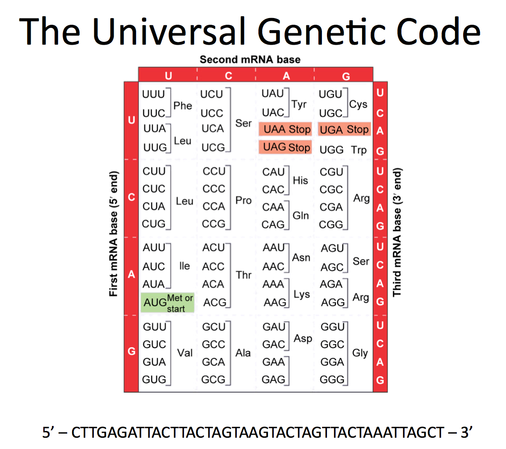
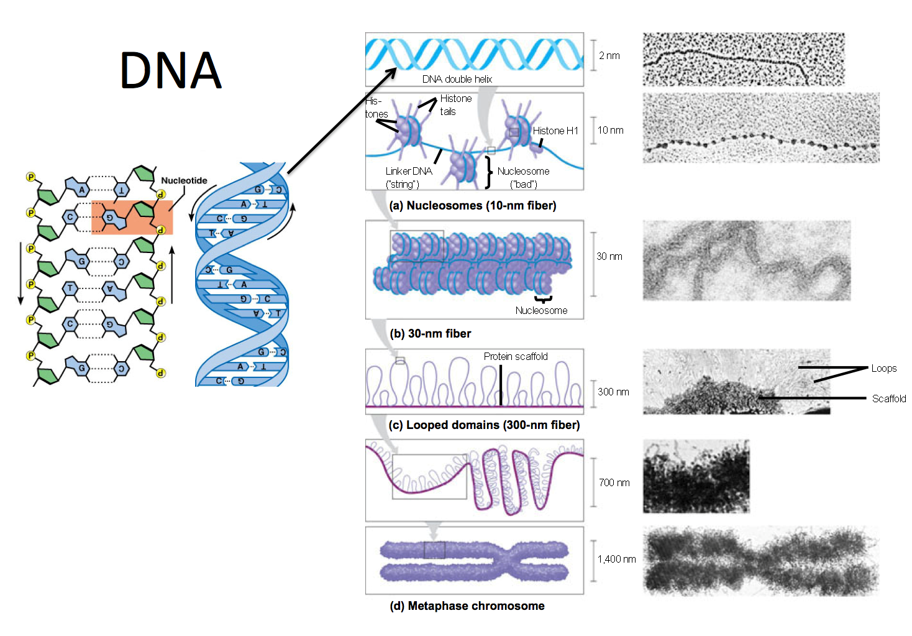
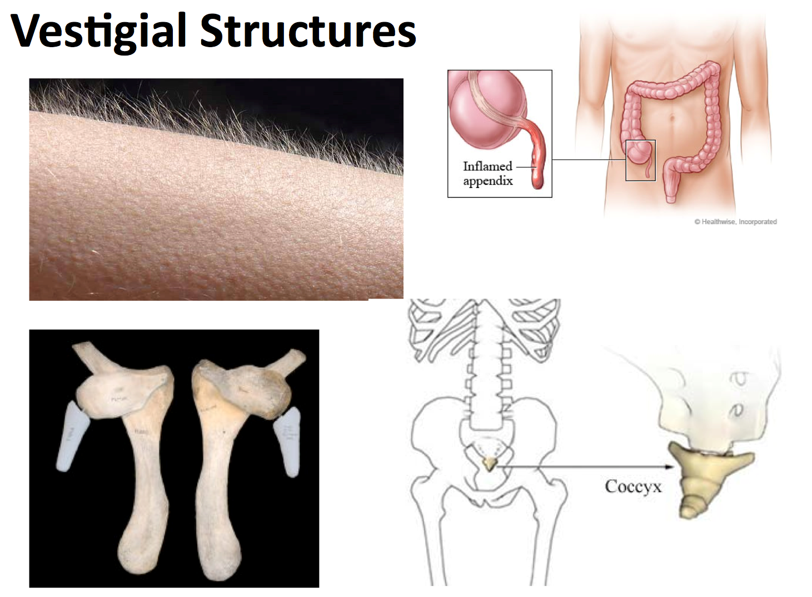
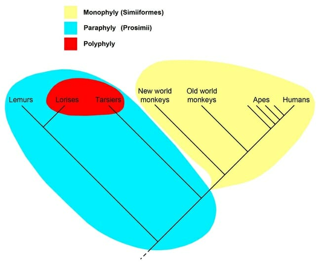
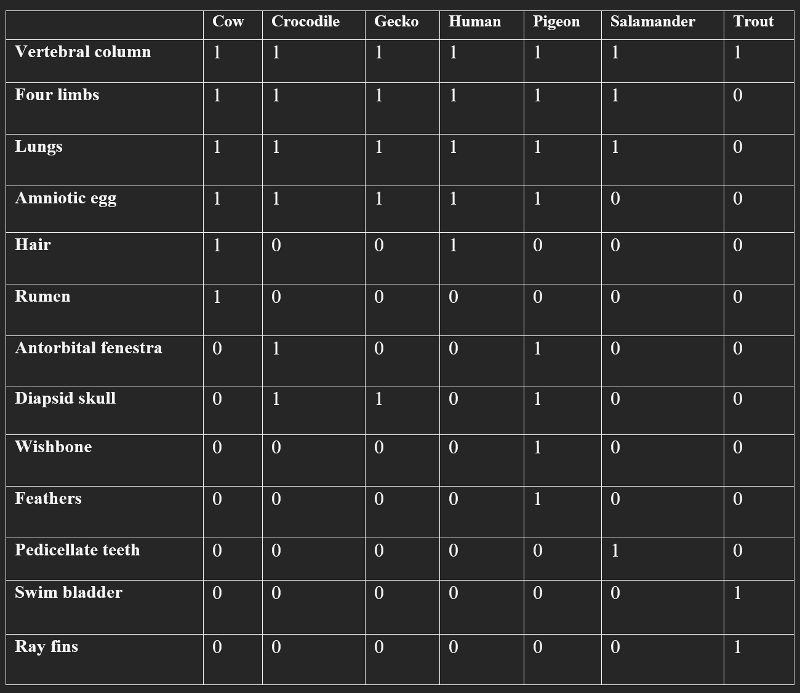
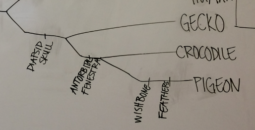
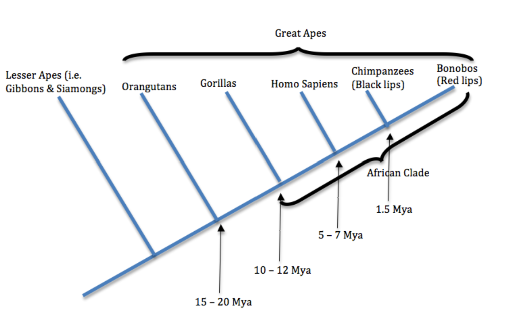
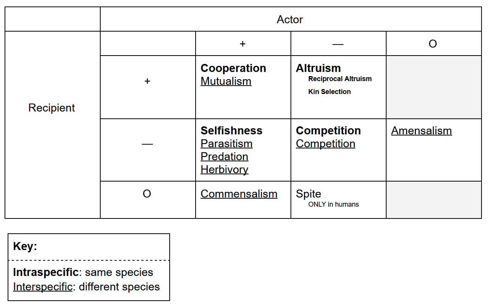

# Exam 2 Review

# Day 6
## Determine, from data, whether a given feature is a homology or an analogy (convergent evolution).

Homology: Similarity due to common ancestry

Analogy / convergent evolution: Similarity due to an environment / environmental pressures.

## Explain the principle behind the Law of Superposition.

The Law of Superposition states that
> within a sequence of layers of sedimentary rock, the oldest layer is at the base and that the layers are progressively younger with ascending order in the sequence.

This is because newer materials and sediment and things like that stack up on the surface to form new deposits / layers over time.

## Use evidence (fossils, morphology/anatomy, embryology) to support the theory of evolution.

**Fossils** can be used with the law of superposition to show the evolution of creatures (namely humans) over time.

**Morphology** and **anatomy** can be used also in conjunction with fossils and the law of superposition. Morphology is:
> The branch of biology that deals with the form of living organisms, and with relationships between their structures.

Which really just means let's look at different fossils and see how they're different.

## Describe the basic structure of a chromosome, including centromeres and telomeres.

Jurassic Park tells us that DNA is made up of:
* A's
* T's
* C's
* G's

> DNA is carefully packed into tight chromosomes to keep it from breaking apart when cells divide.

See the following diagram:

The DNA is wrapped around little protein balls called **nucleosomes** and then they are tightly coiled to form chromosomes.

The chromosome is made up of two parts:
* **Centromere**:
	* this is the pinching point in the center.
* **Telomeres**
	* These are "junk" DNA on the tips of the chromosome that are intended to protect the DNA from potential damage. So they get rekt instead of the important DNA.
	* 'Telo' means 'the end'

* **Karyotype**
	* 'karyo' means nucleus
	* 'type' means picture or image
	* A karyotype is quite literally a picture of the nucleus
* **the nucleus**
> 23 pairs of chromosomes that we have in each of our cells.

Here's a human Karyotype and an accompanying description:

> The dark and light banding patterns are due to the stains used to visualize the DNA.  Depending on the composition of the DNA (how many A's, T's, C's, or G's) and how tightly it is wound determines whether it soaks up a lot of dye and is dark, or a little dye and is light.  You can see that chromosome pairs (these carry the same genes in the same order) match in banding patterns.

## Compare and contrast chromosomal features to reconstruct evolutionary history.

## Explain the significance of vestiges and atavisms in support of the theory of evolution.
**Vestigial structures**
* Left over from evolution - no function
* left-overs from our evolutionary past.
* They no longer function, but they have not been lost
* no longer have a use

examples:

**Atavism**
* Throw back - not everyone has them
* An evolutionary relic which actually shows up when it normally doesn't.
* e.g. a third nipple, post-anal tail

## Identify a trait as a vestige based on an evolutionary history.

Just use the last section to determine what is a vestige.

## Clearly state the position of the Church of Jesus Christ of Latter-day Saints on evolution.

Science defines the ***how?*** while religion gives us the ***who?*** and the ***why?***

Religion and science not adding up is always a result of a lack of understanding in one of those areas.

# Day 7
## Build a graphical depiction of relatedness.

This is when we made the trees showing the relationships and evolution stuffs.

## Distinguish between a monophyletic and paraphyletic grouping.

**Monophyletic**
* describe a group of organisms that share a most common recent ancestor.

**Paraphyletic**
* Same as monophyletic but doesn't include all descendants of that ancestor.

Here's a helpful diagram:

## Read and interpret a phylogenetic tree.

That's just like a family tree. It's the thing we did in class. It's also the diagram in the section above.

A **phylogenetic tree** is a diagram that depicts the lines of evolutionary descent of different species, organisms, or genes from a common ancestor.

We have a few terms we need to know for these types of trees:

| Term | Definition |
|------|------------|
| Node | Common ancestral population |
| Common Ancestor | Population from which 2 species evolved |
| Branch | Changes over time |
| "checkpoints" | Traits / characters  that evolved (somewhere along the branch it evolved, not necessarily at a node) |

## Use data to build a phylogenetic tree using principles of parsimony.

Parsimony just means we assume the simplest thing. This means that, while there may be discrepancies in the order that species developed certain traits, it literally doesn't matter.

## Construct a character matrix.

This is a table that lists traits and species and tells you which species have which traits. Here's picture of one:

In this one, a 1 denotes that they have the tree, and a 0 denotes that they do not.

## Use a character matrix to determine relationships and construct a phylogenetic tree.

Yeah so start with the traits that everybody has and slowly divide the tree by each animal's traits. Just group the animals together and eventually you end up with each individual animal.

## Manipulate a model (rotate nodes) to construct alternative forms of a given tree.

You can do this when there's two trait developments in a row that occur for the same species. In this case, the order that the traits occur doesn't matter and so you can switch them around without it changing the tree.

## Determine closest relatives using a tree.

Those who have a *more recent* common ancestor are more closely related. e.g. a pigeon is more closely related to a crocodile in the following phylogenetic tree:

a **common ancestor** is a population of a species from which 2 species evolved.

## Determine the history of a trait (homology v. convergent evolution) given a tree.

The definitions for homology and convergent evolution can be found in Day 6's notes. The history of a trait can be determined as homology or convergent evolution.
* If two species branch off from one another at some point in the tree but end up with the same traits independently, then the trait is a **homology**.
* If they get the trait off the same line, then it was likely **convergent evolution**.

## Explain that all organisms have been evolving for the same amount of time, such that one species is not ‘more advanced’ or ‘more evolved’ than another and one species does not ‘evolve into’ another.

We define the extent to which an animal is *evolved* as the amount of *time* it has been evolving for. The theory of evolution suggests one common ancestor from which we all evolved.

We define the amount to which a creature is advanced as the amount that it is evolved. Personally, I disagree with this but I'm not a scientist so what does my opinion matter.

# Day 8
## Use evidence to distinguish species.

## Differentiate between the morphological, phylogenetic, biological, and ecological species concepts.

A **species concept** is a way that we define how to differentiate species.

| Term | Definition |
|------|------------|
| Morphological | Species distinction based on physical traits. |
| Phylogenetic | Species distinction based on DNA. |
| Biological | Two types:  (1) pre- and (2) post- **zygotic**.  A **zygote** is a fertilized egg. |
| Ecological | Based on how the animals live and what resources they use. |

## Understand mechanisms of reproductive isolation.

Pre- and Post- zygotic barriers:
> Did you notice the crazy mating dances the birds were doing?  Do you think that if they did a different dance, they would be as successful in wooing a mate?  This type of barrier is called a behavioral barrier and is one of several different pre-zygotic isolating mechanisms (meaning it prevents the zygote--fusion of egg and sperm--from even happening).  Other pre-zygotic barriers include differences in sex organs that prevent copulation (mechanical isolation), differences in the timing of breeding seasons (temporal isolation), distinction in habitats (habitat isolation), and actual incompatibility of sperm and egg (gametic isolation).  

> Sometimes, none of these barriers exist and the organisms can interbreed, but post-zygotic barriers exist:  either the offspring are less fit or die (hybrid low viability) or they are sterile (hybrid sterility).  A mule is a good example of this.  Mules are a cross between a horse (that has 64 chromosomes) and a donkey (that has 62 chromosomes).  Mules have 63 chromosomes and as a consequence have a hard time producing working gametes (although it is not impossible).

## Be able to evaluate the most likely reproductive isolation mechanism in a given scenario.
> If changes in genetics (either due entirely to random chance, or due to random chance and then selection for or against certain traits) are sufficient enough to reproductively isolate the organisms, they will become separate species.

## Distinguish between allopatric and sympatric speciation.

**Speciation** is initiated by the isolation of two or more groups of a single population from each other, with a subsequent change in genetics.

**Allopatric speciation** is speciation due to an actual physical barrier.

**Sympatric speciation** is speciation due to a non-physical barrier / separation.

## Predict evidences that would support or not support separate species.

Are they different? could be separate species then.

## Apply species concepts to human race.

Humans are one species concept. Boom done applied.

## Interpret data to determine which hypothesis about the evolution of the modern human races is most supported.

We find that the theory of evolution is most supported.

# Day 9
## Contrast human skulls and chimpanzee skulls

There are various differences between a human and chimpanzee skull. You can find them if you go to the **Day 9 Pre-class quiz**. Among them are:
* the chimpanzee's brow ridges are much more pronounced.
	* humans have the same brow ridges, but our brain chamber is perched right on top of them, instead of being strung out behind.
* the chimp's **foramen magnum** is closer to the back of the skull and the human's is closer to the middle
	* The foramen magnum is the hole where the spine would go into the skull
* In chimps, the distance between the left and right sides of the jaw is approximately the same between the front and back; whereas, in humans, the jaw gradually expands as you go back.
* The roof of a chimp's mouth is relatively flat; whereas, a human's hard palate arches upward making a more rounded roof of the mouth.
	* This helps humans make the sounds we make for language and communication
* Placement of the voice box:
	* > the voice box (you can find yours by looking for the adam's apple) in a chimp is located directly beneath the ear line (i.e., if you stuck your fingers on your neck in that little pocket behind your lower jaw directly beneath your ears, and then pushed straight in, you would hit a chimp's voice box). In a human, it begins there as a baby and then gradually moves down as you mature, lengthening your phonation chamber.
* The chimp has very pronounced canines. A human does not.
	* These canines are used for tearing flesh, holding on to prey, fighting, and visual displays of aggression.
* Humans have an absence of an elongated muzzle and the presence of a nasal bone.
* The chimp jaw bone is elongated and straighter; the human jaw bone is shorter and wider.
* The chimpanzee has a thickening of bone on the inside of the jaw between the teeth to reinforce the jaw and make it stronger.
	* This is called a **Simian shelf**.
	* It is intended to protect the chimp's jaw from snapping when it clamps down on prey.
	* Instead of this, humans have a chin. Chimps **do not** have a chin. The chin is along the outside of the teeth instead of the inside.

## Evaluate different hominid species to determine how closely related they are to modern humans

To do this, we can look at specific traits and characteristics of humans and compare them with that of the different hominid species.

## Summarize the evidences that support the relationships of Homo sapiens relative to the extant great apes and to the main extinct hominids.  

I genuinely don't remember all of this.

## Use chromosomal evidence to support our relationship to great apes.  

There are strands at the end of the DNA of chimps and humans that are very similar.

The **GULO gene** is a gene that allows a creature to make Vitamin C. Humans **do not** have this gene, and neither do the other great apes. Squirrels and tarsiers and stuff do though.

## Synthesize an argument for what makes humans unique.

There's all the stuff we mentioned in contrasting human and chimp skulls. We're also much smarter than monkeys. We use tools to make things and hunt and all that. We walk on 2 legs.

# Day 10
## Predict an outcome of natural selection given a set of circumstances.

Look for characteristics that increase the "fitness" of a species given a set of circumstances. That species is likely to do better in terms of survival.

## Predict ecological circumstances given an outcome of natural selection.

I think this is referring to coming up with potential reasons certain species did (or did not) do well in terms of survival.

E.g. if all the red bugs got eaten, an ecological circumstance to explain this would be that the environment contrasts with red.

## Hypothesize a potential cause of a change in a population.

This is just taking the previous point a step further. E.g. *because* an environment contrasts with red, and *because* it may be that the predators of the bugs use sight as their way to identify prey, the red bugs got eaten.

It works the same way if a change in an population was good.
* Look for traits of the environment and the creatures living in it. Compare them to identify potential weaknesses or strengths of a creature's trait(s).

## Use differences in reproduction to determine fitness.

Those who are able to reproduce **more** are considered **more fit**.
> natural selection favors traits that increase your reproductive capabilities!

## Explain how changes in the environment do not cause evolution, but that changes in the environment select upon pre-existing variation.

Environment does *not* cause a mutation to occur. The **pre-existing variation spoken** of refers to the random nature of mutations.
* Fitness is determined largely by the extent to which the traits a creature has increases its reproductive capabilities ***in the context of its environment***.
* Mutations occur at random in the offspring of a population.
* If the mutation results in a trait which increases an individual's fitness, it is favored by natural selection, and becomes more common (since that trait allows them to reproduce more).
* If the environment *changes*, the factors that determine which traits are helpful in reproducing changes.
	* **Mutation** is still equally random, but now different traits are favored, and thus different traits will become prominent in a given species.
* The change in the environment does **not** cause the mutations to occur, it only changes the criteria by which the mutations are judged helpful or not.

## Apply a natural selection explanation to an authentic situation (e.g., Pigweed, Antibiotic resistance).

I don't remember the pigweed example so I'll talk about the Antibiotic resistance example.

To set up the scenario, there is a virus which can be killed effectively using antibiotics. When the cells of the virus reproduce / duplicate (or however the do it), mutations can occur. These cells can also share information and traits with one another.

One mutation allows a cell to resist antibiotics. That is, it can no longer be killed with antibiotics. Because of this, this cell reproduces and shares this trait with other cells and this new strand of the virus thrives.

## Identify patterns of selection (i.e., directional, stabilizing, and diversifying/disruptive)

| Pattern | Definition |
|---------|------------|
| Directional Selection | When the environment favors one main trait or characteristic. I.e. the population is going in **one direction**. |
| Diversifying / Disruptive Selection | The environment selects for two extremes while selecting *against* the variety in the middle. |
| Stabilizing Selection | The environment selects against both extremes, favoring the intermediate option. |

# Day 11
## List the postulates (or conditions) of Natural Selection that are necessary for evolution to occur (via this mechanism, Natural Selection).

Certain requirements must be present in order for **natural selection** to occur. We call these requirements the **postulates of natural selection**. If change occurs without these postulates, it was not by means of natural selection.

They are as follows:

| Postulate | Explanation |
|-----------|-------------|
| Variation in the population | There has to be at least slight differences in the population. Otherwise, if a change would kill one member of a population, the entire population would die out. |
| Variation through mutation | If mutations can't occur an organism can't adapt to a change in environment.  <blockquote>Mutations are common. A majority of them are detrimental, meaning they kill the organism, or silent, meaning that they don't cause any change. But, every once in a while, you get a mutation that is beneficial in some way. |
| Developed traits must be *heritable* | For a trait to be **heritable** it must be able to be passed on to its offspring. Otherwise a beneficial mutation only effects the one creature that had it. |
| Biotic potential | Organisms must be able to produce more offspring than can survive in the given environment. <li>A sub-postulate of this one is that there must be **limiting factors** in the environment that only allow so many offspring to survive.</li> |
| Differences in fitness. | I.e. the ***environment*** must change such that some are more fit than others. This means that some individuals in the population must be more fit than others. Remember what it means to be *more fit*:  <blockquote>Natural selection favors traits that increase your reproductive capabilities!</blockquote>There's a definition above as well. |

## Explain the importance of each postulate of the theory of natural selection, and how a violation of this postulate will influence the course of selection.

This was accomplished in the table above.

## Predict how patterns of variation will change given the violation of each of these postulates.

This was accomplished in the table above.

## Explain how natural selection is the result of unequal reproductive success.

When one organism is more reproductively successful, it thrives more in an environment. This is what we mean when we say it has been naturally "*selected*"

## Evaluate hypotheses for the evolution of sexual reproduction.

**Sexual** reproduction can be advantageous because:
* We get more *variety* in offspring
* If/since the environment changes, variety increases our likelihood of beneficial traits.

The two main **hypothesis** to explain sexual reproduction are:
1. It brings beneficial mutations together
2. It purges the genome of harmful mutations

> The advantages of sex don’t appear to act quickly enough to offset the cost of reduced fitness caused by halving the number of offspring you can produce relative to asexual strategies!

> Sex remains one of evolutionary biology’s greatest questions.

## Hypothesize reasons for sexual dimorphism.

**Sexual dimorphism** is the trait which causes major differences to appear between males and females, often times resulting in males and females being different shapes and sizes.

* What favors larger males?
	* Intraspecific (within species) competition
* What favors larger females?
	* Interspecific (between species) predation
* Who is the "choosier" partner?
	* The one who invests more in offspring (Bateman's principles)
		* with humans: it's females

## Use sexual selection to hypothesize mechanisms of speciation.

Don't know what this means. Probably has something to do with the info I already wrote down so just use that.

# Day 12  
## List the three components of life history strategies.

1. Growth
2. Maintenance
3. Reproduction

## Predict the effects of environmental stochasticity on life history behaviors.

The **stochasticity** of an environment is the **randomness** of it. I.e. *how dangerous is your environment?*

The more stochastic your environment is, the more steadily you'll want to produce your offspring because you're more likely to die sooner. In other words, you want to invest roughly equally into growth and reproduction throughout your life to maximize reproduction early on.

If your environment is *low* in stochasticity, you'll be able to wait till later in life to invest in reproduction, like the **giant pacific octopus**:

> The giant pacific octopus endures a remarkable ordeal for the sake of her children. When she is fully mature, she will mate and proceed to lay 20,000 to 100,000 eggs in a rocky den. She will then tend, protect, and aerate her eggs for 5-7 months, depending on the water temperature. During this time of constant care, she will not eat and so she nearly starves to death in the process. Sometimes, she will even eat one of her own limbs to sustain herself until her babies are born at which point she will wander out of the den for food. Due to her wasted state, she easily falls prey to other predators and most often perishes shortly after the birth of her offspring. She literally gives her own life for her children.

## Define terminal investment and use data to defend why it occurs.

**Terminal Investment** is when an organism waits as long as possible to reproduce before death and invests all their time and energy into it (doesn't necessarily determine how much offspring you're gonna have). I.e. Growth for a lot of time then bust out the kids.

An example of this is the previously mentioned **giant pacific octopus**.

## Explain the relationship between size and quantity of offspring.

###### Note: recall that `intra-` refers to the *same* group while `inter-` refers to *across* groups.

In a **highly stochastic** environment organisms will generally have:
* smaller, larger quantities of offspring
* more **interspecific** competition

This is because each offspring is less likely to survive in a highly dangerous and unpredictable environment. Also, the mother’s body does not have to grow as much between offspring because they're all so small.

In a **low stochasticity** environment, organisms will generally have:
* larger, fewer quantities of offspring
	* e.g. elephants having stronger offspring which helps them defend their families.
* more **intraspecific** competition

This is because a low stochasticity environment is less risky.

## Hypothesize evolutionary causes of animal behavior.

If behaviors increase fitness (the amount of offspring an organism can produce), then they will be passed down to their offspring by natural sectional, causing animal behaviors.

A change in the stochasticity in an environment can cause selection to favor terminal investment, fewer but larger offspring, more but smaller offspring, or a more spread out production of offspring.

E.g. the introduction of a new predator in an environment may result in the prey of that predator (who previously were terminal investors) to support a safer approach to reproduction.

## Some more terms:
* Survivorship & Fecundity
	* Survivorship: refers to the ability of something to live / survive
	* Fecundity: refers to the ability of something to reproduce (deals with fertility).

# Day 13
## <u>Reference</u>: Relationship Table
Much of this section can be drawn from this table and the accompanying table of definitions.

| Relationship | Meaning |
|--------------|---------|
| Cooperation | Two or more organisms of the same species work together. `Intraspecific`  |
| Mutualism | Two species who are both benefiting from a relationship with one another. `Interspecific` |
| Selfishness | Benefits actor and hurts recipient. `Intraspecific` |
| Parasitism | Actor benefits, recipient is hurt. The actor is a parasite, so it hangs around and leeches off of resources and stuff like that. `Interspecific` |
| Predation | Predators and prey. Predator eats prey. `Interspecific` |
| Herbivory | Predation with plants. `Interspecific` |
| Commensalism | Actor benefits and recipient has no effect. Like the bird that sits on the cow and eats the bugs around the cow. `Interspecific` |
| Altruism | Selflessness. Types: <li>Reciprocal Altruism: where the organism keeps track of who's helped in the past with the expectation of return.</li><li>Kin Selection: Altruism to help your relatives so that **your** genes get passed on in favor of others.</li><li>True Altruism: Doing something nice purely for the sake of niceness. Doesn't provide selective advantages, exists in the form of **Charity**.</li> `Intraspecific` |
| Competition | Both actor and recipient are harmed. Both `Intraspecific` and `Interspecific` |
| Amensalism | Actor recieves no benefit, recipient is harmed, like when cows crush them bugs walking through a field. `Interspecific` |
| Spite | Actor is harmed, recipient has no benefit. `Humans only` |

## Hypothesize mechanisms for the evolution of symbiotic relationships.

## Determine symbiotic relationships based on ecological circumstances (i.e., cooperation, mutualism, selfishness, predation/parasitism, commensalism, altruism, spite, competition).

You'll be given a scenario and you'll have to link the scenario to one of the relationships from the tables above.

E.g.
* a fish cleans the teeth of a shark, what kind of relationship is this? (answer: mutualism)
* two cats fighting and yowling in the bushes (answer: competition)

## Predict positive, negative, or neutral effects on species given a symbiotic relationship.

Use the tables above and your own intuition.

## Predict genetic relatedness of organisms given a symbiotic relationship.

Again, use your brain you will be fine.

## Distinguish between intraspecific and interspecific relationships

| Term | Definition |
|------|------------|
| Intraspecific | Same species |
| Interspecific | Different species |

## Predict ways in which predator/prey relationships can influence the evolution of each player.

Prey will likely evolve to be more evasive/defensive of the predator, and the predator will likely evolve to more efficiently hunt the prey. Things like that. Again use your brain you got this. 

## Identify each symbiosis in humans.

Charity (pure altruism) and spite.
