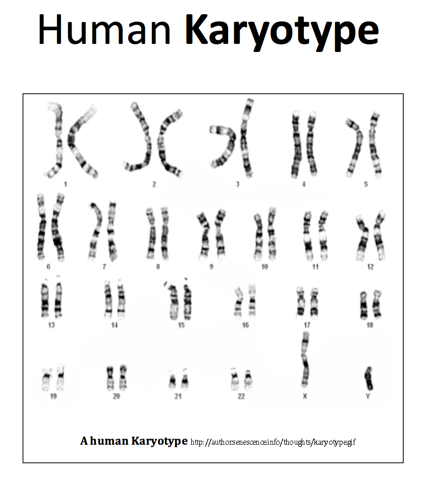

# Exam 2 Review

# Day 6
## Determine, from data, whether a given feature is a homology or an analogy (convergent evolution).

Homology: Similarity due to common ancestry

Analogy / convergent evolution: Similarity due to an environment / environmental pressures.

## Explain the principle behind the Law of Superposition.

The Law of Superposition states that
> within a sequence of layers of sedimentary rock, the oldest layer is at the base and that the layers are progressively younger with ascending order in the sequence.

This is because newer materials and sediment and things like that stack up on the surface to form new deposits / layers over time.

## Use evidence (fossils, morphology/anatomy, embryology) to support the theory of evolution.

**Fossils** can be used with the law of superposition to show the evolution of creatures (namely humans) over time.

**Morphology** and **anatomy** can be used also in conjunction with fossils and the law of superposition. Morphology is:
> The branch of biology that deals with the form of living organisms, and with relationships between their structures.

Which really just means let's look at different fossils and see how they're different.

## Describe the basic structure of a chromosome, including centromeres and telomeres.

Jurassic Park tells us that DNA is made up of:
* A's
* T's
* C's
* G's

> DNA is carefully packed into tight chromosomes to keep it from breaking apart when cells divide.

See the following diagram:

The DNA is wrapped around little protein balls called **nucleosomes** and then they are tightly coiled to form chromosomes.

The chromosome is made up of two parts:
* **Centromere**:
	* this is the pinching point in the center.
* **Telomeres**
	* These are "junk" DNA on the tips of the chromosome that are intended to protect the DNA from potential damage. So they get rekt instead of the important DNA.
	* 'Telo' means 'the end'

* **Karyotype**
	* 'karyo' means nucleus
	* 'type' means picture or image
	* A karyotype is quite literally a picture of the nucleus
* **the nucleus**
> 23 pairs of chromosomes that we have in each of our cells.

Here's a human Karyotype and an accompanying description:

> The dark and light banding patterns are due to the stains used to visualize the DNA.  Depending on the composition of the DNA (how many A's, T's, C's, or G's) and how tightly it is wound determines whether it soaks up a lot of dye and is dark, or a little dye and is light.  You can see that chromosome pairs (these carry the same genes in the same order) match in banding patterns.

## Compare and contrast chromosomal features to reconstruct evolutionary history.

## Explain the significance of vestiges and atavisms in support of the theory of evolution.
**Vestigial structures**
* Left over from evolution - no function
* left-overs from our evolutionary past.
* They no longer function, but they have not been lost
* no longer have a use

examples:

**Atavism**
* Throw back - not everyone has them
* An evolutionary relic which actually shows up when it normally doesn't.
* e.g. a third nipple, post-anal tail

## Identify a trait as a vestige based on an evolutionary history.

Just use the last section to determine what is a vestige.

## Clearly state the position of the Church of Jesus Christ of Latter-day Saints on evolution.

Science defines the ***how?*** while religion gives us the ***who?*** and the ***why?***

Religion and science not adding up is always a result of a lack of understanding in one of those areas.

# Day 7
## Build a graphical depiction of relatedness.

This is when we made the trees showing the relationships and evolution stuffs.

## Distinguish between a monophyletic and paraphyletic grouping.

**Monophyletic**
* describe a group of organisms that share a most common recent ancestor.

**Paraphyletic**
* Same as monophyletic but doesn't include all descendants of that ancestor.

Here's a helpful diagram:

## Read and interpret a phylogenetic tree.

That's just like a family tree. It's the thing we did in class. It's also the diagram in the section above.

A **phylogenetic tree** is a diagram that depicts the lines of evolutionary descent of different species, organisms, or genes from a common ancestor.

We have a few terms we need to know for these types of trees:

| Term | Definition |
|------|------------|
| Node | Common ancestral population |
| Common Ancestor | Population from which 2 species evolved |
| Branch | Changes over time |
| "checkpoints" | Traits / characters  that evolved (somewhere along the branch it evolved, not necessarily at a node) |

## Use data to build a phylogenetic tree using principles of parsimony.

Parsimony just means we assume the simplest thing. This means that, while there may be discrepancies in the order that species developed certain traits, it literally doesn't matter.

## Construct a character matrix.

This is a table that lists traits and species and tells you which species have which traits. Here's picture of one:

In this one, a 1 denotes that they have the tree, and a 0 denotes that they do not.

## Use a character matrix to determine relationships and construct a phylogenetic tree.

Yeah so start with the traits that everybody has and slowly divide the tree by each animal's traits. Just group the animals together and eventually you end up with each individual animal.

## Manipulate a model (rotate nodes) to construct alternative forms of a given tree.

You can do this when there's two trait developments in a row that occur for the same species. In this case, the order that the traits occur doesn't matter and so you can switch them around without it changing the tree.

## Determine closest relatives using a tree.

Those who have a *more recent* common ancestor are more closely related. e.g. a pigeon is more closely related to a crocodile in the following phylogenetic tree:

a **common ancestor** is a population of a species from which 2 species evolved.

## Determine the history of a trait (homology v. convergent evolution) given a tree.

The definitions for homology and convergent evolution can be found in Day 6's notes. The history of a trait can be determined as homology or convergent evolution.
* If two species branch off from one another at some point in the tree but end up with the same traits independently, then the trait is a **homology**.
* If they get the trait off the same line, then it was likely **convergent evolution**.

## Explain that all organisms have been evolving for the same amount of time, such that one species is not ‘more advanced’ or ‘more evolved’ than another and one species does not ‘evolve into’ another.

We define the extent to which an animal is *evolved* as the amount of *time* it has been evolving for. The theory of evolution suggests one common ancestor from which we all evolved.

We define the amount to which a creature is advanced as the amount that it is evolved. Personally, I disagree with this but I'm not a scientist so what does my opinion matter.

# Day 8
## Use evidence to distinguish species.

## Differentiate between the morphological, phylogenetic, biological, and ecological species concepts.

A **species concept** is a way that we define how to differentiate species.

| Term | Definition |
|------|------------|
| Morphological | Species distinction based on physical traits. |
| Phylogenetic | Species distinction based on DNA. |
| Biological | Two types:  (1) pre- and (2) post- **zygotic**.  A **zygote** is a fertilized egg. |
| Ecological | Based on how the animals live and what resources they use. |

## Understand mechanisms of reproductive isolation.

Pre- and Post- zygotic barriers:
> Did you notice the crazy mating dances the birds were doing?  Do you think that if they did a different dance, they would be as successful in wooing a mate?  This type of barrier is called a behavioral barrier and is one of several different pre-zygotic isolating mechanisms (meaning it prevents the zygote--fusion of egg and sperm--from even happening).  Other pre-zygotic barriers include differences in sex organs that prevent copulation (mechanical isolation), differences in the timing of breeding seasons (temporal isolation), distinction in habitats (habitat isolation), and actual incompatibility of sperm and egg (gametic isolation).  

> Sometimes, none of these barriers exist and the organisms can interbreed, but post-zygotic barriers exist:  either the offspring are less fit or die (hybrid low viability) or they are sterile (hybrid sterility).  A mule is a good example of this.  Mules are a cross between a horse (that has 64 chromosomes) and a donkey (that has 62 chromosomes).  Mules have 63 chromosomes and as a consequence have a hard time producing working gametes (although it is not impossible).

## Be able to evaluate the most likely reproductive isolation mechanism in a given scenario.
> If changes in genetics (either due entirely to random chance, or due to random chance and then selection for or against certain traits) are sufficient enough to reproductively isolate the organisms, they will become separate species.

## Distinguish between allopatric and sympatric speciation.

**Speciation** is initiated by the isolation of two or more groups of a single population from each other, with a subsequent change in genetics.

**Allopatric speciation** is speciation due to an actual physical barrier.

**Sympatric speciation** is speciation due to a non-physical barrier / separation.

## Predict evidences that would support or not support separate species.

Are they different? could be separate species then.

## Apply species concepts to human race.

We are all one species. 

## Interpret data to determine which hypothesis about the evolution of the modern human races is most supported.
# Day 9
## Contrast human skulls and chimpanzee skulls

## Evaluate different hominid species to determine how closely related they are to modern humans

## Summarize the evidences that support the relationships of Homo sapiens relative to the extant great apes and to the main extinct hominids.  

## Use chromosomal evidence to support our relationship to great apes.  

## Synthesize an argument for what makes humans unique.
# Day 10
## Predict an outcome of natural selection given a set of circumstances.

## Predict ecological circumstances given an outcome of natural selection.

## Hypothesize a potential cause of a change in a population.

## Use differences in reproduction to determine fitness.

## Explain how changes in the environment do not cause evolution, but that changes in the environment select upon pre-existing variation.

## Apply a natural selection explanation to an authentic situation (e.g., Pigweed, Antibiotic resistance).

## Identify patterns of selection (i.e., directional, stabilizing, and diversifying/disruptive)
# Day 11
## List the postulates (or conditions) of Natural Selection that are necessary for evolution to occur (via this mechanism).

## Explain the importance of each postulate of the theory of natural selection, and how a violation of this postulate will influence the course of selection.

## Predict how patterns of variation will change given the violation of each of these postulates.

## Explain how natural selection is the result of unequal reproductive success.

## Evaluate hypotheses for the evolution of sexual reproduction.

## Hypothesize reasons for sexual dimorphism.

## Use sexual selection to hypothesize mechanisms of speciation.
# Day 12  
## List the three components of life history strategies.

## Predict the effects of environmental stochasticity on life history behaviors.

## Define terminal investment and use data to defend why it occurs.

## Explain the relationship between size and quantity of offspring.

## Hypothesize evolutionary causes of animal behavior.
# Day 13
## Hypothesize mechanisms for the evolution of symbiotic relationships.

## Determine symbiotic relationships based on ecological circumstances (i.e., cooperation, mutualism, selfishness, predation/parasitism, commensalism, altruism, spite, competition).

## Predict positive, negative, or neutral effects on species given a symbiotic relationship.

## Predict genetic relatedness of organisms given a symbiotic relationship.

## Distinguish between intraspecific and interspecific relationships

## Predict ways in which predator/prey relationships can influence the evolution of each player.

## Identify each symbiosis in humans.
