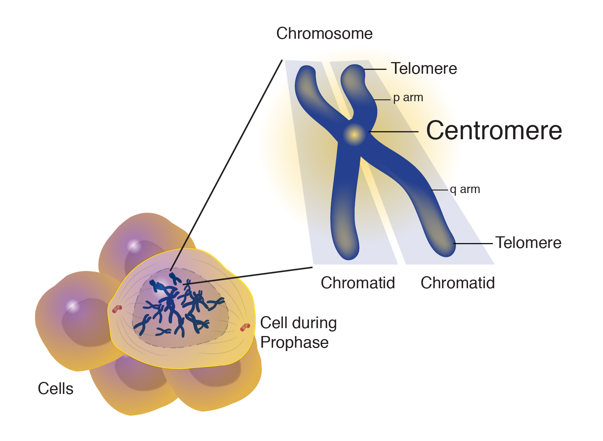
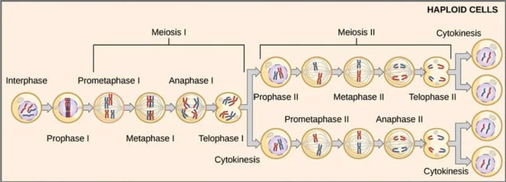
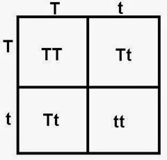
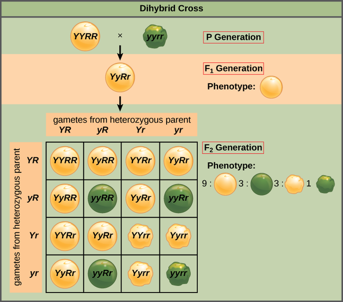
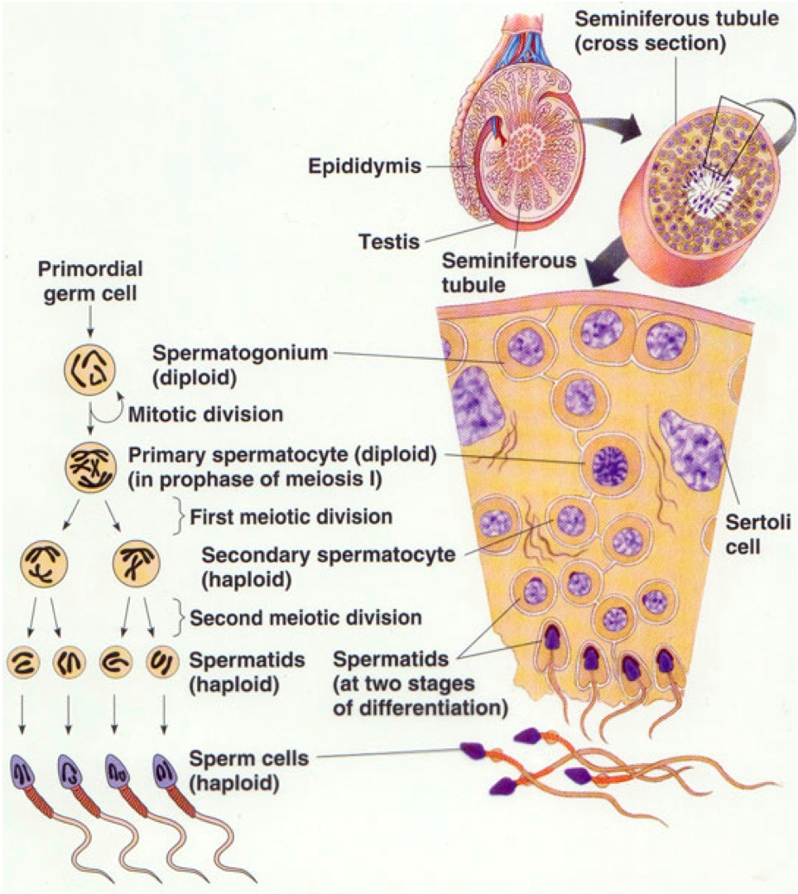
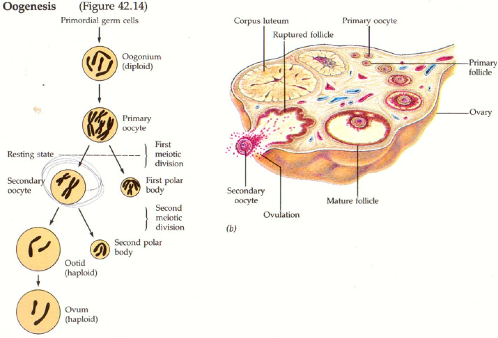
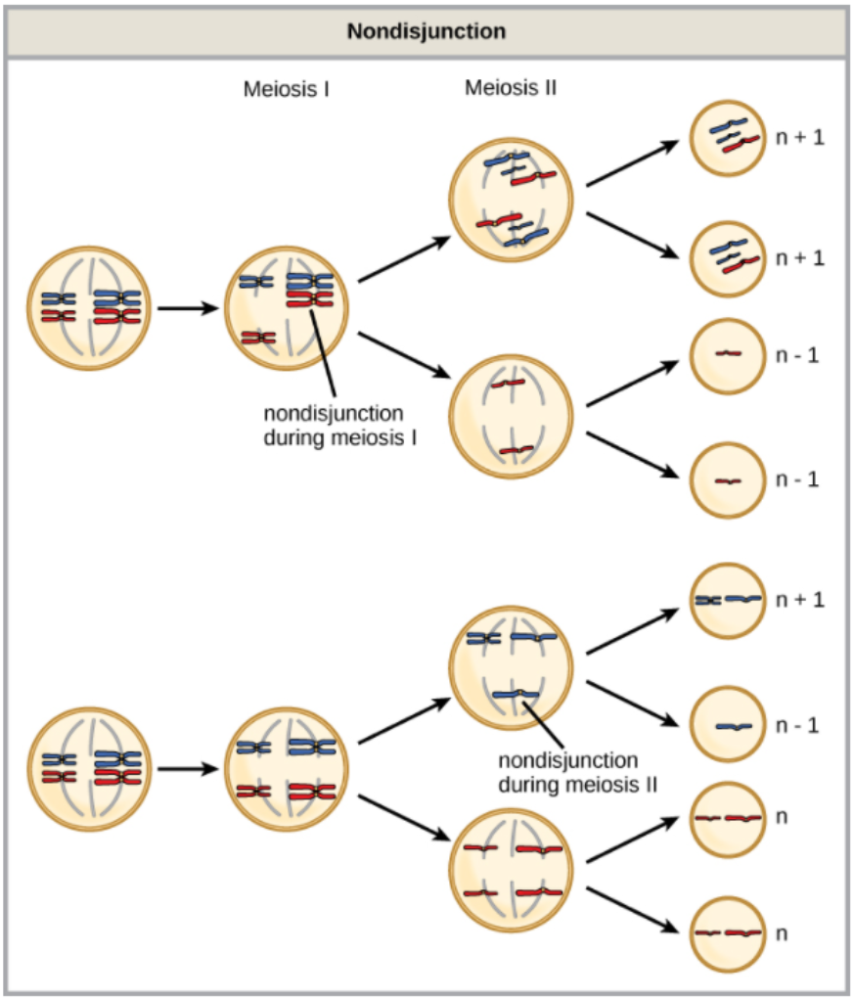
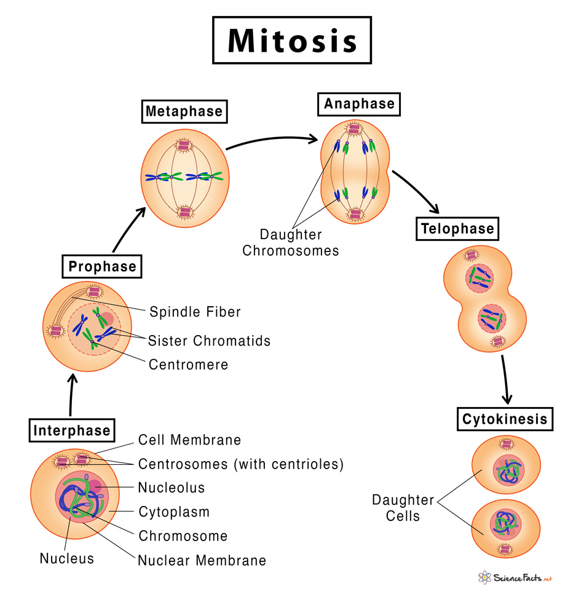
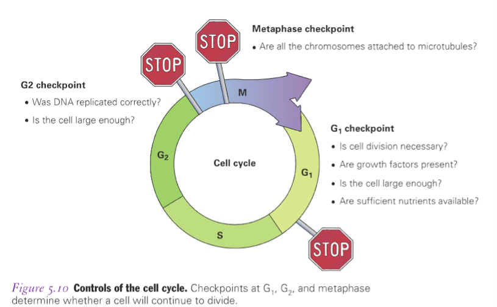

# Exam 3 Review
# Day 15
## Terminology

| Term | Definition |
|------|------------|
| Gene | A segment of DNA that codes for a trait. |
| Genome | All your DNA. |
| Allele | The different variations of a gene. |
| Chromosome | "Chapter" in your DNA recipe book. A packet of DNA. |
| Homozygous | A **zygote** is an egg + sperm. Homozygous if the egg and sperm both brough the **same** allele. |
| Heterozygous | The egg and sperm brough **different** alleles to the table. |
| Genotype | What alleles you have. |
| Phenotype | How alleles express (what they look like). |
| Dominant/Recessive Inheritance | When one allele (dominant) completely masks the other allele (recessive). |

Dominant alleles don't take over the world because they are different frequencies. E.g. dwarfism, 6 fingers. Both of those are dominant but they are in low frequency. If you don't have dwarfism or 6 fingers you are likely homozygous recessive.

## Use the knowledge that for every gene, an individual possesses two alleles and that sometimes one allele is dominant and one allele is recessive, to solve genetics problems.
[click here](#problem-solving-strategy) for the section on problem solving. Or just scroll down a bit.

## What is a Punnett Square?
**def.** A square diagram used to predict possible genotypes of a gene or genes given the genes of two parents.

## For the following points, I'll list some helpful strategies
#### Hypothesize genetic explanations for inheritance patterns.
#### Analyze phenotypic and genotypic data and determine parent genotypes.
#### Predict offspring based on parental genotype and/or phenotype.
Generally speaking, you'll want to read the description and then just start writing down possibilities. Start by writing what you know, then move on to what you can infer from that.

---

**For example**, if the question goes something like:

*The "beans" gene is dominant. It's phenotype is present in Sarah but not her brother. What genotype must their parents have for this gene?*

Begin by listing what you know, and then what you can infer ($\rightarrow$) about genotypes from this information:
* beans is dominant $\rightarrow$ must be $AA$, $Aa$, or $aA$ to show phenotype, **must** be $aa$ to not show phenotype
* The beans gene shows in Sarah $\rightarrow$ Sarah must have $AA$, $Aa$, or $aA$.
* The beans gene does not show in her brother $\rightarrow$ Sarah's brother **must** have $aa$.

From this we now look at what the question wants: *What genotypes do their parent's have?*
* We know they must be able to produce either $AA$, $Aa$, or $aA$
	* This does **not** mean they have to be able to produce all 3.
	* From this we know at least 1 of their parents has to have at least 1 dominant allele ($A$).
* We know they must be able to produce $aa$.
	* The only thing that satisfies the production of $aa$ *and* a genotype with $A$ in it is if the parents are both $Aa$ (or $aA$).

The following Punnett square shows possible genotypes of offspring if both parents are **heterozygous** (i.e. $Aa$ or $aA$)

|   | $A$ | $a$ |
|---|---|---|
| $A$ | $AA$  | $Aa$  |
| $a$ | $Aa$  | $aa$  |

See how if any parent had one more $A$ allele, the production of $aa$ wouldn't be possible? For example, look at the following Punnett Square:

|   | $A$ | $A$ |
|---|---|---|
| $A$ | $AA$  | $Aa$  |
| $a$ | $Aa$  | $Aa$  |

---

## Use the terms homozygous, heterozygous, dominant, recessive, genotype, and phenotype correctly.

See the terminology table for Day 15 (today). All these terms are in that table. Here's some tips on **using** them correctly.

A **genotype** is two alleles. An **allele** (for our understanding) is a letter that makes up a genotype. E.g. a genotype could be $Aa$. $A$ and $a$ are both alleles.

A **phenotype** is the *showing* of a gene. For example, if the gene is a sixth finger, and you have a sixth finger, you have the 6th finger **phenotype**.

A **recessive** allele just refers to how the allele contributes to the genotype as a whole. If the inheritance pattern is **complete dominance** (see the Modes of Inheritance table on Day 19), then conventionally we use a lower case letter for a *recessive* allele and a upper case letter for a *dominant* allele.

**Homozygous** just means you have the **same allele type**. i.e. $AA$ or $aa$. It is usually accompanied by either *recessive* or *dominant*.
* Homozygous recessive: $aa$
* Homozygous dominant: $AA$

**Heterozygous** means one of each allele type is present in the genotype. I.e. $Aa$ or $aA$. You don't need to specify recessive or dominant.

A gene itself can be dominant or recessive or codominant. This is all explained in the **Inheritance Table** in Day 19.

## Describe human sex determination.
Human sex determination is the way our genes determine what sex we will be. This is determined by our $X$ and $Y$ chromosomes.
* Males: $XY$
* Females: $XX$

See from the following Punnett square how this still results in a 50% chance of either sex in offspring:

|   | $X$ | $X$ |
|---|---|---|
| $X$ | $XX$  | $XX$  |
| $Y$ | $XY$  | $XY$  |

Also from the table above, see that, 100% of a boy's X-chromosomes comes from his **mother**.

Some traits will be what's called X-linked or Y-linked. This means that the trait is carried on the X or Y chromosome.

---

**Let's see another example**, if the question goes something like:

*Blue skin is an autosomal recessive trait. It is also X-linked. If Mary has this trait, but her husband does not, what are the chances they'll produce offspring with this trait?*

###### Recall: women have 2 X chromosomes, while men have 1 X and 1 Y.

* When we represent X-linked traits, we usually prepend the allele we're talking about with an X. So instead of just `a`, we'll have `Xa`.
* Since the trait is autosomal **recessive**, we know that Mary must be `XaXa` for this trait.
* Since her husband does not have it, and because he has only one X-chromosome, he must have `XAY` for this trait.

Let's make the Punnett square for this:

|    | XA   | Y
|----|------|---
| Xa | XaXA | XaY
| Xa | XaXA | XaY

So of the four possibilities, 2 of them (the two `XaY`s) will have the trait. Thus, the chances they'll produce this offspring is $\frac{2}{4}=\frac{1}{2}=0.5=50\%$

---

**For example**, if the question goes something like:

*Blue skin is an autosomal recessive trait. It is also X-linked. If Mary **does not** have this trait, but her husband does, what are the chances they'll produce offspring with this trait?*

* In this case, Mary could have either `XAXA` or `XAXa` because both of those account for

---

***Quick aside***: **if** the question had also states that Mary's *mother* had the trait, then we would know Mary is heterozygous (i.e. `XAXa`). This is because:
1. She does **not** have the trait, and she can't be homozygous recessive (`XaXa`).
2. Her mother would have **had to** pass on `Xa` to her (because it's the only allele she carries).

This also tells us that Mary's father must have been `XAY` because Mary had to have gotten an `XA` from her father.

---

Ok back to the question.
* Mary has to be either `XAXA` or `XAXa`
* Her husband has it, so he has to be `XaY`
* Because we don't know for sure which genotype Mary is, we have to account for both possibilities in our probability calculation. This just means we make Punnett squares for both.

$\text{First)}$ If Mary is `XAXA`, then it's impossible for her children to have this trait. See:

|    | Xa   | Y
|----|------|---
| XA | XAXa | XAY
| XA | XAXa | XAY

All of her children would be dominant *against* the trait. Thus, if she is homozygous dominant, the chances of her children having the trait are $\frac{0}{4}$.

$\text{Second)}$ If mary is `XAXa`, then:

|    | Xa   | Y
|----|------|---
| XA | XAXa | XAY
| Xa | XaXa | XaY

Two (`XaXa` and `XaY`) of her children would have the trait. So if she's heterozygous, the chances of her children having the trait are $\frac{2}{4}$.

To get the total chance, we consider both tables as a whole. So of the 8 total possibilities, 2 of them result in a child with the blue skin trait. i.e.
$$
\frac{0}{8} + \frac{2}{8}=\frac{2}{8}=\frac{1}{4}=0.25=25\%
$$
So there's a 25% chance her kids have blue skin.

---

# Day 16
## Derive the Hardy-Weinberg equation.

Given a dominant allele $R$ and a recessive allele $r$, we need two of either or each to define a geneotype. I.e. $RR$, $Rr$, $rR$, $rr$.

Assuming reproduction is random, let the probability of a dominant allele being drawn be $p$ and the probability of a recessive allele being drawn be $p$. i.e. $p$ and $q$ are your **allele frequencies**. Then your **genotype frequencies** are described as such:
$$
p+q=1
$$
$$
\text{The probability of a getting a homozygous dominant individual is}\\
p*p=p^2
$$
$$
\text{The probability of a getting a homozygous recessive individual is}\\
q*q=q^2
$$
$$
\text{The probability of a getting a heterozygous (and $\therefore$ dominant) individual is}\\
pq\text{ or }qp = pq+qp = 2pq
$$
$$
\text{The Hardy-Weinberg Equation describing the complete probability of all three possibilities}\\\text{(i.e. these values sum to 1)}\\
p^2 + 2pq + q^2 = 1
$$

Furthermore, your **phenotype frequencies** are described as:
| Phenotype | Frequency |
|-----------|-----------|
| Dominant  | $p^2+2pq$ |
| Recessive | $q^2$     |

###### Recall: The phenotype is based off whether the trait shows or not. In other words, the dominant trait shows if you have the genotype $RR$, $Rr$, or $rR$. These are all separate genotypes, but they all result in the same *phenotype* (the display of the dominant trait).

## Problem Solving Strategy
1. What have you been given?
2. What is being asked for?

The answer to both of these questions will be:
* A genotype?
* A phenotype?
* An allele?

Once you know the answer to these questions, use the following definitions and some algebra to solve the problem.

| Expression / Equation | Definition |
|-----------------------|------------|
| $p$ | Dominant allele frequency. |
| $q$ | Recessive allele frequency. |
| $p+q=1$ | The probability/frequency of dominant and recessive alleles sum to 1. |
| $p^2$ | The frequency of a **homozygous dominant genotype**.  e.g. $RR$. |
| $q^2$ | The frequency of a **homozygous recessive genotype**.  e.g. $rr$. |
| $2pq$ | The frequency of a **heterozygous genotype**.  e.g. $Rr$ or $rR$. |
| $p^2+2pq+q^2=1$ | The Hardy-Weinberg equation. States that the genotypic frequencies sum to 1. |
| $p^2+2pq$ | The frequency of a dominant **phenotype**.  e.g. if the creature has $RR$ or $Rr$ or $rR$, it will display a dominant trait and thus have a the dominant phenotype. |
| $q^2$ | The frequency of a recessive **phenotype**. Notice that this is the same as the frequency of a *homozygous recessive genotype*, because the only way a recessive trait can show is if you have 2 recessive alleles making up the genotype. |

## To help with the following points, I'll give one or more example problems:
##### Determine probabilities of each genotype and phenotype given the proportion of alleles in a population.
##### Determine allele frequencies given genotypes/phenotypes in a sample of individuals.
##### Determine the change in allele frequencies that will occur in a population over each generation.
##### Use the Hardy-Weinberg equation to determine allele frequencies in a population given a genotype and/or phenotype frequency and vice versa (assuming the population is in Hardy-Weinberg equilibrium).

**Example**: imagine you're given a table describing the frequencies of two alleles `A` and `B`. There's two populations of people that have the gene related to these alleles, `population 1` and `population 2`. The following table describes these populations and their genotypic frequencies:

|      | `population 1` ($n=95$) | `population 2` ($n=102$) |
|------|-------------------------|--------------------------|
| `AA` | 10                      | 56
| `AB` | 23                      | 32
| `BB` | 72                      | 14

##### You are now asked to find the **allelic frequency** of `A` and of `B` in the first population, `population 1`.
First you need to understand what the figures in the table mean.
* $n$ refers to the total number of people in the population
* Each number in the table under a `population` heading refers to the number of people who have the genotype listed in the leftmost column
	* For example, the cell containing the number '10' tells us that in `population 1`, there are exactly $10$ people with the genotype `AA`.

To find the allelic frequencies, you honestly just count.
* For every person with `AA`, there are 2 `A`s.
* For every person with `AB`, there is one `A` and one `B`.
* For every person with `BB`, there are 2 `B`s.

Using this, we can calculate the total number of `A` and of `B` alleles in the population.
$$
\begin{align}
\text{A alleles}&=(10*2) + 23=43
\\
\text{B alleles}&=(72*2) + 23=167
\end{align}
$$
Now to find the **proportion** or **frequency** of these alleles, we divide them by the total number of alleles.
* In `population 1` there are 95 people.
* Each person has 2 alleles that make up the genotype for this gene.
* The total number of alleles, therefore, is $95*2=190$

So, finally, to calculate the frequencies:
$$
\begin{align}

\text{A frequency}&=\frac{43}{190}=0.2263 \approx 23\%
\\\\
\text{B frequency}&=\frac{167}{190}=0.8789 \approx 88\%

\end{align}
$$

#### Determining Hardy-Weinberg equilibrium

###### Recall: Hardy-Weinberg equilibrium describes a population that is *not evolving*.

* If we only look at the `A` frequency of $23\%$, we can say that we might ***expect*** (by the Hardy-Weinberg equation) that the frequency of `B` would be:
 	* $100\%-23\%=77\%$
* Given this, we could say the proportion of heterozygous individuals (`AB`) in the population is, according to the Hardy-Weinberg equation, ***expected*** to be:
 	* $2pq=2*0.23*0.77=0.1771 \approx 18\%$.
	* You can find this information in the long table of equations above (under **Problem Solving Strategy**).
* To then find the **number** of heterozygous individuals, we simply multiply this proportion by the total number of individuals.
	* i.e. $0.18*n=0.18*95 = 17.1 \approx 18$
	* note: we always round up when dealing with number of individuals because you can't deal with a fraction of an individual.

We can clearly see that the *actual* number of heterozygous individuals that we see recorded in the table is **higher** than that which we would expect from a population in Hardy-Weinberg equilibrium. Thus, `population 1` is not in Hardy-Weinberg equilibrium.

# Day 17
## Terminology
## Predict the outcome of the violation of each of the given assumptions of Hardy-Weinberg.
### What does it mean to be in Hardy-Weinberg equilibrium?
The Hardy-Weinberg equation determines how alleles will be distributed using probability. When the HW equation is in equilibrium, it means that the population and its alleles and proportions of those alleles and phenotypes are **not changing**.

## Predict which assumption has been violated given allelic frequencies of two populations.
For a population to be in Hardy-Weinberg equilibrium, there are a few requirements. i.e. we assume the following to be true when modeling a population after Hardy-Weinberg equilibrium.
1. No **natural selection** is occurring
2. No **gene flow** (immigration/emigration) is occurring
3. No **genetic drift** is occurring
4. Organisms are reproducing at random (no **non-random mating**)
5. No **mutations** are happening

| Term | Definition |
|------|------------|
| Natural Selection | There are differences in fitness. |
| Gene Flow | Immigration & emigration of a population or individuals in a population. |
| Genetic Drift | When some outside factor causes there to be a dramatic shift in allele and gene proportions. Two types: <li>Founder effect: A few of a population start over somewhere else</li><li>Bottleneck: All of a population are killed off but a few.</li> |
| Non-random Mating | When mating is not random (wow this is helpful). i.e. ***sexual selection***. |
| Mutations | Alleles are changing. |

The Hardy-Weinberg equation describes the situation where a population ***is not evolving***. It is our **null** for evolution. Thus if any of the 5 requirements are not met, then the population ***must be evolving***.

###### <u>IMPORTANT NOTE</u>: the definition table is *not* the list of assumptions. It defines terms in the assumptions, but the actual assumptions are the *absence* of the terms in the table. Just look at the numbered list above.

## Apply the Hardy-Weinberg equation to real-world scenarios to hypothesize evolutionary causes

### Case Study: Malaria
##### You don't need to know all this, it's just an example
* Kenya lowlands have high malaria presence, but low morbidity (death rates)
* Kenya highlands have just recently begun to experience high malaria presence and their morbidity rates are high.

| Thoughts |
|----------|
| From Heather: the people in the lowlands have been exposed to malaria for longer, so they have developed genetic resistances (through mutations). Maybe they're different genetically. |

* Moormann et al., 2003, 2003 hypothesized that highland populations have less protective genes than lowland populations.
* Their test: look at frequency of a known malaria-resistant gene, *Hemoglobin S* (The gene for Sickle Cell Anemia).

If the lowland and highland populations are in Hardy-Weinberg equilibrium, then their genetics should be the same and not evolving.

So we took some datas and here we got the Hemoglobin A/S genotypes.

| Genotype | Lowland area transmission | Highland area transmission |
|----------|---------------------------|----------------------------|
| HbAA     | 254 (74%)                 | 340 (97%)
| HbAS     | 90 (26%)                  | 12 (3%)
| HbSS     | 0                         | 0

The proportion of A in lowland:
$$
\frac{254*2+90}{344*2}\approx .87
$$
And in the highland:
$$
\frac{352*2+12}{352*2}\approx .98
$$

So if we've got one S you are more resistant. If you get two S's then you're totally immune apparently but a sad side effect is that most of them die in infancy. So here we see some Stabilizing Selection (away from either homozygous genotype and towards the heterozygous genotype).

## Compare expected and actual frequencies to hypothesize evolutionary causes.

# Day 18  
## Terminology
| Term | Definition |
|------|------------|
| Chromosome | A packet of DNA - 23 pairs
| Gene | A Recipe for a trait
| Allele | Variations of a gene
| Homologous | Same genes, same order, but **NOT** necessarily the same alleles
| Sister Chromatid | Duplicates of a chromosome

## Genetic Equation
$$
an=b
$$
* $a$: the number of copies of a gene
* $n$: the number of unique chromosome types
* $b$: the total number of chromosomes

## Draw the process of meiosis.

| Terms | Definition |
|-------|------------|
| Chromatid | One chromosome contains two similar structures that are held together at a point called the centromere. Each of this is referred to as chromatid.
| Centromere | Strands of replicated chromosomes. A centromere is where the two chromatids are linked in the structure.   
| Homologous Chromosomes |

**Meiosis** is a type of cell division that reduces the number of chromosomes in the parent cell by half and produces four gamete cells. So it's turning diploids into a haploids.

Unlike **mitosis**, which duplicates body cells, **meiosis** produces gametes (which are **sperm** and **egg** cells). Let's now go through the important phases you can see in the picture above.

1. <u>**Interphase**</u>; during interphase, the gamete-producing cell goes through:
	* Cell Growth
	* DNA Replication
	* Doing it's regular cell functions
	* Makes sure the cell is ready to perform meiosis (or mitosis, if it's not a gamete-producing cell).
*  <u>**PMAT**</u>
	* Prophase
	* Metaphase
	* Anaphase
	* Telophase
	* You're going to do this twice for meiosis
		* So when we say *Prophase 1* we mean the first time we do
2. <u>**Meiosis 1**</u>:
	1. <u>Prophase 1</u>
		* Crossing over occurs
			* When the chromosomes are lined up in their homologous pairs
			* They share some information, which can result in **recombinant chromosomes**
			* Crossing over helps create *genetic variation*
		* Spindles start to form.
	1. <u>Metaphase 1</u>
		* **Spindle fibers** and **centrioles** (which are like little tentacle things that come out and move the chromosomes around)
		* Put all the chromosomes in their homologous pairs in a line in the middle of the cell.
	2. <u>Anaphase 1</u>
		* The spindle fibers now pull the chromosomes away from their pair and towards the edges of the cell.
	3. <u>Telophase 1</u>
		* Creates two nuclei with the newly separated chromosomes. After this stage there are two separate cells.
		* The cell splitting into new cells is called **cytokinesis**.
		* These new cells are **haploids** because they contain only one pair of each chromosome.
3. <u>**Meiosis 2**</u>
	1. <u>Prophase 2</u>
		* Crossing over doesn't occur.
		* Chromosomes don't have homologous pairs anymore.
		* Spindles start to form.
	2. <u>Metaphase 2</u>
		* Chromosomes are lined up in the middle by the spindles, but this time they are not in homologous pairs because there's only 1 copy of each chromosome (hence, a haploid $n=23$).
		* i.e. they are in a single file line
	3. <u>Anaphase 2</u>
		* Chromatids pulled away from each other, so there's no longer a complete chromosome in either cell.
	4. <u>Telophase</u>
		* Cells split again; cytokinesis (resulting in 4 new cells)
		* Each cell has 23 chromatids, and 23 centromeres.
* Because of crossing over and independent assortment, all resulting cells from meiosis are unique (different from each other and the starting cell).
* **Nondisjunction** is when, sometimes, chromosomes don't separate correctly.
	* this can result in too many or too few chromosomes.

### Sperm production example
Jack has a $2n=46$ structure (like all people). Since it's $2n$ he's got diploid cells.
* The cells that make sperm start out as diploids
* Before we go through meiosis the cell duplicates its chromosomes
* So we get these "ropes" that come out from the edges of the cell and get one of each chromosome.
	* All the homologous pairs line up as pairs in the **metaphase**.
	* Law of Independent Assortment
		* Every single gene is independent from one another. (mostly true)

#### The following points are explained above in the description of meiosis.
##### Explain where and how the law of independent assortment and the law of segregation are fulfilled by meiosis.

##### Use the principles of meiosis to predict offspring outcomes.

## Determine ploidy number (e.g., diploid and haploid) of a cell based on a figure or description of the cell.

###### Recall:
$$
an=b
$$
* $a$: the number of copies of a gene
* $n$: the number of unique chromosome types
* $b$: the total number of chromosomes

**Diploids** and **haploids** are types of cells:
* Diploid:
	* Contains 2 copies of each chromosome
	* Represented as $a=2$ in the genetic equation $an=b$
		* e.g. humans are $2n=46$ because they have 23 chromosomes, and their cells are diploid cells, meaning they have 2 copies of each chromosome.
* Haploid:
	* Contains 1 copy of each chromosome
	* Represented as $a=1$ in the genetic equation
		* e.g. $1n=8 \Rightarrow n=8$ means there's one copy of each chromosome in each cell, and there's 8 total chromosomes.

## Justify why gametes should have half the number of chromosomes as the parent cell.

A **gamete** is a *haploid* male (sperm) or female egg cell. For humans, their equation is:
$$
n=23
$$
Because there's 23 unique chromosomes, and a sperm and egg cell each contains one copy of each of them.

Because humans reproduce meiotically (their sex cells are diploids and they split), a sperm and egg have to each have half of the genome required to create a new person.

In terms of the equation think of it like this:
$$
\text{
	2 of ($\overset{\text{haploid gametes}}{n = 23}$) = ($\overset{\text{diploid zygote}}{2n=46}$)
}
$$

## Determine all possible gametes that can result from a given parent.

## Defining Sex
A persons sex is defined by whether they make eggs or sperm. The Y chromosome has something called SRY that makes the gonads fall.

hehehehehe

hehe

# Day 19
## Inheritance Table (Modes of Inheritance)
| Type of Inheritance | Genotypes | Phenotypes | Picture |
|---------------------|-----------|------------|---------|
| Complete Dominance  | AA  Aa  aa  | Dominant Dominant Recessive |
| Codominance | AA AB BB | "A" Phenotype Both Phenotypes "B" Phenotype |
| Incomplete Dominance | aa ab bb | "a" Phenotype Blended  "b" Phenotype

* For **incomplete dominance**, an 'ab' phenotype results in a blended phenotype rather than both showing contrastingly.
	* e.g. 'aa' is red, 'bb' is blue, then 'ab' results in purple

## Blood Types
### ABO
There are 3 alleles: `A`, `B`, `i`
* `AA`, `Ai`: A
* `BB`, `Bi`: B
* `ii`: O
* `AB`: AB

### Rh Gene
This is the positive/negative thing
* `++`, `+-`: $\text{Rh}+$
* `--`: $\text{Rh}-$

#### See the pre-class exercises for Day 19, 20, and 21 for the following points:
##### Predict genotypes given phenotypes of family members, from word problems and pedigrees.

##### Solve problems about traits expressing complete dominance, codominance, and incomplete dominance.

##### Identify and predict genotypes for traits with more than two alleles.

## Perform a monohybrid and dihybrid cross, using Punnett squares and/or multiplication rules.

A **Punnett square** is when you have the gametes on the sides of the square and use it to determine what possible offspring two parents can have.

A **monohybrid** cross is when you're only looking at one differing trait. So there will only be 4 squares in the Punnett square. Like so:

A dihybrid cross is when the parents differ on two traits. Like the following with 16 squares:

## Assess the mode of inheritance for a given trait, using pedigrees or family history.

See the "Modes of Inheritance" Tree at the start of Day 19.

# Day 20  
## Heather's Notes:

### Terms
| Term | Definition |
|------|------------|
| Autosomes | Any chromosome that is not a sex chromosome.
| Sex-linked chromosomes | Sex chromosomes |
| Recombination/Recombinants | When pieces of DNA are broken and recombined to produce new combinations of alleles.
| Law of Independent Assortment | all chromosome PAIRS assort independently. So in the example below, see the point marked <mark>THIS ONE</mark>
| Crossing over | During meiosis when homologous pairs get together and swap their chromosome “arms”.

#### EXAMPLE PROBLEM: Fruit Flies
* Body: Gray G Black g
* Wings: Normal N Vestigial n
* GGNN <3 ggnn
	* > it means... they do the dirty, they make the kids, it's what the heart means!
    * Because these are linked, they would produce only offspring that are GNgn unless crossing over occurred, in which case they would
* GgNn <3 ggnn <mark>THIS ONE</mark>
    * GgNn, Ggnn, ggNn, ggnn
    * Ggnn and ggNn are recombinants

## Solve problems about traits expressing sex linkage.
## Solve problems where traits are linked on the same chromosome.

# Day 21  
## Explain the process of gamete formation in males and females.

#### Spermatogenesis

* **def.** The process through which sperm are made.
* The cell that **creates the sperm through meiosis** is called **spermatogonium**.
	* While they use **meiosis** to create sperm cells, they also use **mitosis** to duplicate/replenish themselves.
	* Here's a visual of the process of mitosis and meiosis of these cells:

* Takes place in the testicles
* When the testes create the sperm, it's collected by the **epididymis**, then transported through a tube.
* Other glands are connected to this tube and they add fluid and nutrients (like semen) to help the sperm survive the hostility of the woman's tract, which is acidic.
* The penis is full of cells which fill with blood when needed to make sure it can deliver the sperm.
* The **testicles** are outside the body because spermatogenesis is optimal at a few degrees *below* body temperature.
	* If the temperature is too high the sperm dies.
	* ***Pro tip:*** Sitting in a hot tub for a long time is like temporary sterilization (however, NOT an reliable method of birth control).

#### Ovulation
* **def.** the process of making eggs.
	* 3 types:
		1. Scrambled
		2. Sunny-side up
		3. Boiled
	* You just got pranked!
* So the **vagina** is the opening to the **cervix**, which opens up to the **uterus**.
* The uterus is the incubation machine for growing a baby.
* The uterus grows a thick, blood-rich lining each month in preparation for pregnancy and then sheds that lining at the end of each cycle if pregnancy does not occur.
* At the top of the *uterus* (on each side) there is an opening that leads to the **fallopian tubes**.
	* These tubes have feathery tissue (whatever that means) that:
		1. move the egg down the tube
		2. house and nurture sperm that are wanting to fertilize the egg
* The tubes end in finger-like projections that surround the ovaries (but don't actually touch them) called **fimbriae**.
	* These catch the egg that are expelled from the ovary and carry it into the tubes.

##### Oogonium / Oogenesis
> Just like in the testes, the ovaries contain diploid egg-making cells called **oogonium** (pronounced "oh-oh-go'-nee-um").  And just like in the testes, the oogonium replenish themselves through mitosis and create eggs through meiosis.

#### *Sex Facts!*
* About men:
	* A single man creates 100-200 million sperm each day!
	* 100 million are ejected during a sexual encounter. *Crazy* right?!
    * From spermatogonium to mature sperm takes 64 days (so if you sterilize yourself, it takes about 2 months to regain your sperm count)
    * Epididymis is 20 feet long, coiled into about 4 cm (this is the tubing sitting directly on top of each testicle)
    * Average sperm count is 100,000,000/mL of semen; men produce up to 2 mL/day; all 2 mL expelled in one ejaculate
    * Sperm swim 3 mm/min. (to swim entire female tract takes 2 hours)
    * Sperm can live up to 7 days in the female body (and they actually need a day or two to become mature enough to penetrate an egg)
    * Males create sperm 24/7 from puberty to death!  That's a lot of sperm.
* About women:
	* There are no interesting facts about women.

## Predict genetic results of in vitro fertilization using polar bodies.

Polar body is an egg that's like definitely gonna die. i.e. they don't have enough to make 2 whole eggs so they put all the effort into 1.

## Determine how to increase the odds of becoming pregnant.

> The opening to the outside is the vagina.  The vagina is very acidic in order to kill any invading cells (bacteria, fungus, or even sperm).  From here, you travel up toward the cervix.  The cervix is a tight constriction of cartilage that keeps the uterus shut to the outside world during most of a women's cycle.  It does this by secreting thick, and practically impenetrable mucus.  During a few days each month (in the middle of the cycle), the mucus thins enough to allow sperm to enter.  It is during this time that a female can get pregnant.
* So if you wanna get pregnant, have sex on the day of ovulation

## Determine the parent in which nondisjunction occurred, and when during meiosis or mitosis nondisjunction occurred, given a genetic outcome of the daughter cells or offspring.

Ok this kind of sucks and just requires some reasoning and knowledge of the process of meiosis.

**def.** Nondisjunction is when two chromatids fail to break away from each other, resulting in an extra chromosome or one too few chromosomes in offspring.

So if the kid has XYY, it's nondisjunction occured in the dad in Meiosis 1

Eh idk just look at the diagram here:

# Day 22
## Terminology
| Term | Definition |
|------|------------|
| Mitosis | Process used by the body to repair and grow cells. It's an exact replication of a cell. It creates an exact copy. |
| Interphase: $G_1$ | Gap 1: Where the cell is doing it's job. This when a cell is being a cell. Like a heart cell is pumping the blood
| Interphase: $S$ | Synthesis
| Interphase: $G_2$ | Gap 2: Doing it's job again
| Checkpoints, What do they check? | Checks for errors in DNA, damage, health, do we need another cell? |
| $G_0$ | "Retirement" of the cell. Still doing it's job but it's not gonna reproduce. Fancy term is *senesence* |
| Apoptosis | Cell death - on purpose. Cellsuicide. Celluicide. |

## Compare and contrast meiosis and mitosis.
While **meiosis** halves the number of chromosomes in the process of creating a new cell, **mitosis** duplicates a cell. So for **meiosis**:
$$
2n \rightarrow n
$$
But for **mitosis**
$$
2n \rightarrow 2n
$$

When thinking about whether an event is mitotic or meiotic, only look at the chromosome number.

## Diagram the key steps in each phase of the cell cycle and in each phase of mitosis.

## Predict a meiotic or mitotic event in a life cycle given the purpose.

Meiotic (meiosis) events occur almost exclusively for reproduction. Mitotic (mitosis) events occur for a number of reasons. Among them:
* heal a wound or something else
* duplicate the cells that create sperm
* developing a multicellular organism (i.e. cells in the embryo growing into a fetus)
* If it deals with replenishment, regeneration, and repair of tissue, it's almost certainly mitosis
* If it deals with replenishment of cells, it's also almost certainly mitosis.

## Predict when and how cancer might occur in the life cycle of a cell.

Cancer cells can come from a mutation increasing resistance to controls which maintain normal tissue, or a mutation in the regulating cells that make them less effective.

> Genetic mutations causing the malfunction or absence of one or more of the regulatory proteins at cell cycle checkpoints can result in the "molecular switch" being turned permanently on, permitting uncontrolled multiplication of the cell, leading to carcinogenesis, or tumor development. ([source here](https://cyclacel.com/research_science_cell-cycle.shtml))

## Explain and contrast proto-oncogenes, tumor suppressor, and repair genes; predict the effects of a mutation in each.

See **Control Mechanisms** below for a description of each of the terms.
* A mutation hindering tumor suppressors would cause more tumors (doi). Could mean death.
* A mutation increasing tumor suppression could result in more cells dying or an inability to heal and all that. Also death. It means mitosis will happen less often.
* A mutation helping proto-oncogenes work more effectively could result in tumors because it would increase cell mitosis.
* A mutation hindering proto-oncogenes could result in, again, more cells dying and an inability for you body to heal.

## Determine at which checkpoint a cancerous cell has experienced a mutation.

A cancerous cell would be stopped in G1. G1 also checks for **mutations**.

## Predict the effect of lengthening telomeres.

**Telomeres** are the little things at the end of the chromosomes. When they run out, it triggers the cell to go into **apoptosis** (cell death). This prevents mitosis of these cells as well. If these start to lengthen, it results in tumors because we just get a buildup of cells in one place.

## Control Mechanisms
* Tumor suppressors - "off switches" - e.g. p53
* Proto-oncogenes - "on switch" - e.g. Cyclin
* Contact Inhibition
* Anchorage Dependence
* Telomeres
	* Every time you go through the S phase, the telomeres get a bit shorter
	* A cell can only go through mitosis a certain number of times.
	* Telomosomething enzyme lengthens telomeres in the balls and also in cancer cells

## Benign vs. Malignant
These are two different types of growth.
* Benign expands but stays within its cell type.
* Malignant is expansion and inflitration of other cell types.

## How to Treat Cancer
* Slash
	* you go in and physically remove it
* Burn
	* Burn it off with radiation. Cause a bunch of DNA damage so it goes through apoptosis
* Poison
	* Chemotherapy
	* Targets cells that are going through mitosis
	* So it kills cancer cells but also kills your other cells.
