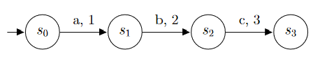
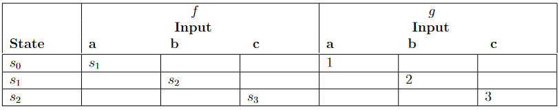
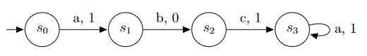
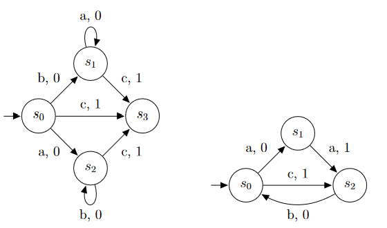
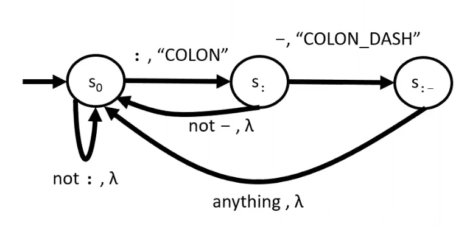
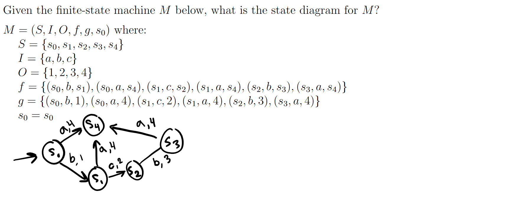
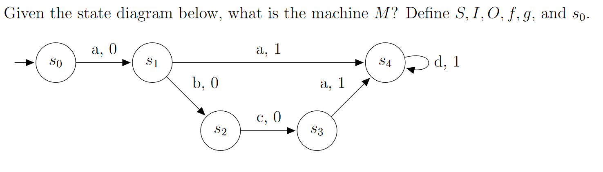

# Finite-State Machines - 9/3/2021
## Definition
**Finite-state machines** are the recognizers for the languages generated by regular expressions. They are used in many areas of Computer Science.

> A finite state machine is going to receive some input, and this input is a string from a regular language. The finite state machine's purpose is to look at the first character of the string that it's on, transition from state to state, and perform the appropriate output.

Some examples of FSM uses are:
 * spell checking
 * grammar checking
 * speech recognition
 * text indexing and searching
 * markup languages: xml/html
 * network protocols

A finite-state machine $M=(S, I, O, f, g, s_0)$ consists of:
 * a finite set $S$ of **states**
 * a finite **input alphabet** $I$
 * a finite **output alphabet** $O$
 * a **transition function** $f$ that assigns to each state and input pair a new state.
 * an **output function** $g$ that assigns to each state and input pair an output
 * an **initial state** $s_0$

### FSM Equivalence
Two FMS are *equivalent* if they give the exact same output for all inputs.

## Representing Finite-State Machines
### Diagram Form

 * Each circle with a label is a state.
 * Each arrow with a label represents a transition from one state to another
 * An arrow's label consists of two parts seperated by a comma:
	 * the first, the input symbol read
	 * the second, the output symbol written
 * The arrow with no label shows the machine's starting state (i.e. $s_0$).
 * All inputs but the expected input are considered invalid and lead to an **error state** (not shown in the diagram for simplicity)
 * Upon successful reading of the expected character, the output symbol will be written, and the machine will transition to the next state.
	 * e.g. when the machine above reads $a$, it will output $1$ and transition to $s_1$
 * Excess characters when the machine has run through all its states throws an error.
 * e.g. the machine pictured above only reads the input $abc$.

### Table Form

We can define this finite-state machine $M$ as follows:
$$ M=(S, I, O, f, g, s_0) $$
where 
$S=\{s_0, s_1, s_2, s_3\}$ 
$I=\{a, b, c\}$ 
$O=\{1, 2, 3\}$ 
$f=\{(s_0, a, s_1), (s_1, b, s_2), (s_2, c, s_3)\}$ 
$g=\{(s_0, a, 1), (s_1, b, 2), (s_2, c, 3))\}$ 
$s_0=s_0$ 

### Using Finite-State Machines to Recognize languages
If we define an input string to be recognized when the last output bit is a certain value, we can use finite-state machines as language recognizers in a precise way. Remember that upon using a symbol in the string being evaluated to transition to another state, that symbol becomes **consumed**, and the next symbol is used for the new state.

For example, if we define an input string to be recognized if the last input bit is a 1 and change our output function to:
$$ g=\{(s_0, a, 1), (s_1, b, 0), (s_2, c, 1))\} $$

> ... such FSMs – that only outputs $O=\{0, 1\}$, and whose output criteria is a ‘$1$’ for string acceptance – are referred to as **Mealy**
machines

We can see that the FSM will now accept any string from the language
$$ L=\{a, abc\} $$
which is generated by $(a \cup abc)$.

The *finite* part of finite-state machine only refers to the number of states, not the number of recognizable strings. Thus if we do the following:

We can see that the FSM now recognizes strings from the language
$$ L=\{a, abc, abca, abcaa, abcaaa, \dots\} $$
(an *infinite* amount of strings) which can be generated with $(a\cup{}abc(a\text{*}))$.

### Examples

Left:
$$ b(a\text{*})c \cup a(b\text{*})c \cup c $$

Right:
$$ aa \cup (aab)\text{*} \cup c \cup (cb)\text{*} $$
or
$$ (aa \cup c)[b(aa \cup c)]\text{*} $$

Notice how these have **multiple transitions per state**. The case where this would be invalid is if you had more than one transition for the same symbol (e.g. two arrows from the same state whose required input is $a$).

#### Lecture practice:
* Create a FSM that outputs `Lehi` every time it reads a $1$ and `Sariah` every time it reads a $0$.

$$ M=(S, I, O, f, g, s_0) $$
where 
$S=\{s_0\}$ 
$I=\{0, 1\}$ 
$O=\{\text{Lehi}, \text{Sariah}\}$ 
$f=\{(s_0, 0, s_0), (s_0, 1, s_0)\}$ 
$g=\{(s_0, 0, \text{Sariah}), (s_0, 1, \text{Lehi})\}$ 
$s_0=s_0$ 

### FSA
For language recognition, there is a useful specially designed kind of finite-state machine called a **finite-state automaton** (FSA, finite-state automata in plural form). Finite state machines have output, but finite state automata do not.

## Lexer
### Definition
A Lexer is a program that turns programmer-specific **items** into programmer-independent structures called **tokens**.
 * Each token contains the following information required by the computer:
		1. a token name, which is selected from a set of predefined names, e.g. `STRING`
				* this defines the type of item
		2. the specific **item** for that token, e.g. `Hello World`
				* this is how the token stores information
		3. a line number
				* used mostly for debugging
 * A **token** encodes the text into the corresponding *symbols* of the programming language of the file. This allows us to define what all the text we're writing means.

The output of the lexer is an **ordered** collection of tokens. It has to be ordered for obvious reasons (think `int a = 1;` vs `a 1 = int;`)

For example, consider that you have a token with name `COLON` = `:` and another `COLON_DASH` = `:-`. See the following FSM, are there any problems with it? (YES).

## More Practice Problems

---

$$ M = (S, I, O, f, g, s_0) $$
where
$$ M=(S, I, O, f, g, s_0) $$
where 
$S=\{s_0, s_1, s_2, s_3, s_4\}$ 
$I=\{a, b, c, d\}$ 
$O=\{0, 1\}$ 
$f=\{(s_0, a, s_1), (s_1, a, s_4), (s_1, b, s_2), (s_2, c, s_3), (s_3, a, s_4), (s_4, d, s_4)\}$ 
$g=\{(s_0, a, 0), (s_1, a, 1), (s_1, b, 0), (s_2, c, 0), (s_3, a, 1), (s_4, d, 1)\}$ 
$s_0=s_0$ 

Now let's find the regular expression for it
$$ aad\text{*} \cup abcad\text{*} $$
$$ = (aa \cup abca)d\text{*} $$
which you can simplify to:
$$ a(a \cup bca)d\text{*} $$
or
$$ (a \cup abc)ad\text{*} $$
or
$$ a(\lambda \cup bc)ad\text{*} $$

---
