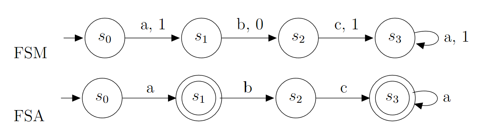
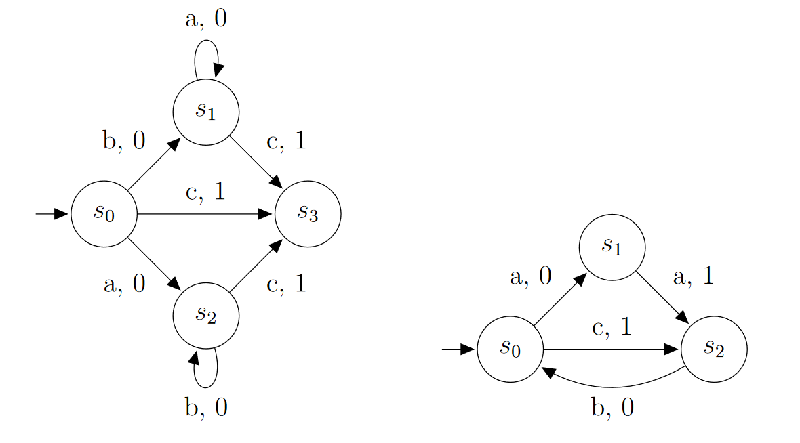
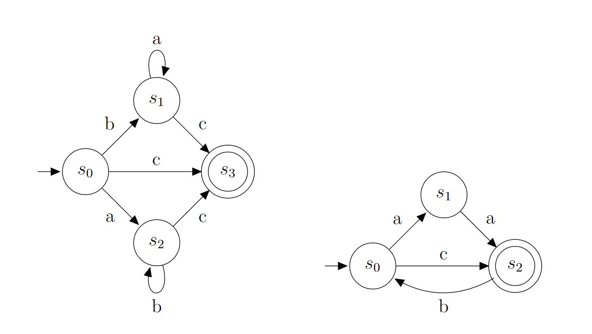
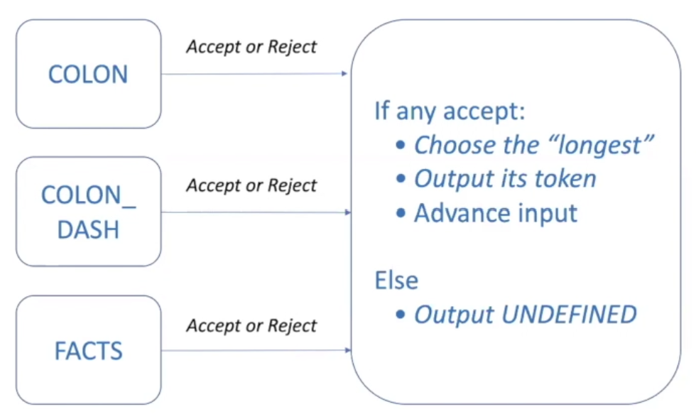

# Finite-State Automata - 9/8/2021
## Definition
A finite-state automaton (automata for plural form) is a kind of finite-state machine that does not include outputs for each transition, but rather has a list of final states. I.e. a *finite-state automaton* $M=(S, I, f, s_0, F)$ consists of the following:
 * a finite set $S$ of **states**
 * a finite **input alphabet** $I$
 * a **transition function** $f$ that assigns each state and input pair a new state
 * an **initial state** $s_0$
 * (the difference between FSM and FSA) a set of **final states** $F\subseteq{S}$

Think of $F$ as the set of all transitions whose output to get there is a 1 in a **Mealy machine**. Instead of using output, we just say that the machine recognizes a string that ends on that state. In a diagram, we'll represent a final state $s_f\in{}F$ with two circles around the state instead of one. E.g. see the following diagram:

To translate our FSM to an FSA, $S=\{s_0, s_1, s_2, s_3\}, I, f$, and $s_0$ all remain the same, but we now have $F=\{s_1, s_3\}$.

## Language Recognition
### Definition
To formalize our definition:

A string $x$ is said to be *recognized* or *accepted* by the FSA $M=(S, I, f, s_0, F)$, if it takes the initial state $s_0$ to a final state. That is, $f(s_0, x)$ is a state in $F$. The **language recognized** by the machine $M$, denoted $L(M)$ is the set of all strings that are recognized by $M$.

## Finite-State Automata Equivalence
### Definition
Same as for FSMs; two FSAs are **equivalent** if they recognize the same language.

## More examples:
### FSM:

### FSA:

## Converting FSAs to Code
There are plenty of approaches. Two main ones are:
1. Peek & Patch
2. (the better one) Parallel & Max

### Parallel & Max

The three boxes with token names in them each represent a FSA which are all run on the input string. If any recognize a word from the string, then the **longest** (meaning the FSA which processed the most characters) is chosen as the determinant for the token creation. Input is advanced however many characters were processed by the longest FSA.

> What about when two FSAs accept the string but have the same length?

There are many ways to deal with this issue. For us, always use the ***keyword*** FSA rather than the ***ID*** FSA. That's usually what the conflict will be.
