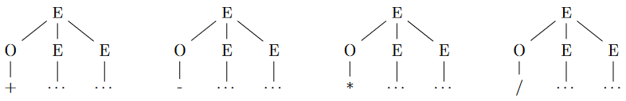
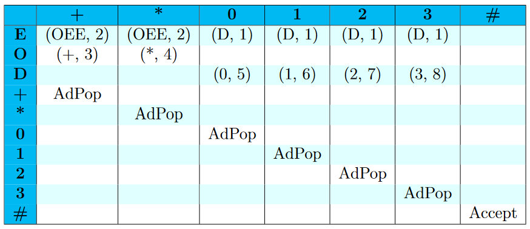
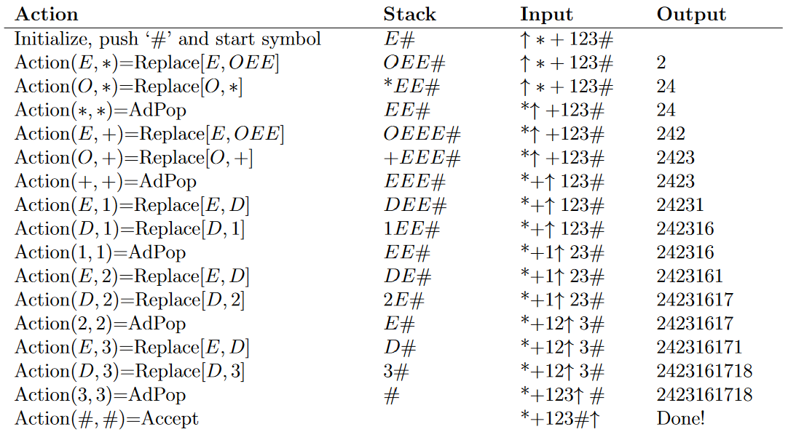
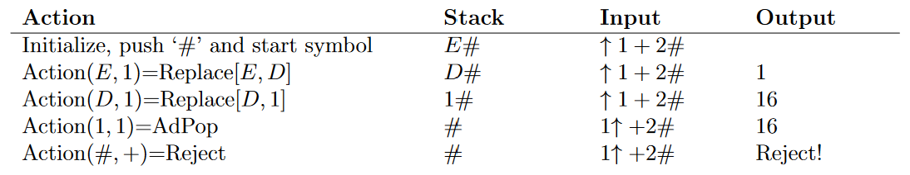

# Grammars: Table-Driven Parsing - 9/15/2021
## Systematic Parsing
In order to design code to create parse-trees, we need a way to systematically approach them. We could do a brute force creation and search of all possible trees and see if they match the string we're trying to parse but that is suuuuper dumb. Instead we'll do something else. See the following grammar:

$G=(V, T, S, P) \text{where}$ 
$N={E, O, D}$ 
$T={0, 1, 2, \dots, 9, +, -, *, /}$ 
$S=E$ 
$P=\{\\
\qquad E \rightarrow D | OEE,\\
\qquad O \rightarrow + | - | * |\text{ } / \text{ },\\
\qquad D \rightarrow 0 | 1 | 2 | \dots | 9\\
\}\\$

This grammar represents arithmetic expressions in prefix notation.

---
*An aside on prefix notation*:

See the table below for a quick example:
| infix expression | prefix expression | postfix expression |
|------------------|-------------------|--------------------|
| $A+B$            | $+AB$             | $AB+$              |
| $A+B*C$          | $+A*BC$           | $ABC*+$            |

see [this site](https://runestone.academy/runestone/books/published/pythonds/BasicDS/InfixPrefixandPostfixExpressions.html) for more details

---

## The Algorithm
1. If we can match the current symbol of our terminal string with a producible terminal, we choose that production.
2. If the current nonterminal cannot produce the current symbol, choose a production with a starting nonterminal.

E.g. with our grammar above, let's find a tree for $+-431$. From the reading:
> Our first symbol in our terminal string is $+$. Starting with our start symbol, $E$, we check if $E$ has a production that starts with $+$. It does not. Now we must look at the productions from $E$ that start with a nonterminal. Our choices are $O$ and $D$. Now we check to see if either $O$ or $D$ has a production that starts with $+$. $O$ does; $D$ does not. Thus we choose the production $OEE$. We continue this process until we have parsed the entire terminal string.

## LL Grammars
When there's more than one production rule that produces the same terminal, we have to guess at which production to take and backtrack if it ends up being wrong.
### Definition
**LL Grammar**s are a subset of context-free grammars that do not require backtracking. An LL grammar can be parsed with an **LL Parser**.

An LL parser parsers the input from left to right and produces a leftmost derivation (thus LL).

**Leftmost Derivation**: A derivation strategy where the leftmost nonterminal is chosen as the next nonterminal to read.

An $LL(k)$ parser is able to parse an LL grammar with just $k$ look-ahead characters. This means that we only have to go $k$ levels deep into the productions in order to determine what we want.

The prefix grammar we wrote above is an **$LL(1)$** grammar. Say we want the terminal string '$6$' and we start at $E$. We can't see any $6$s in the production results for $E$, so we'll go deeper into each nonterminal in the production results. We see $D \rightarrow 6$ so that's $1$ deep. Ya feel?

## FIRST Set
In a $LL(1)$ grammar, we only have to look at the **first** character of the terminal string to choose the correct production, for all productions in all possible derivations. We use something called **FIRST sets** to help better understand these kinds of grammars. Dr. Goodrich says:
> Let $A$ denote some nonterminal in the parse tree. The children of $A$ in the parse tree are derived by applying the production $A \rightarrow RHS$ and putting the terminals and nonterminals from the right-hand side, $RHS$, into the tree as children of $A$. Any terminal that can be the leftmost descendent in the subtree under $A$ belongs in the $FIRST$ set of $A$. $FIRST$ sets capture what nonterminals can appear as a leftmost descendent of $A$ when you apply $A \rightarrow RHS$.

Read that last line again, it pretty much sums it up:
> **$FIRST$ sets capture what nonterminals can appear as a leftmost descendent of $A$ when you apply $A \rightarrow RHS$.**

### Example
Consider again our $LL(1)$ prefix arithmetic grammar. We start with $E$. We have 2 possible productions from here:
$$
E \rightarrow D \quad | \quad E \rightarrow OEE
$$

Looking at the first one, we know that the first, leftmost terminals that can be produced from the right hand side of the production (i.e. $D$) are $0, 1, 2, \dots, 9$. Thus we say,
$$
FIRST(E \rightarrow D) = \{ 0, 1, 2, \dots, 9 \}
$$
Likewise, let's take the leftmost nonterminal on the right hand side of the production $E \rightarrow OEE$. The nonterminal spoken of is $O$. We can now say,
$$
FIRST(E \rightarrow O) = \{ +, -, *, / \text{ } \}
$$
Why? See the image below:

Hopefully this is starting to make sense for you.

### FIRST Set Formal Definition
The **FIRST set** of a production is the set of all first terminals it can eventually produce (since we are dealing with leftmost derivations, we mean the first, leftmost terminal produced by the current production).

We say that a grammar is $LL(1) \iff$ the $FIRST$ sets for *all* productions of *all* terminals is **disjoint** (that is, they don't share any elements).

E.g. the sets $FIRST(E \rightarrow O)$ and $FIRST(E \rightarrow D)$ are disjoint because they share no elements.

More examples of $FIRST$ sets from our grammar above: $FIRST(O \rightarrow +)=\{+\},\quad FIRST(O \rightarrow -)=\{-\},\quad FIRST(D \rightarrow 2)=\{2\}$.

## Parse Tables
A parse table helps guide us through $LL(k)$ grammar parsing. The rows are all nonterminals and terminals, while the columns are only the nonterminals. Both the rows and columns have an additional character $\#$.

The parse table is built around a push-down automaton (PDA). The way it works is:
* find the leftmost character of our input string in the column labels.
* find the leftmost nonterminal in our parsing string in the rows.
* perform the productions listed from the nonterminal row downwards.
* pop that character and repeat.

Example:
$P=\{\\
\qquad E \rightarrow D_{(1)} | OEE_{(2)},\\
\qquad O \rightarrow +_{(3)} | *_{(4)} \\
\qquad D \rightarrow 0_{(5)} | 1_{(6)} | 2_{(7)} | 3_{(8)}\\
\}\\$
Here we've enumerated the productions for output in a program. The following is the appropriate table **parse table**.

Let's use this table to parse 2 strings. First:
$$
*-+123
$$

Now let's try an invalid string:
$$
1+2
$$

In code, using a table to parse is pretty inefficient. Instead we'll use **recursive-decent parsing**. But that's for the next lessons.
