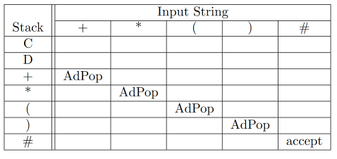
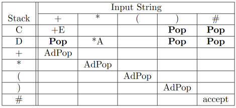

# FOLLOW Sets - 9/17/2021 & 9/20/2021
## Definition
$$
\text{For the grammar $(V,T,S,P)$, the $FOLLOW$ set of a nonterminal $A \in N$ is given by:}\\\\

FOLLOW(A)=
\begin{cases}
\{ t \in T : S\overset{*}{\Rightarrow} \omega A t \eta \} \cup \{ \# \} & if\quad{}S\overset{*}{\Rightarrow} \alpha A \\
\{ t \in T : S\overset{*}{\Rightarrow} \omega A t \eta \} & otherwise
\end{cases}

\\\\
\text{We'll take $\#$ to mean the "end of string character".}
$$

Interpreting the definition:
* We'll take $\overset{*}{\Rightarrow}$ to mean any number of productions (zero or more production steps)
	* i.e. $E\overset{*}{\Rightarrow}t$ means $E$ followed by some amount of productions produces $t$.
* The string $\omega A t \eta$
	1. $\omega$ and $\eta$ are strings that can be made up of both terminals and/or nonterminals.
		* It is possible for $\omega = \lambda$ and/or for $\eta = \lambda$
	2. $A$ is the nonterminal for which we are computing the $FOLLOW$ set.
	3. $t$ is a terminal that can "follow" the $A$ in some derivation from the starting nonterminal.
* The phrase $if \text{ } S \overset{*}{\Rightarrow} \alpha A$
	* This condition is true if, for a given nonterminal $A$, there is a series of productions to take the starting nonterminal $S$ to a state where $A$ is the rightmost symbol in the string.

**SO WHAT IS IT??**

The $FOLLOW$ set for a nonterminal $A$ is the set of all terminals that can be the symbol **directly to the right** of $A$ after some number of productions.

**WHY?**

What we're doing here is adding capability to the table method of parsing our grammars. The $FOLLOW$ set tells us when to use the production $A \rightarrow \lambda$ (i.e. Pop from the stack and not advance the input).

**HOW??**

The *how* is out of this scope of this class.

## Example
Take the following productions in our prefix arithmetic:
$$
\begin{aligned}
C \rightarrow & +E|\lambda \\
D \rightarrow & *A|\lambda
\end{aligned}
$$

Using the $FIRST$ sets of the productions that don't result in $\lambda$, we can get the following table:

But what about the ones that *do* result in $\lambda$? For these we use follow sets.
$$
\begin{aligned}
FOLLOW(C) &= \{ \text{ }), \# \} \\
FOLLOW(D) &= \{ +, ), \# \}
\end{aligned}
$$

> The idea is that if C is at the top of the stack and I see an element of the FOLLOW set, then I should stop using C and move to the next part of my parse. This is equivalent to simply popping the stack.

This gives us the following new table of instructions:

