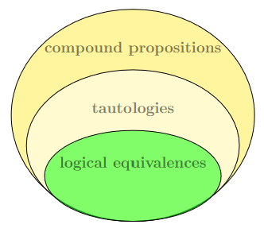

# Proofs With Propositional Logic - 9/27/2021
###### Recall that tautologies are special compound propositions and logical equivalences are a special type of tautology. i.e.

## Rules of Inference
The idea is that we want to be able to show/conclude without error that certain propositions are true given the truthfulness of other propositions.

In other words, we want to prove an **argument** is valid or sound. An argument consists of a **conclusion** drawn from **premises**. The premises are statements (i.e. propositions) which are assumed to be true, and the conclusion - *given the premises* - must be *shown* to be true in order for the argument to be validated or become sound.

A given argument is valid $\longleftrightarrow$ the conclusion cannot be false when the premises are true.

**Rules of inference** are simple arguments which can be used to build larger proofs. Each rule of inference consists of starting premises (the *knowledge base*), which are implicitly joined with conjunction $\wedge$. There is then a horizontal line, and the conclusion next to the *therefore* $\therefore$ symbol.

Here are some useful rules of inference:

### Modus Ponens
Consider the truth table for implication
| $p$ | $q$ | $p \rightarrow q$ |
|-----|-----|------------|
| 
T   | 
T   | 
T
| T   | F   | F
| F   | T   | T
| 
F   | 
F   | 
T

The yellow highlighted row shows that when $p \rightarrow q$ and $p$ are both true, so is $q$. Thus we get ***modus ponens*** ([see this helpful link if you're confused about the name](https://www.csm.ornl.gov/~sheldon/ds/sec1.3.html)):

$$
\begin{aligned}
\text{
	(premise 1)
}
\qquad&{
	p
}\\
\text{
	(premise 2)
}
\qquad&{
	p \rightarrow q
}\\
&\rule{30pt}{1pt}\\
\text{
	(conclusion)
}
\qquad&\therefore{
	q
}
\end{aligned}
$$

The pink highlighted row in the truth table above gives us ***modus tollens***.

### Modus Tollens
$$
\begin{aligned}
\text{
	(premise 1)
}
\qquad&{
	\neg q
}\\
\text{
	(premise 2)
}
\qquad&{
	p \rightarrow q
}\\
&\rule{30pt}{1pt}\\
\text{
	(conclusion)
}
\qquad&\therefore{
	\neg p
}
\end{aligned}
$$

### Simplification
$$
\begin{aligned}
\text{
	(premise)
}
\qquad&{
	p \wedge q
}\\
&\rule{30pt}{1pt}\\
\text{
	(conclusion 1)
}
\qquad&\therefore{
	p
}\\
\text{
	(conclusion 2)
}
\qquad&\therefore{
	q
}
\end{aligned}
$$
Here's the corresponding truth table:
| $p$ | $q$ | $p \wedge q$ |
|-----|-----|--------------|
| <mark>T   | <mark>T   | 
T
| T   | F   | F
| F   | T   | F
| F   | F   | F

### Resolution
$$
\begin{aligned}
\text{
	(premise 1)
}
\qquad&{
	p \vee q
}\\
\text{
	(premise 2)
}
\qquad&{
	\neg p \vee r
}\\
&\rule{30pt}{1pt}\\
\text{
	(conclusion)
}
\qquad&\therefore{
	q \vee r
}
\end{aligned}
$$

### Disjunctive Syllogism (Special Case of Resolution)
$$
\begin{aligned}
\text{
	(premise 1)
}
\qquad&{
	p \vee q
}\\
\text{
	(premise 2)
}
\qquad&{
	\neg p
}\\
&\rule{30pt}{1pt}\\
\text{
	(conclusion)
}
\qquad&\therefore{
	q
}
\end{aligned}
$$

Another form of resolution takes place when $p=r\overset{let}=F$
$$
\begin{aligned}
\text{
	(premise 1)
}
\qquad&{
	p \vee F
}\\
\text{
	(premise 2)
}
\qquad&{
	\neg p \vee F
}\\
&\rule{30pt}{1pt}\\
\text{
	(conclusion)
}
\qquad&\therefore{
	F
}
\end{aligned}
$$

Which subsequently gives us

$$
\begin{aligned}
\text{
	(premise 1)
}
\qquad&{
	p
}\\
\text{
	(premise 2)
}
\qquad&{
	\neg p
}\\
&\rule{30pt}{1pt}\\
\text{
	(conclusion)
}
\qquad&\therefore{
	F
}
\end{aligned}
$$

## Proofs by Deduction
**Proof by deduction** is the method of using deduction as the reasoning for a proof (we can also call proofs that use this method *direct proofs*). We can use rules of inference to help us *deduce* conclusions.

The following is an example. All proofs of deduction follow this basic format. We start with the knowledge base, and then a horizontal line, and then our subsequent conclusions.
$$

Proof.\text{given the premises, deduce $t$ (i.e. proove that $t$ is always true):}\\
\begin{alignat}{1}

1. &\quad \neg &p \wedge q \\
2. &\quad &r \rightarrow p \\
3. &\quad \neg &r \rightarrow s \\
4. &\quad &s \rightarrow t \\

&&\rule{150pt}{1px}\\

5. &\quad \neg &p \qquad \text{simplification on 1}\\
6. &\quad \neg &r \qquad \text{modus tollens on 5 and 2}\\
7. &\quad &s \qquad \text{modus ponens on 6 and 3}\\
8. &\quad &t \qquad \text{modus ponens on 7 and 4}\\
&\therefore & t \qquad \square

\end{alignat}
$$

## Proofs by Contradiction
To execute a **proof by contradiction**, we negation the desired conclusion and then continue concluding new premises until we conclude the premise false. By doing this, we have our contradiction and have proven the desired conclusion false. This is based on the logical equivalence:
$$
p \rightarrow q \equiv (p \wedge \neg q) \rightarrow F
$$

### Proof by Contradiction using Resolution
We use the **rule of inference**, ***resolution***,  to streamline proofs. To do this, follow the proceding steps:
1. Convert all starting premises into Conjunctive normal form (CNF)
	* recall that CNF is defined by the following:
		* terms are *grouped* by disjunction and *separated* by conjunction.
		* negation must be atomic
		* conditional and bi-conditional operators are not allowed
2. Apply **resolution** and/or **disjunctive syllogism** until we conclude the conclusion.
	* recall that disjunctive syllogism is just a special type of resolution.
	* this makes it so that we can more easily and systematically streamline proofs; we *always* use resolution at each step instead of attempting to figure out which rule of inference to apply.

We can automate this process. Here's the intuition behind it:
* We know each argument $A$ is true.
* We want to prove the conclusion $C$.
* We can negate $C$ and then show that $A \wedge \neg C$ is false.
* Because we know that $A$ is true, the only case in which $A \wedge \neg C$ is false is if $\neg C$ is false.
	* i.e. $(A \text{ and } A \wedge \neg C) \rightarrow \neg C$
* If $\neg C$ is false, then $C$ must be true.
	* i.e. $\neg(\neg C)\rightarrow C$

##### Here I say the same thing in a more technical way:
We must show that the compound proposition $A \rightarrow C$ is a **tautology**. With implication ($\rightarrow$), if the LHS is true, it does not tell us anything about the truth value of the RHS. So our goal is to prove that *the right hand side (the conclusions) cannot be false, if the left hand side (the arguments) are true*. Consider the following:

We want to prove that $A \rightarrow C$
$$
\begin{alignat}{1}
1.& \quad & A \rightarrow C\\
2.& \quad \neg & A \vee C \qquad \text{using Conditional-disjunction equivalence}
\end{alignat}
$$

So proving $\text{2}$ is the same as proving $\text{1}$. We can negate 2 and get:

$$
\begin{alignat}{1}
3. & \quad \neg & (\neg A \vee C)\\
4. & \quad & A \wedge \neg C \qquad \text{using De Morgan's Law}

{\qquad\qquad\qquad\quad}

\end{alignat}
$$

This matches the intuition we outlined above.

##### Since $4$ is the negation of $2$, both $4$ and $1$ cannot be a tautology. Remember that $A$ is always true. Thus, if we negate our conclusion and use a simplification with $A$ to show that we find a contradiction, then statement $2$ is a tautology and we have thereby proved our conclusion.

---

Basically:
We assume a proposition is not true, and then find a contradiction that shows we must have been wrong about it being not true. Thus, it has to be true.

So we'll assume $A \wedge \neg C$ is true and then use resolution to find a contradiction, showing $A \wedge \neg C$ is actually false. Thus, $\neg A \vee C$ must be true and subsequently so must $A \rightarrow C$.

---
