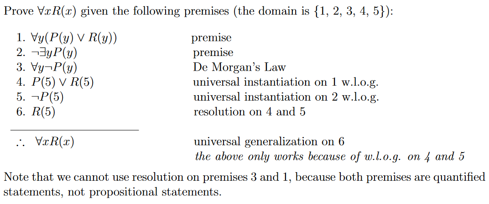

# Proofs With Predicate Logic - 10/4/2021
## Rules of Inference
### Universal Instantiation

**Universal instantiation** states that if $P(x)$ is true $\forall x$, then for a specific instance of the domain, $c$, $P(c)$ must also be true. We write it as:
$$
\begin{alignat}{1}
& \forall x & P(x) \qquad \text{$x$ is universal.}\\

\rlap{\rule{80px}{1px}}&&\\

& \therefore & P(c) \qquad \text{$c$ is an instance}

\end{alignat}
$$

### Universal Generalization

> [Universal generalization] states that $\forall x P(x)$ is true, given the premise that $P(c)$ is true for all elements c in the domain. Universal generalization is used when we show that $\forall x P(x)$ is true by taking an arbitrary element c from the domain and showing that $P(c)$ is true [see the book* for a further explanation].

We write it as:

$$
\begin{align}
&P(c) \qquad &\text{for an arbitrary $c$}\\

&\rule{100px}{1px}& \\

&\therefore \forall x P(x) &

\end{align}
$$

### Existential Instantiation

**Existential instantiation** states that there must be some element $c$ that makes the predicate $P(c)$ true if $\exists x P(x)$. We write it as

$$
\begin{align}
& \exists x P(x) & \\

&\rule{100px}{1px}& \\

&\therefore P(c) & \qquad \text{for some element $c$} \\

\end{align}
$$

### Existential Generalization

**Existential generalization** states that if for some element $c$, $P(c)$ is true, then we can generalize that fact by stating there exists some $x$ such that $P(x)$ is true. We write it as

$$
\begin{align}
& P(c) & \qquad \text{for some element $c$}\\

&\rule{100px}{1px}& \\

&\therefore \exists x P(x) & \\
\end{align}
$$

### Universal Modus Ponens

We get **universal modus ponens** by combining *universal instantiation* with *modus ponens* into a new rule of influence:

$$
\begin{align}
& \forall x (P(x) \rightarrow Q(x)) \qquad &\\
& P(c) & \text{where $c$ is a specific element of the domain}\\

&\rule{100px}{1px} & \\

& \therefore Q(c) &
\end{align}
$$

### Universal Modus Tollens

We get **universal modus tollens** when we combine *universal instantiation* with *modus tollens* into a new rule of inference:

$$
\begin{align}
& \forall x (P(x) \rightarrow Q(x)) \qquad &\\
& \neg Q(c) & \text{where $c$ is a specific element of the domain}\\

&\rule{100px}{1px} & \\

& \therefore \neg P(c) &
\end{align}
$$

### W.L.O.G
Recall that universal generalization works for an *arbitrary* value of the domain. When we use universal instantiation, it requires us to use a quantified statement (a particular case). The problem is that once we've used universal instantiation, we can no longer use universal generalization, since the value we've chosen is now not arbitrary. We get around this with the following annotation:
$$
w.l.o.g.
$$
Which is to say "without loss of generality".

#### Why is this useful?
> propositions cannot contain quantifiers. Thus, we sometimes have to convert our premises from predicate logic to propositional logic – to make use of propositional logic rules of inference – and then back to predicate logic.

See the following example proof:

### Variable Scope
As we went over in lesson 12, variables can be either:
* free
* bound

By convention, any free variables will be replaced with universal quantification ($\forall$) with the justification being universal generalization.

> Thus, if we have a predicate $P(x)$, where $x$ is a variable and not in the domain, then we can convert $P(x)$ to $\forall xP(x)$ by universal generalization.
