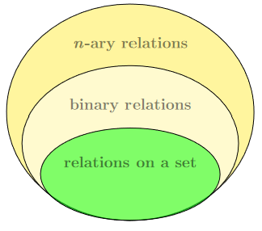
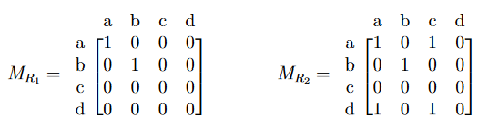

# Relational Algebra and Data Model - 10/8/2021
## Definitions
### Relation
* A **relation** is a set of tuples which is a subset of the **Cartesian product** of some number of sets.
* So take a bunch of sets and get the Cartesian product of them all. Any subset of that is called a relation on those sets. i.e.
$$
\text{A relation $R$ on $n$ sets $A_1,A_2,\dots,A_n$ is defined as any $R$ such that:}\\
R \subseteq A_1 \times A_2 \times \dots \times A_n
$$

#### $n$-ary Relation
An **$n$-ary relation** is a relation on $n$ sets.

##### Binary Relation
If $n=2$, the relation is called a **binary relation**.

e.g. $R \subseteq A \times B$ where $A$ and $B$ are sets.

#### Relations on a (Single) Set
A **relation on a set** $A$ denotes a relation from $A$ to $A$. i.e.
$$
R \subseteq A \times A
$$

### Relational Hierarchy

## Relation Operations
There's 3 key operators for relations:
* union
* intersection
* difference

Remember that relations are just sets, so these are actually the same as they would be for sets. In fact I'm not even going to go over them. Go to `pdf/RelationalAlgebra.pdf` if you really want to see the worked examples.

There ***is*** one key different operator and that's...
### Relational Cross-product
The **cross-product** of two relations is essentially the same as the Cartesian product of two sets, except **order matters** in the relational cross-product since we're dealing with sets of *tuples* instead of just sets (or even sets of sets).

It is denoted the same as the Cartesian product. That is, for 2 relations $R_1$ and $R_2$, their cross-product is written as:
$$
R_1 \times R_2
$$

Consider the following example where $A$ and $B$ are sets, while $R_1$ and $R_2$ are relations:
$$
\begin{align}
A&=\{
	a,b,c,d
\}\\
B&=\{
	1,2,3,4
\}\\
R_1&=\{
	(a,1),(b,2)
\}\\
R_2&=\{
	(c,3),(c,4)
\}
\end{align}
$$
Then the result of the **relation cross-product** $R_1 \times R_2$ is:
$$
R_1 \times R_2 = \{
	(a, 1, c, 3), (a, 1, c, 4), (b, 2, c, 3), (b, 2, c, 4)
\}
$$
Again, because we're dealing with tuples, *order matters*. So $(a,1,c,3)\neq(c,3,a,1)\neq(a,c,1,3)$ etc...

## Matrix Representation of a Relation on a Set
Relations on a set can be represented as a **zero-one matrix** that has a one in each cell that corresponds to each tuple of the relation. This will come in handy down the line when we apply our understanding of relations.

Example:
$$
\begin{align}
A&=\{
	a,b,c,d
\}\\
R_1&=\{
	(a,a),(b,b)
\}\\
R_2&=\{
	(a,a),(a,c),(b,b),(d,a),(d,c)
\}
\end{align}
$$

We can represent $R_1$ and $R_2$ as $M_{R_1}$ and $M_{R_2}$ respectively:

