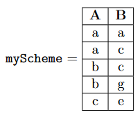

# Relational Algebra 2 - 10/11/2021
## Table of Contents
1. [Relational Data Model](#relational-data-model)
2. [Application to **Datalog**](#application-to-datalog)
3. [Unary Operators](#unary-operators)
4. [**Datalog**: Queries](#evaluating-datalog-queries)
5. [Binary Operators](#binary-operators)
6. [**Datalog**: Rules](#evaluating-datalog-rules)

## Relational Data Model
* The **relational data model** (RDM) is a way that we can use relations to represent data.
* We define a table with a relation
	* Each row in the table represents a tuple in the relation
	* We call each row/tuple an **instance** of the relation.
* We call the sets from which the relation was created the **schema** of the relation.

Here's an example with the binary relation $R$ on sets $A$ and $B$.
$$
\begin{align}
A&=\{
a,b,c,d
\}\\
B&=\{
a,c,e,g
\}\\
R&=\{
(a,a),
(a,c),
(b,c),
(b,g),
(c,e)
\}
\end{align}
$$
* The *relational table* for $R$ is:

| $A$ | $B$ |
|-----|-----|
| $a$ | $a$ |
| $a$ | $c$ |
| $b$ | $c$ |
| $b$ | $g$ |
| $c$ | $e$ |

* The *schema* for $R$ is $A,B$
* There are $5$ *instances* of $R$

### Application to Datalog
Representing a Datalog Program in a relational data model. See the following Datalog program:
```
Schemes:
	myScheme(A, B)
Facts:
	myScheme('a', 'a').
	myScheme('a', 'c').
	myScheme('b', 'c').
	myScheme('b', 'g').
	myScheme('c', 'e').
Rules:
	myScheme('c', X) :- myScheme('a', X), myScheme('b', X).
Queries:
	myScheme(A, 'c')?
	myScheme(X, X)?
```
* This Datalog program defines a scheme, or *schema* called `myScheme` of a relation.
* `myScheme` has two columns: `A` and `B`
	* This correlates to two sets: $A$ and $B$.
* It then defines all the `Facts` or *instances* of the relation.
	* The facts also define the domains for the set specified by the schema columns.
	* $A=\{a,b,c\}$ and $B=\{a,c,e,g\}$
* We can see that the relation defined by the program above is actually the same as the table we made in the example at the beginning of this document.



The only difference here is that we have a label for our table. Notice that $A$ does not include $d$ as it did in the original example. This is because Datalog only defines a domain by that which is specified in the Datalog facts.

## Unary Operators
Each **unary operator** operates on a relational table and returns a new relational table (thus preserving the original). We'll go over three of them:
* select
* project
* rename

### Select, $\sigma$
* Denoted with lower-case sigma, $\sigma$
* The **select** operator allows the specification of a column and desired rows from that column. It then returns a table containing only rows that meet the criteria.
* The syntax is as follows: $\sigma_{\text{Col=Row}}(\text{myScheme})$
	* This *selects* all the rows for which the value of `Row` is the value in the desired column `Col`
	* All column labels specified must be in the schema
		* otherwise the value is undefined
	* There are no constraints on the values
		* if these values are not in the domain, then the result is an empty table.
* Again, the original table is not modified.

For example:


### Project, $\pi$
* Denoted with lower-case pi, $\pi$
* The **project** operator chooses columns rather than rows.
* Duplicate rows are never stored.
	* i.e. if a projected row is the same as another row, it is only stored once in the returned table.
* The syntax is as follows: $\pi_{A_1A_2\dots A_n}$
	* $A_1$ through $A_n$ are sets of a relation.
	* You can specify any number of column labels.
	* All column labels specified must be in the schema.
* You can reorder columns by changing the order you list column labels

Examples:


### Rename, $\rho$
* Denoted with lower-case rho, $\rho$
* The labels of our columns in relational tables are called **attributes**.
* The **rename** operator allows us to change attributes.
* The syntax is as follows: $\rho_{A \leftarrow Z}$
	* $A$ must be in the schema
	* $Z$ cannot already be in the schema
	* Results in a new table in which the column label $A$ is renamed to $Z$.

For example:


## Evaluating Datalog Queries
```
Queries:
	myScheme(A, 'a')?
	myScheme(X, X)?
```
* `myScheme(A, 'a')?`
	* What values are in column $A$ where the second column has the value '$c$'?
	* Using unary operators:

$$
\text{myScheme($A$, ‘$c$’)} = \pi_A (\sigma_{B=\text{‘$c$’}}(\text{myScheme}))
$$


* `myScheme(X, X)?`
	* What are the values of $X$ such that the table contains the same value in the first two columns, $A$ and $B$, respectively?
	* Using unary operators:
		* since we don't have any columns named $X$ we're going to have to rename one. We could rename either but here we rename $A$.

$$
\text{myScheme($X$, $X$)} = \rho_{A \leftarrow X}(
		\pi_A(
				\sigma_{A=B}(
						\text{myScheme}
					)
			)
	)
$$


So we say that the query is satisfiable with the answer $X=a$. Know that not all queries will be satisfiable.

## Binary Operators
There's lot of operators, but we'll focus on these 4:
* union
* intersection
* cross product
* natural join

These are all operators for two relational tables.

See `pdf/RelationalDataModel.pdf` for examples. This is pretty trivial so I'm not going to write all the examples here.

### Union, $\cup$
* Same as union between relations except
	* We do **not** keep duplicate rows
	* The schema of each relational table must be the same


### Intersection, $\cap$
* Same as intersection of two relations except:
	* The schema of each relational table must be the same

### Cross-product, \times
* Same as cross-product of two relations.
* Creates all possible combinations (again: **order matters**).
* Schema must be **completely different**
* If there is a column found in both schema, a *natural join* is performed instead of the cross product.

### Natural Join, $\Join$ or $|\times|$
* Denoted as $|\times|$ or $\Join$
* Joins any two tables on any common columns
* When two tables have the **exact same schema**, the result of a natural join is the same as an intersection.
* When two tables have **unique schema**, the result of the natural join is the same as the cross product.
* When two tables only share **some common schema** it performs *intersection* on the common schema columns and then appends the relevant rows from the other columns.
* The ordering of the columns is irrelevant
	* This one can be confusing so here are some examples:

e.g. 1


e.g. 2


e.g. 3 (column ordering doesn't matter)


## Evaluating Datalog Rules
