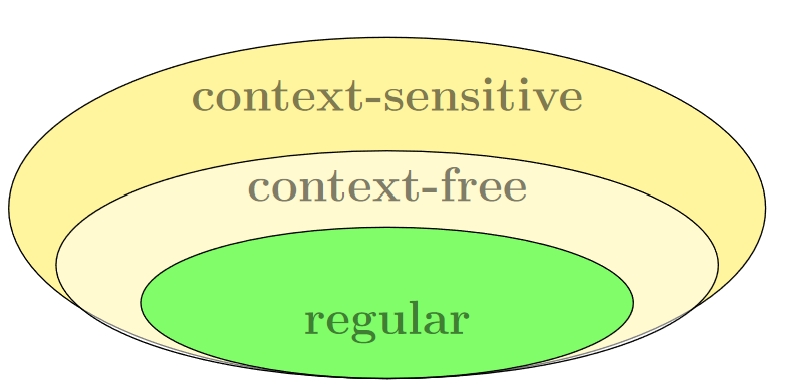
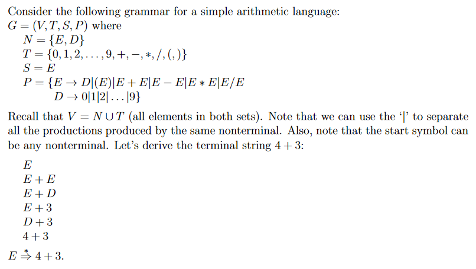

# Chomsky Grammars - 9/10/2021
## Definition
**Grammars** are more expressive languages than regular languages. They can generate all languages that regular expressions can, but regular expressions cannot generate all languages that grammars can.

Recall the definitions of:
* a vocabulary or alphabet $V$ of symbols
* a word or sentence over V is a string of finite length of elements in $V$
* the empty string $\lambda$ (sometimes $\epsilon$) is the string containing no symbols
* the set of **all words** over $V$ is denoted by $V^*$

## Phase-Structured Grammar
A phrase-structured grammar $G=(V, T, S, P)$ where
* $V$ is a vocabulary
* $T$ is a set of **terminals** (all possible symbols in all strings generated by the grammar)
* $S\in{V}$, the starting nonterminal
* $P=\{A\rightarrow{}a, \dots\}$ a set of production rules (left-hand side **produces** right-hand side)
	* We can use '$|$' to denote all possible productions produced by the same nonterminal. Think of it as the word 'or'.
		* e.g. $\{S \rightarrow \lambda|1|2\}$ means $S$ can produce $\lambda$ or $1$ or $2$

### Other definitions:
* $N$ is the set of non-terminals, $V-T$ (all symbols $s\in{}V \text{  s.t.  }s \notin{}T$)
	* Think of elements of N as intermediary variables in **derivation**.
* $V=N\cup{}T$

## Definition of a Language Generated from a Phrase-Structured Grammar
For a phrase-structured grammar $G$, we say the language generated by $G$ is $L(G)$, which is the set of all strings of terminals that are **derivable** from the starting state $S$. I.e. (and just pretend the single arrow down there is a double arrow like this one: $\Rightarrow$)
$$
L(G)=\{w\in{T^*|S\xrightarrow{*}w}\}
$$

* The starred arrow just means that any number of productions could have gone into producing the right-hand side, when starting from the left-hand side.
* The process of *derivation* is starting at the start symbol $S$ and then using the production rules until there are only terminals in the resulting string.

## Context-Free Grammars (Type 2 Grammars)
### Definition
Context-free grammars are a subset of all phrase-structured grammars. They are all grammars such that the left-hand side of each production rule is a *single*, *nonterminal*. Grammars who have production rules with more than one non-terminal on the left-hand side are called **context-sensitive** (**Type 1** grammars) (e.g. $aAb \rightarrow{} \dots$). See the following visualization:



## Linking Grammars and Languages
For a given language $L$ and context-free grammar $G$ which generates that language:
* The vocabulary of $L$ is the same as the set of terminals, $T$, of $G$
* The strings of $L$ are the terminal strings of $G$

It's a bit confusing I know but stay with me. The key to understanding grammars are the productions.

## Recognizing Context-Free Languages
Finite-state machines are not quite enough to recognize languages. Instead we'll use something called **pushdown automata**. They are essentially finite-state automata but they can push and pop information to the stack at each transition, which is key in recognizing context-free languages.

## Examples
---
Taking a symbol $a^n$ to mean $a$ concatenated to itself $n$ times, consider the language:
$$
L=\{0^n1^n|n\ge0\}
$$
We can't do this with regular expressions because we have no concept of exponents. But with a stack we can push a $0$ each time we read a zero, and pop a zero each time we read a $1$, and see if we come up with an empty stack at the end to see if the criteria are met (that is, there are the same number of $0$s and $1$s). Let's define a context-free grammar to generate L:
$$
G_L=(V, T, S, P)\text{ where}
$$
$V=\{S, \lambda, 0, 1\}$<br>
$T=\{\lambda, 0, 1\}$<br>
$S=\{S\}$<br>
$P=\{S \rightarrow 0S1, S \rightarrow \lambda\}$<br>

So to attempt to **derive** all possible **terminal strings**, we can do the following:

|string before|production|string after|terminal string?|
|-------------|----------|------------|----------------|
|$S$|$S \rightarrow \lambda$|$\lambda$|$\checkmark$|
|$S$|$S \rightarrow 0S1$|$0S1$||
|$0S1$|$S \rightarrow 0S1$|$00S11$||
|$\dots$|$\dots$|$\dots$||
|$0\dots{}0S1\dots{}1$|$S \rightarrow \lambda$|$0 \dots 01 \dots 1$|$\checkmark$|

And thus we see that $G_L$ produces the language
$$
L=L(G_L):\{\lambda, 01, 0011, 000111, \dots\}
$$

---
This one is mad weird



---

## Backus-Naur (or Normal) Form
BNF is a standardization for the identification of terminals and nonterminals in a grammar. It was created to support the development of programming lanugages.
* Nonterminals are wrapped in angle brackets e.g. `<id>`
* Terminals are not in angle brackets e.g. `id`
* Production rules use `::=` instead of \rightarrow

e.g.
```py
<definition> ::= <type> <id> = <idOrint>;
<type>       ::=   int | byte
<idOrint>    ::=  <id> | <int>
<id>         ::= a | b | c | ... | x | y | z
<int>        ::= 0 | 1 | 2 | ... | 9
```

Here, terminals
$$
T=\{\texttt{int}, \texttt{byte}, \texttt{'='}, \texttt{';'}, \text{all letters of the alphabet, digits from '0' to '9'}\}
$$
The non-terminals are
$$
N=\{\texttt{<definition>}, \texttt{<type>}, \texttt{<idOrint>}, \texttt{<id>}, \texttt{<int>}\}
$$
And $S$ is usually just the first nonterminal, but will be specified otherwise.

#### BNF example
Derive `int b = 3` from the grammar specified above
```py
<definition>
<type> <id> = <idOrint>; # <definition> ::= <type> <id> = <idOrint>;
int <id> = <idOrint>; # <type> ::= int | byte
int b = <idOrint>; # <id> ::= a | b | c | ... | x | y | z
int b = <int> # <idOrint> ::= <id> | <int>
int b = 3; # <int> ::= 0 | 1 | 2 | ... | 9
```

Derive `int a = b;`
```py
<definition>
<type> <id> = <idOrint>;
int <id> = <idOrint>;
int a = <idOrint>;
int a = <id>;
int a = b;
```

Derive `byte z = 1;`
```py
<definition>
<type> <id> = <idOrint>;
byte <id> = <idOrint>;
byte z = <idOrint>;
byte z = <int>;
byte z = 1;
```

## Example: Simple Arithmetic Language
$$
G_L=(V, T, S, P)\text{ where}
$$
$N=\{E, D\}$<br>
$T=\{0, 1, 2, \dots, 9, +, -, *, /, (, )\}$<br>
$S=\{E\}$<br>
$P=\{E \rightarrow D|(E)|E+E|E-E|E*E|E/E,D \rightarrow 0|1|2|\dots|9\}$<br>

* Strings generated by a grammar (strings in a language) can only consist of elements of $T$ i.e. **terminals**.
* notice how we have $N$ up there and not $V$. Remember that $V=N \cup T$.
	* So if we have 2 of the three, we can derive the third. $N$ is just usually more useful.
	* You can also infer nonterminals from your productions (since we are using *context-free* grammars).
	* convention is that nonterminals are all capital letters, and terminals are lowercase, numbers, and symbols.

In BNF:
```
<E> ::= <D> | (<E>) | <E>+<E> | <E>-<E> | <E>*<E> | <E>/<E>
<D> ::=  0  |   1   |    2    |   ...   |    8    |    9
```

See if you can generate `9*3+2-1`
```py
<E>
<E>*<E>
<E>*<E>+<E>
<E>*<E>+<E>-<E>
<D>*<D>+<D>-<D>
9*3+2-1
```
ez money
