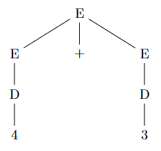
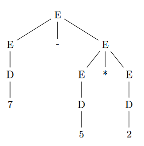
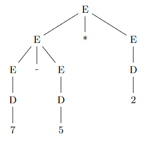
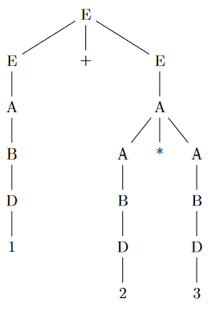

# Grammars: Parse Trees & Ambiguity - 9/13/2021
## Parse Trees
### Definition
From Dr. Goodrich:
> Building a parse tree for a string is all about figuring out which production will turn nonterminals into terminals in a way that matches the string.

... yeah real helpful. A parse tree is a tree that **identifies** the production rules used to derive a valid string. They also give us a way to **evaluate** valid strings in a language. Parse trees are evaluated from bottom to top.

Recall our simple arithmetic language from before:
$$
G_L=(V, T, S, P)\text{ where}
$$
$N=\{E, D\}$<br>
$T=\{0, 1, 2, \dots, 9, +, -, *, /, (, )\}$<br>
$S=\{E\}$<br>
$P=\{\\E \rightarrow D|(E)|E+E|E-E|E*E|E/E,\\D \rightarrow 0|1|2|\dots|9\\\}$<br>

Let's derive the terminal string $4+3$ using a parse tree:



## Ambiguity
When we have a grammar that allows for multiple parse trees for the same terminal string it is said to be **ambiguous**. Any grammar that has more than one possible derivation (or parse tree) for at least one terminal string is then an ambiguous grammar.

For example, we can derive $7-5*2$ with multiple trees:




But evaluating from top to bottom gets us
1. $7-(5*2)=-3$
2. $(7-5)*2=4$

You've seen this already with using difference C++ compilers.

## Fixing Ambiguity
There are 3 cases of ambiguity:
1. Precedence
	* defines the order of operations
2. Left associativity
	* defines when operators should be evaluated from left to right
3. Right associativity
	* defines when operators should be evaluated from right to left

The easiest example for us is the order of operations in mathematics (here, precedence is just an arbitrary number it doesn't mean anything):
|operation|precedence|associativity|
|---------|----------|-------------|
|P|1|Left|
|E|2|Right|
|M, D|3|Left|
|A, S|4|Left|

So when we have something like $3*4 / 6$ we just do left to right, but if we have $5\text{^}3\text{^}4$ we do right to left i.e. $5^{3^4}$. Ah yeah. So how do we program this into a grammar?

### Programming Precedence Into a Grammar
We evaluate our parse trees from the bottom upwards. So when we're writing our productions, we have to add non-terminals such that we must derive operations of lower precedence first. I.e. We push higher precedence operators lower in the tree, e.g.

$P = \{\\
	E \rightarrow A | E+E | E-E,\\
	A \rightarrow B | A*A | A/A,\\
	B \rightarrow D | (E),\\
	D \rightarrow 0 | 1 | 2 | \dots | 9,\\
	\}$

Thus, if we were to parse something like $1+2*3$ we would be *forced* to do the following:
 $E \rightarrow E+E \rightarrow E+A \rightarrow E+A*A \rightarrow D+A*A \rightarrow 1+2*3$

 And there's no other way we could have done it to produce a different parse tree because, if the $+$ operator exists in the terminal string, it must be produced *first* (or second to $-$).

 Since we have **enforced precedence**, we have a non-ambiguous parse tree:

 

### Programing Associativity into a grammar
Once again, we have to introduce new nonterminals to fix associativity ambiguity. We have a general pattern for this.
* Right recursion (in a production) leads to right associativity (in a binary operation).
* Left recursion leads to left associativity.
	* Left recursion enforces left associativity by pushing the first character of the right-hand side of the production lower in the parse tree than the last character of the right-hand side.
	* Works the same for right associativity except, ya know, right.

So we'll have

$\text{(Left Associativity) }Z \rightarrow Zxxx$<br>
$\text{(Right Associativity) }Z \rightarrow xxxZ$<br>

So for our arithmetic grammar we've been developing, we will need to change the nonterminal on the right side of our productions to a new nonterminal that will be lower in the parse tree. That way if we want to use the same nonterminal, it has to be used on the left. We'll add exponentiation as well (which uses right associativity) to illustrate this point better. E.g.

$P = \{\\
	E \rightarrow A | E+A | E-A,\\
	A \rightarrow B | A*B | A/B,\\
	B \rightarrow C | C\text{^}B,\\
	C \rightarrow D | (E),\\
	D \rightarrow 0 | 1 | 2 | \dots | 9,\\
	\}$

## Practice
HW #2 Q 5

```py
<time>    ::= <hours>:<minutes> <amOrpm>
<amOrpm>  ::= <am> | <pm>
<hours>   ::= 1  | 2  | 3  | ... | 12
<minutes> ::= 00 | 01 | 02 | ... | 59
<am>      ::= am
<pm>      ::= pm
```
