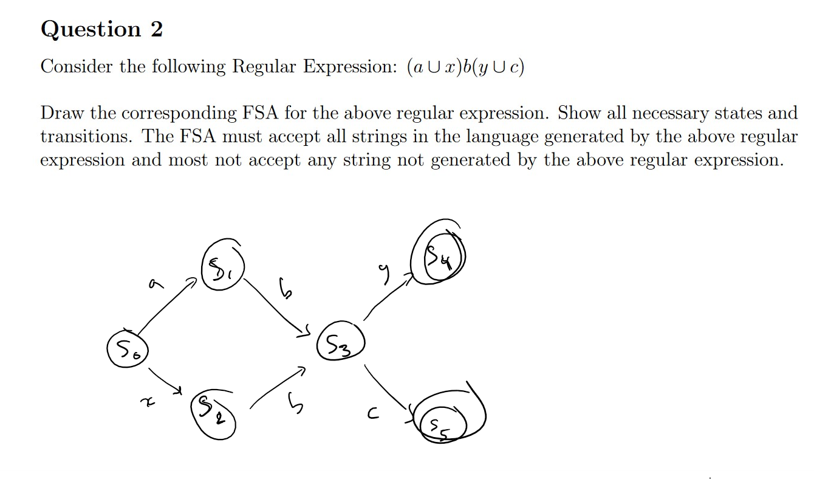

# Midterm 1 Prep
## Question 1
$$
\text{
	( yx* $\cup$ xy* )z
}
$$

## Question 2

## Question 5

| - - - | ! | a | b | c | # |
|-------|---|---|---|---|---|
| A     |
| B     |
| !     |
| a     |
| b     |
| c     |
| #     |
