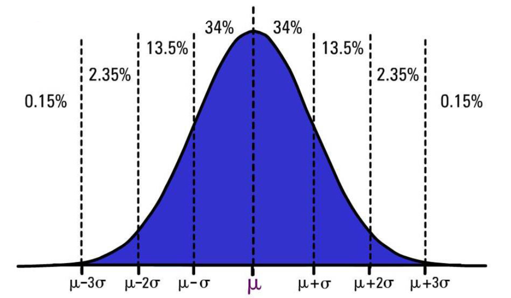

# STAT 121 Lesson 12 - Normal Distribution and Standard Scores
## Normal Distributions
A famous family of density curves. All normal distributions curves are probability density curves, but not all PDCs are normal distributions.

## Notation Differences
There's different notation for density curves and histograms. See the following table:
| Characteristic | Name | Density Curve (population) Notation | Histogram (sample) Notation |
|---------------|------|-------------------|-----------------|
| Center        | Mean | $\mu$ (mu)        | $\bar{x}$       |
| Spread | Standard Deviation | $\sigma$   | $s$             |

## Characteristics of a Normal Distribution
* Symmetric
* Bell-shaped
* One peak
* Mean = Median
	* $\mu$ is a point of symmetry in a normal distribution.
* $\sigma$ is the distance from the mean to the point where the curve begins to fall less steeply
	* i.e. the average distance all points are from $\mu$
	* i.e. $x$ value of the point of inflection

> Every normal curve has inflection points at exactly 1 standard deviation on each side of the mean. [source](https://courses.lumenlearning.com/wmopen-concepts-statistics/chapter/introduction-to-normal-random-variables-2-of-6/)

### 68-95-99.7 Rule
For **normally distributed** sample data (roughly symmetric and mound-shaped):
* Approximately 68% of observations fall within 1 SD of the mean.
* Approximately 95% of observations fall within 2 SDs of the mean.
* Approximately 99.7% of observations fall within 3 SDs of the mean.

### Cumulative Percentages
Cumulative percentages just means the area to the left of a given value.

## Standardization
When dealing with multiple normal distributions, it helps to **standardize** them so we can more easily compare them. In a standardized normal distribution or **standard normal distribution**,
$$
\mu=0\\
\sigma=1
$$
To convert a normal distribution to a *standard* normal distribution, we use a **standard normal variable** $z$. If $x$ is normally distributed with mean $\mu$ and standard deviation $\sigma$,
$$
z=\frac{x-\mu}{\sigma}
$$
We call this our $z\text{-score}$. It gives us the number of standard deviations above or below the mean of a normal distribution an observation is.
#### Example
Birth weights of full-term babies are approximately normally distributed with $\mu=3485\text{g}$ and $\sigma=425\text{g}$. Thus:
* A baby who weighs $4122.5\text{g}$ is
$$
z=\frac{4122.5-3485}{425}=1.5\text{ standard deviations from the mean}
$$
* A baby who weighs $3166.25\text{g}$ is
$$
z=\frac{3166.25-3485}{425}=-0.75\text{ standard deviations from the mean}
$$
######<u>Note</u>: a negative $z\text{-value}$ denotes deviation to the left of (or *below*) the mean, while a postive $z\text{-value}$ denotes deviation to the right (or *above*) the mean.

## Learning Outcomes
* Distinguish the different symbols for population parameters and sample statistics.
* Describe the characteristics of a normal distribution
* Describe the effect of changing the mean and standard deviation on the normal curve
* Use the 68-95-99.7 Rule to answer normal probability problems
* Describe the characteristics of the standard normal distribution
* Convert the value of a normally distributed variable to a standard normal variable or z- score
* Interpret a standard score or z-score in context
