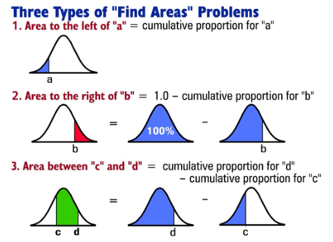

# STAT 121 Lesson 13 - The Standard Normal Distribution & Its Applications
## Standard Normal Distribution
### Characteristics
* Normal density curve with:
$$
\mu=0\\
\sigma=1
$$
* Area under curve defines (all of the following, which are synonymous):
	* Proportion
	* Percentage
	* Probability
* A standard normal distribution is formed by taking the $z\text{-score}$ for each value of the random variable $x$ of a non-standard normal distribution.
* Recall a $z\text{-score}$ is defined for a given random variable $x$ and the $\mu$ and $\sigma$ of its density curve,
$$
z=\frac{x-\mu}{\sigma}
$$
### Finding Proportions
For proportions that can't be found easily using the $68\text{-}95\text{-}98.7$ rule, we'll just use a table. The **table of standard normal probabilities** is a table of prederived values. For a given value on the table, it will give us the area to the **left** of the variable.

##### 3 Types of Finding Proportion Problems:
There's 3 main types, they're pretty simple to solve but here's a quick guide:

##### Getting $x$ value from $z$:
Do some algebra and you get:
$$
x=z\sigma+\mu
$$
