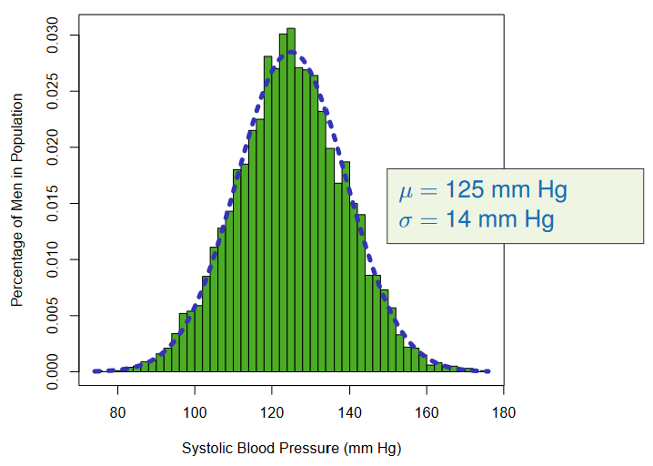
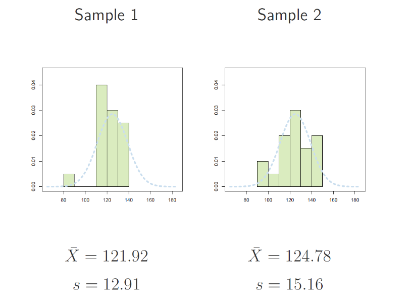

# STAT 121 Lesson 14 - Sampling Distribution of $\bar{X}$ and the Central Limit Theorem

> Sampling distributions are important in statistics because they provide a major simplification en route to statistical inference. More specifically, they allow analytical considerations to be based on the probability distribution of a statistic, rather than on the joint probability distribution of all the individual sample values.

## Term Review
| Term | Definition |
|------|------------|
| Population | The entire group of individuals that is the target of our interest.   E.g. All BYU full-time students
| Sample | A subgroup of the population from which we obtain information.   E.g. 170 BYU full-time students
| Parameter | A numerical fact about the population.   E.g. $\mu$, the average GPA of all full-time BYU students
| Statistic | A numerical fact about the sample.   E.g. $\bar{x}$, the average GPA of the 170 students in our sample

## New Notation:
| Notation | Meaning |
|----------|---------|
| $\mu$ | population mean
| $\sigma$ | population standard deviation
| $\bar{X}$ | sample mean (i.e. the mean of a taken sample)
| $s$ | sample standard deviation
| $\text{Mean($\bar{X}$)}$ | mean of the sampling distribution of $\bar{X}$
| $\text{SD($\bar{X}$)}$ | standard deviation of the sampling distribution of $\bar{X}$

## The Sampling Distribution of $\bar{X}$
**def.** The sampling distribution of a sample mean $\bar{X}$ is a theoretical probability distribution. It describes the distribution of:

$(1)$ all sample means $(2)$ from all possible random samples $(3)$ of the **same size** $(4)$ taken from the **same population**.

**Process to create sampling distribution of a population:**
1. Take some number of random samples $N$ from the population, each of size $n$.
	* Theoretically, to get a complete sampling distribution, $N \rightarrow \infty$
2. For each of the samples taken:
	* plot the sample values
	* calculate the sample mean $\bar{X}$
	* calculate the sample standard deviation $s$
3. Take the $N$ sample means collected and plot their distribution. i.e. plot the sampling distribution of the sample mean.

---

**e.g.** See the following distribution:

From this we take $N=500$ samples of $n=20$ subjects. Here are 2 plots representing 2 of those $500$ samples:

We then plot the **distribution of all the sample means**  $\bar{X}$ that we calculated and we get:

What we find as we repeat this process with increasingly higher values for $n$ is that $\text{Mean($\bar{X}$)}$ stays the same, while $\text{SD($\bar{X}$)}$ decreases. Like so:

We find that this happens *even when the original distribution is not even closely normally distributed*. For example, see this right-skewed distribution and it's accompanying sample distributions:

---

##### Variations in sample mean distributions are a result of changes to the size of each sample $n$, *NOT* the number of samples $N$.

This thought leads us to the **Central Limit Theorem**
## Central Limit Theorem
**def.** If you take a large stratified random sample of size $n$ from any population then the shape of the sampling distribution of $\bar{X}$ is approximately **normal**.
* The shape gets more normal as $n$ increases.
* $n>30$ is considered to be **large**.
* **CLT** allows us to use the standard normal table to compute approximate probabilities associated with $\bar{X}$.

### Attributes of the Sampling Distribution of $\bar{X}$
For a given distribution of $\bar{X}$ for all possible *stratified random sample*s of size $n$ from a population with mean $\mu$ and standard deviation $\sigma$,
* Center
	* Mean of sampling distribution of $\bar{X}$ is $\mu$
* Spread
	* Standard deviation of sampling distribution of $\bar{X}$ is $\frac{\sigma}{\sqrt{n}}$
* Shape
	* Case 1: Population is normal
		* The shape of the distribution of $\bar{X}$ is normal.
	* Case 2: Population is non-normal
		* By the Central Limit Theorem, the shape of the distribution is approximately normal when $n$ is large (i.e. $n>30$).
