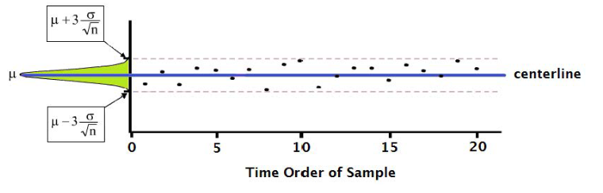

# STAT 121 Lesson 16 - Statistical Process Control
**def.** Statistical Process Control (SPC) is a method of quality control which employs statistical methods to monitor and control a process.

* It helps ensure that a process operates **efficiently**, producing more specification-conforming products with less waste.
* Key tools used:
	* control charts
	* continuous improvement focus
	* design of experiment
	* Central Limit Theorem

In a process, we use statistics to monitor process variables over time to decide if variability is consistent with natural variation.
* If consistent, we continue the process
* If inconsistent, we:
	1. stop the process
	2. find the cause of the unnatural variation
	3. fix the problem
	4. resume process

### What is a Process in Statistics?
**def.** A process is a sequence of interconnected steps in producing a product or service.
* All processes have **natural variation** (i.e. common causes or normal sources of variation)
	* e.g. raw material, human performance, equipment performance, measurement
* All processes are occasionally susceptible to **unnatural variation** (i.e. special causes or assignable sources of variation)
	* e.g. Bad batch of raw material, broken machine, poorly trained operator

## Definitions
| Term | Definition |
|------|------------|
| $\bar{X}$ Control Chart | A statistical tool for monitoring an input or output of a process that has variation. It clearly displays unnatural variation, which implicates a problem has occurred.
| **In** Control Process | A process whose output exhibits only natural variation over time. |
| **Out of** Control Process | A process which exhibits unnatural variation over time. |

## Control Charts
A control chart uses the central limit theorem to determine if a process is in **statistical control**.

##### To construct a control chart:
For a sequence of samples of size $n$ from a population with mean $\mu$ and standard deviation $\sigma$.
1. Draw axes
	* $x\text{-axis}$ represents the **time order** of the sample
		* This just means that you enumerate the samples in the order they were taken.
	* $y\text{-axis}$ represents the means of the sampling distributions.
2. Draw horizontal centerline at $\mu$
3. Draw **horizontal control limits** at $\mu \pm 3 \frac{\sigma}{\sqrt{n}}$
	* These describe the bounds of a process that is **in control**.
4. Plot the means $\bar{X}$ from samples of size $n$ against time.

It should look like this:

### Out-of-Control Signals
If one of the following conditions is met, the process is **out of control** (not *in* control). This is the point where SPC would have us stop the process to look for a cause. The signals are:
1. There exists **one point** above the upper control limit or below the lower control limit.
2. There exists a run of **9 or more points in a row** on the same side of the centerline.
	* This is as unlikely as one point outside the control limits.
