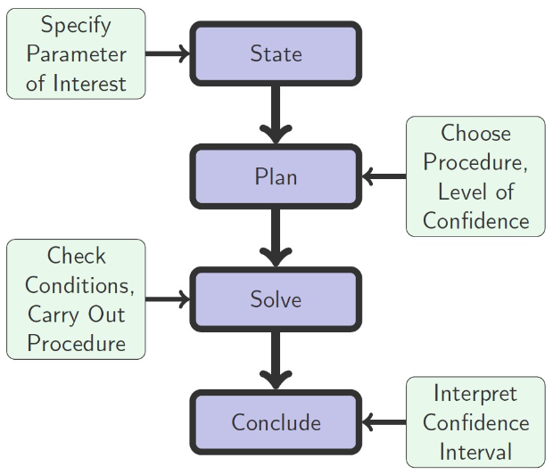
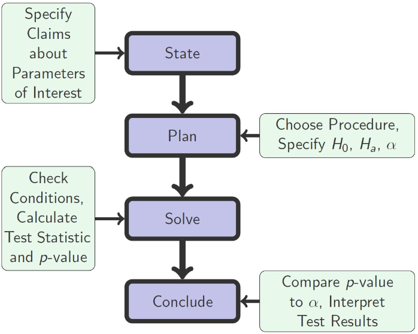

# STAT 121 Lesson 17 - Introduction to Inference
Recall these definitions:
| Term | Definition |
|---|---|
| Parameter | A numerical fact about the population.   E.g. $\mu$, the average GPA of all full-time BYU students
| Statistic | A numerical fact about the sample.   E.g. $\bar{x}$, the average GPA of the 170 students of a sample taken from all BYU students.

## Statistical Inference
This is the fourth and final step in the exploratory data analysis cycle we talked about in [lesson 2](lesson_2_big_picture_exploratory_data_analysis.md)

**def.** Drawing conclusions about a population (**parameters**) based on data from a sample (**statistics**) with a measure of uncertainty.

### Types of Statistical Inference
* Confidence Interval
	* **Point estimate** +- measure of uncertainty

* Test of Significance
	* Reject a null-hypothesis if $p<\alpha$
	* $\alpha$ is some predetermined value
	* $p$ is the likelihood that you would get the result you got if the null-hypothesis was true.
	* Essentially stating: if the result we got is unlikely enough (if $p<\alpha$), then the assumptions we made about it (null-hypothesis) are almost definitely false.

## Types of Conclusions to Make About a Parameter
* Point Estimation
* Interval Estimation
* Hypothesis Testing

### Point Estimation
Point estimation gives a single value as an estimation.
* Quantitative Data Example:
	* Based on a sample of $n = 47$ policies, we estimate that the average premium at this agency is approximately $$1800$.
* Categorical Data Example:
	* Based on a sample of $n = 144$ households, we estimate that the proportion of infected bamboo cutting boards is approximately $10.4\%$.

#### Some definitions:
| Term | Definition |
|---|---|
| Estimator | A general statistic that estimates the parameter. e.g. the estimator of the population mean $\mu$ is the sample mean $\bar{X}$
| Estimate | A specific value of an estimator.

#### $\bar{X}$ as an Estimator of $\mu$
In order to be "good", sampling needs to be done **randomly**. If this is so then,
* On average, $\bar{X}$ wll give us the right answer.
	* This is *unbiasedness*
* As sample size increases, the accuracy of $\bar{X}$ increases.

### Interval Estimation
Interval estimation gives a range of values as an estimation.
* Quantitative data example:
	* Based on a sample of $n = 47$ policies, we estimate that the average premium at this agency is **between** $$1,700$ and $$1,900$.
* Categorical data example:
	* Based on a sample of $n = 144$ households, we estimate that the proportion of infected bamboo cutting boards is **between** $8.4\%$ and $12.4\%$.

### Hypothesis Testing
Hypothesis testing also gives a range as an estimation, but does so by testing a hypothesis. That is that we assume a hypothesis to be true, then attempt the same study and determine whether the difference in our result is statistically significant.
* Quantitative data example:
	* The insurance agent believes that the average premium at her agency is $$2500$. Based on the sample $n = 47$ claims, we found that the average premium was $$1800$. This statistic, therefore, provides evidence that the average premium is less than $$2500$. That is, $\bar{X} = \$1800$ is an outcome that would rarely happen if the average was indeed $$2500$.
* Categorical data example:
	* Researchers believe that the proportion of infected bamboo cutting boards is $2\%$. Based on a sample of $n = 144$ households, we found that the proportion of infected bamboo cutting boards was $10.4\%$. This statistic provides evidence that the proportion of infected bamboo cutting boards is greater than $2\%$.

## Conclusions for Inference
There's lots of conditions but these are the two most prevalent.
* Randomness in data collection or independence condition
	1. Check whether the data came from random samples or randomized experiments
	2. Check for repeated measures on an individual which violates this condition
* Normality of populations or sampling distributions
	1. Check for normality of population distribution by making sure the plot of data is symmetric, has a single peak, and has no outliers
	2. Check for a sufficiently large sample size for the test statistic to follow a normal or desired distribution. The definition of large sample size will differ depending on the procedure and the presence of extreme skewness and outliers.
