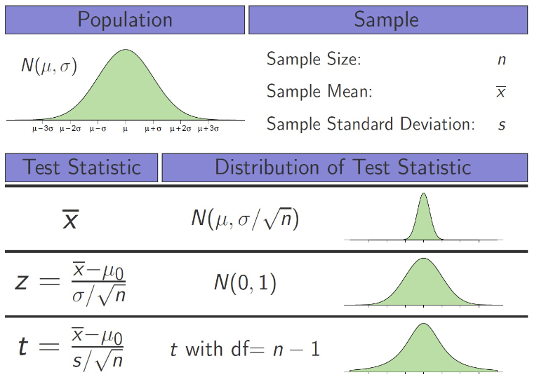

# STAT 121 Lesson 21 - One-sample $t$-test for means
## Student's $t$-distribution
**def.** If $(1)$ Data has been gathered using SRS (stratified random sampling), $(2)$ the $\sigma$ (standard deviation) of the population as a whole is unknown, and $(3)$ the population as a whole is normally distributed **or** the sample size of the SRS is large enough ($n>30$), then the **sampling distribution** of:
$$
\frac{\bar{X}-\mu}{s/\sqrt{n}}
$$
has a $\text{Student's $t$-distribution }$ with $n-1$ degrees of freedom.

For a test of significance that's:
* Take the sample mean, subtract it from the proposed mean, multiply the result by the square root of the size of the sample, and divide it all by the sample's standard deviation.

For the **degrees of freedom**, just think of it as different *versions* of the $t$-distribution. So depending on $n$, the distribution will look a bit different, and we use that to get what we want.

This is useful in performing statistical inference (both with confidence intervals and significance tests).

### Comparison to other distributions
See the following chart comparing the normal distribution, standardized normal distribution, and student's $t$ distribution.

## One-sided vs Two-sided $p$ value
One-sided:
* one-sided tests determine if a sample mean is **either** significantly greater than or significantly less than the proposed mean.
* e.g.
	* $H_a: \mu < 128$
	* $H_a: \mu > 128$

Two sided:
* two-sided tests determine if a sample mean is **both** significantly larger and significantly greater than the proposed mean.
* e.g.
	* $H_a \neq 128$

## Remember the 4-step process for inference:
1. State
	* Identify the question to be answered, or the problem to be solved.
2. Plan
	* Decide which procedure to follow
	* Determine $H_0$, $H_a$, and $\alpha$
3. Solve
	* Collect Data
	* Check Conditions
	* Calculate Test Statistic and $p$-value(s)
4. Conclude
	* Compare $p$-values with $\alpha$
	* Make a decision
	* Declare it in context
