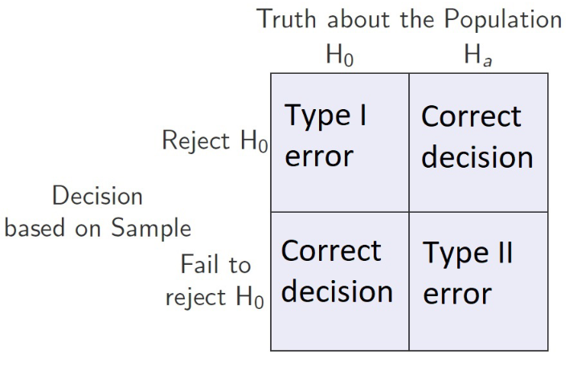
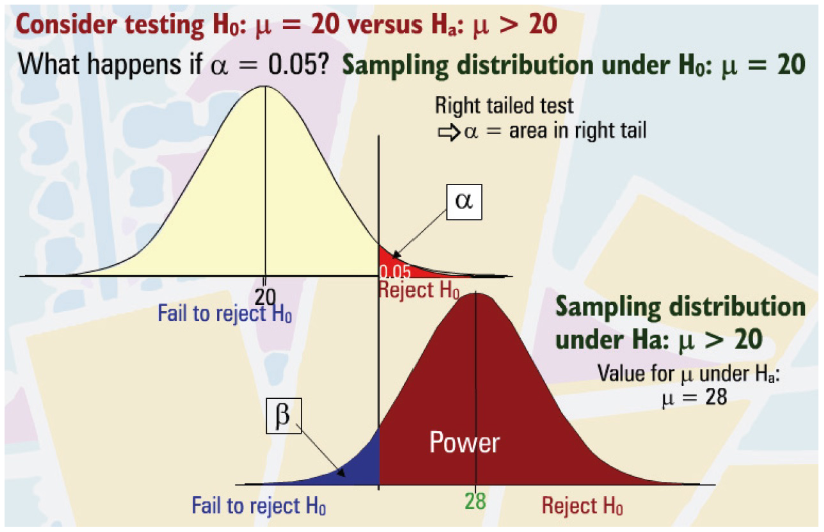

# Lesson 23 - Error Probabilities and Power of a Test
## Defining Safety and Power of tests
* Safety:
	* **def.** A study with a low risk of a false positive is called *safe*.
		* Type 1 Error
* Power:
	* **def.** A study with a low risk of a false negative is called *powerful*.
	* Type 2 Error
* For determining false positives and false negatives: treat $H_a$ as being positive

We only get **both** of these conditions when you have lots of money in the planning stage of the study.

## Error Types

* Type 1 Error:
	* **def.** Reject $H_0$ when it is true.
* Type 2 Error:
	* **def.** Fail to reject $H_0$ when it is false.

## Notation for Probabilities
#### $\alpha$
* Level of significance
* Probability of getting a type 1 error
* Probability of Rejecting $H_0$ when it is true.

#### $\beta$
* Probability of getting a type 2 error
* Probability of failing to reject $H_0$ when it is false

#### Power
* Probability of rejecting $H_0$ when it is false
* $1-\beta$

See the following image:

When keeping $n$ the same:
* You can see how if $\alpha$ were to decrease, it would increase $\beta$, thereby decreasing power.
* On the flip side, an increase in increasing $alpha$, we would see a decrease in $\beta$ and an increase in power.
* $\alpha \propto \frac{\text{Power}}{\beta}$

When keeping $\alpha$ the same:
* Furthermore, increasing the sample size $n$ **increases** power and **decreases** $\beta$.
* $n \propto \frac{\text{Power}}{\beta}$

When keeping $\alpha$ and $n$ the same:
* The effect size $|\bar{x} - \mu_0| \propto \frac{\text{Power}}{\beta}$

Effect size is easier to detect when sample size is larger and data is not as variable.

## Determining Sample Size
* Smaller $\alpha$ requires larger $n$
* Depending on the size of the effect, higher $\text{Power}$ requires larger $n$

## Influences of Power
* Effect Size
* Variability in observations
* Chosen significance level $\alpha$
* Sample size $n$
