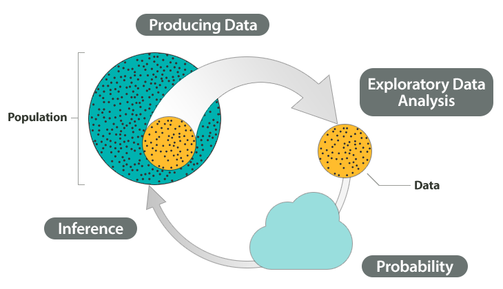

# STAT 121 - Lesson 2 - The Big Picture
Statistics is about converting data into useful information. We **collect data**, **summarize data**, and **interpret data**. This is the process of statistical problem solving.

## The Process of Statistics
### 1. Producing Data
First, we identify the group we want to study and call it the **population**. When the population is too large to study entirely, we collect data from a subgroup of the population and call that group a **sample**. When we collect data from this sample, it's called **producing data**.

When using a sample, it must be chosen such to represent the population well.

### 2. Exploratory Data Analysis
This step involves taking the collected data and summarizing it in a meaningful way.

1. Organize and summarize data.
2. Discover features, patterns, striking deviations from patterns.
3. Interpret patterns in context.
4. Single variable patterns (distribution) and two variable patterns (relationship).
  * distribution of a variable: summary of data one variable at a time.
    * What values does the variable take?
    * How often do these values occur?
5. Visual displays and numerical summaries

### 3. Probability
Our sample will never be a perfect representation of the population as a whole. We acknowledge and examine this difference using **probability**.

### 4. Inference
Using what we've discovered from our sample, we draw conclusions about our data. This step is known as **inference**. We should usually provide a margin of error (i.e. *uncertainty* in your conclusion).

### Visual Model

