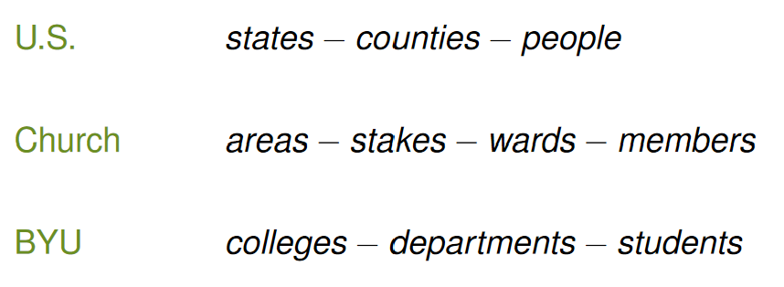

# STAT 121 Lesson 3 - Collecting Data - Sampling
## Why sample?
Compared to a census:
 * Practical
 * Cheap
 * Can be more accurate (larger sample sizes introduce human error)
e.g. they take a blood sample not a blood census

For sampling to work:
1. explicitly describe the population
2. explicitly describe variable
3. select representative sample
	 * how?

## Population vs Sample
* Sample facts only *approximate* population facts ($\pm$ uncertainties)
* larger samples have less uncertainty.
* sample uncertainty can be assessed with probability, whereas non-sample difficulties cannot.

## How to select representative samples
### How to sample badly (**NON-PROBABILITY SAMPLING**)
* **convenience sampling**: select individuals in easiest possible way.
	 * first spuds off truck
	 * stop people in the Wilk at noon
	 * Psych 101 class
	 * first 25 chickens caught
* **volunteer response sampling**: individuals select themselves
	 * television polls
	 * online polls
	 * ratemyprofessor.com
* **quota sampling**: force the sample to meet specific quotas
	 * e.g., recruit 200 females and 300 males between 45 and 60
		 * participants within a subgroup are not selected randomly, rather by convenience or some sort of judgment call
		 * this is *only* bad because they are **not selected randomly**.

These are bad because:
1. bias
	 * sampling favors certain outcomes
	 * not representative
2. impossible to assess uncertainty

### How to sample well (**PROBABILITY SAMPLES**)
 * Roll the dice! *Probability sampling*: In a probability sample, each individual in the population has a known probability of selection. Select individuals using a random device:
	 * names in a hat
	 * random digit table
	 * random number generator
	 * randomizer.org
 * **Probability Sampling Designs**:
	1. simple random sampling (SRS, simple random sample)
		* put all names in a hat, stir well, draw out desired number of names.
		* assign a number to each individual in the population, use a random device to select desired number of individuals.
		* We'll use $n$ for sample size, and $N$ for population.
	2. cluster sampling
		* Used when population is naturally divided into groups called clusters (e.g. households are divided into city blocks).
		* Each cluster is essentially representative of the population as a whole.
		* a random sample of clusters is taken
		* all individuals in the selected clusters are included in the sample.
	3. stratified random sampling
		* Quota sampling but done right
		1. classify population into groups (**strata**) that are different from each other (e.g. classify according to age or gender).
		2. Individuals within a group (**stratum**) share a similar characteristic (e.g. all are males or all are children)
		3. select SRS from *each* group.
		4. Combine SRS's.
		* this involves more work than just a SRS, but with **less uncertainty**.
	4. multistage sampling
		* most populations have hierarchical structure
		* Take a sample at each level, e.g.
			1. SRS of states
			2. for selected states, SRS's of counties
			3. for selected countries, SRS's of people
			4. combine SRS's of people

e.g.

