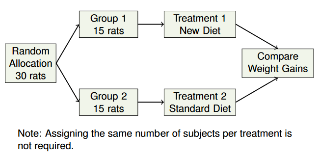

# STAT 121 Lesson 6 - Design of Experiments
## Valid Experiment Designs
* Randomized Controlled Experiment (RCE)
	* Subjects randomly assigned to treatments
* Randomized Block Design (RBD)
	* A special case of RBD is a **matched pairs** design.

### Randomized Controlled Experiment (RCE)
#### Definition
Subjects assigned to treatments such that each subject has an equal chance of being assigned to any possible treatment (typically with the same number of subjects per treatment).

**Recipe**:
* put all names into a hat
* stir well
* draw out desired number of names for treatment A, then B, etc.

E.g. diagram:

**Note**: In practice, statisticians often use programs like **R**, and **SAS** to generate random numbers (they won't draw names from a hat).

**WHEN TO USE**: Use when individuals are similar.

---

remember the experimental design principles:
1. comparison
2. randomization
3. replication
4. (double-blinding)

**BENEFITS OF INCORPORATING THESE PRINCIPLES**:
* Bias is reduced and unwanted confounding is eliminated.
* Laws of probability can be applied to assess whether
treatment effects are larger than expected due to chance
variation.
* 
A well-designed experiment provides evidence of a <b>cause and effect</b> relationship.

---

### Randomized Block Design (RBD)
#### Definition
* What is a block?
	* A group of Individuals that are:
		* Similar with respect to some characteristic known before the experiment begins, and which characteristic is expected to affect the response to the treatments.
		* Ideally equal in number to the number of treatments.
* What is a RBD?
	* An experimental design where the random assignment of individuals to treatments is carried out separately within each block.
* Blocks **control** the effects of the variables that define them.

A general guide is:
1. classify subjects into blocks based on lurking variable(s)
2. randomly assign subjects to treatments separately within each block

**WHEN TO USE**: When the individuals are similar within a block but very different from block to block.

#### Advantages
* RBD makes designs more powerful by perfectly equalizing effects of certain **lurking variables**.
* Removes confounding of lurking variables with response variable
* Reduces chance of variation by removing variation associated with the lurking (blocking) variable
* Yields more precise estimates of chance variation which makes detection of statistical significance easier.

### Matched Pairs (A subset of RBD)
#### Definition
* Special case of RBD
* The block in this kind of experiment is always a pair of individuals or a pair of measurements.
* Explanatory variable: two treatments.
* Examples:
	* twins, each receiving a different treatment
	* two treatments on each individual
	* measurements before and after each treatment on each individual

With regard to the design principles:
1. Randomly assign the two treatments to the two individuals within each pair (block) OR **randomize** the order of applying the treatments to each individual.
2. **Replication** equals the number of pairs
3. **Compare** the two treatments. Each pair serves as its own control

Here's a guide on how to randomize given a certain block:
| Blocks (pairs) | Randomization |
|----------------|---------------|
| Two matched individuals | Randomly assign treatments to individuals within pair |
| One individual,  2 treatments | Randomly assign order or treatments |
| One individual,  pre & post measurements | Randomly select individuals |

### Observational Studies (NOT EXPERIMENTS)
#### Characteristics:
* Comparison: variables of interest are compared among different groups or populations
* No random assignment to treatments; however, random sampling from population is important
* Replications: enough participants per group to measure chance variation

#### Consequences
* These are only *potential* consequences, and stem from a lack of randomization. Bias and confounding of explanatory variable with lurking variables
* Cannot correctly apply the laws of probability to assess whether treament effects are larger than expected due to chance variation
* Cannot conclude cause and effect relationship between the explanatory variable and the response variable

## Experiments vs Observational Studies
|                                | Well-Designed Experiment | Observational Study |
|--------------------------------|--------------------------|---------------------|
| **Control or Comparison**      | Yes                      | Usually             |
| **Control or Comparison**      | Yes                      | No                  |
| **Control or Comparison**      | Yes                      | Yes                 |
| **Establish cause and effect** | Yes                      | No                  |
