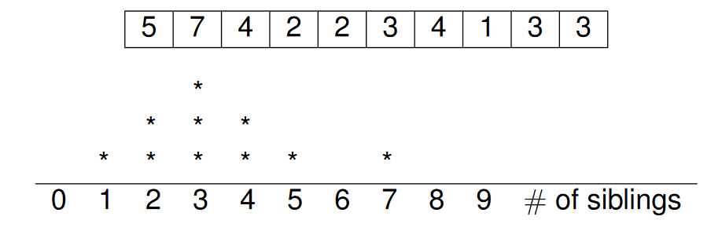

# STAT 121 Lesson 7 - Examining Distributions of quantitative variables with graphs
## Analysis of Distribution for Quantitative data
1. Always plot your data first.
2. Look for an overall pattern and for striking deviations such
as outliers.
3. Look at the shape, center, and spread of the distribution.
4. Add numerical summaries to supplement the graph.
5. If the overall pattern is regular, use a mathematical model
(e.g., Normal distribution) to describe the data

## Visual Display of Data
In order to more easily interpret data, we want to represent numerical quantities with visual elements (length, area, position, darkness, etc.). The representation's visual aspect should utilize **proportionality** and *minimal mental processing* for the viewer.

### Display for Quantitative Variables
4 main tools:
* Histogram
	1. construct horizontal line with consistent scale such that
	range ≥range of data
	2. divide range into classes of equal width
	3. count number of individuals in each class
	4. construct bar over each class such that height proportional
	to number/percent in class
	* unanswered question: how many classes?
		* subjective choice
		* more data allows more classes
		* too many classes = histogram too noisy
		* too few classes = histogram too smooth
		* trial and error
		* usually 10-15 classes
* Stem plot
	1. separate measurements into stem and leaf
		* stem = all but final digit
		* leaf = final digit
	2. write stems in vertical column
	3. write each leaf to right of stem
	* Can split stems in two or more ways
		* e.g., split stems to double number of stems (each stem
		appears twice)
		* leaves 0-4 with upper stem
		* leaves 5-9 with lower stem
	* Can *round value* to set leaf

* Dot plot
	* For small data sets, we can transform data into dots on the real number line. Each dot represents a data point or response; repeated points are stacked. Make sure the dots have equal sizes and are evenly spaced. For example, a random sample of 10 Stat 121 students were asked how many siblings they had and their responses are as follows. (Note: There are 10 points, one for each of the responses.)

* Boxplot (not in this lesson)

## Interpreting Visual Displays
* shape

* center

* spread

* modes (Lesson 8)
* outliers (Lesson 8)

## Lesson Slide Notes
