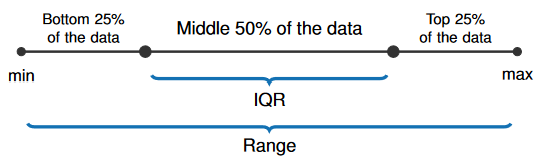
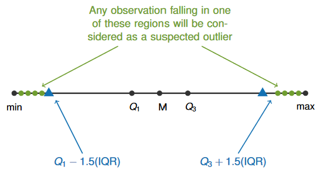

# STAT 121 Lesson 8 - Numerical Measures of Distribution Part 1

## Numerical Summary
The distribution of a quantitative variable can be measured with:
### Shape
* Went over in Lesson 7
### Center
1. Mode
	* value corresponding to a peak
	* in simple data sets, the value with the highest frequency
2. Median
	* "Middle value" of ordered data
		* if the number of data is odd, it's a middle value, otherwise you take the mean of the two middle values
	* Denoted by $M$
	* Value such that it splits the distribution directly in half
3. Mean
	* traditional measure of center
	* arithmetic average
	* sum of values / num of values
	* center of gravity of distribution

$$\bar{x}=\frac{1}{n}\sum^n_{i=0}{x_i}$$

##### Mean vs Median
* *consumer alert*: media considers either one the "average"
* Approximately equal if histogram is approximately symmetric
* Median "resistant" to outliers and long tails
* Mean has desirable properties for inference
* General Guide:
	* first construct a visual representation of data
	* evaluate skewness and outliers
	* use *median* if skewed or outliers are present
	* use *mean* if roughly symmetric
	* This is because an outlier will affect a mean much more than a median.
$$
\begin{aligned}
\text{Symmetric distributions: }& \bar{x}=M\\
\text{Left-skewed distributions: }& \bar{x}<M\\
\text{Right-skewed distributions: }&\bar{x}>M
\end{aligned}
$$

### Spread
Main measures of spread:
1. Range
	* $\text{maximum$-$minimum}$
	* only measures **overall** sprad.
	* highly **affected** by outliers
2. Interquartile range ($IQR$)
	* $Q_3-Q_1$
	* range occupied by the middle $50\%$ of data
	* compare to overall range to determine the extent to which data is clustered.
	* highly **resistant** to outliers.

3. standard deviation
	* "average distance" of values from mean
	* will be discussed further in future lessons

### Quartiles
The following three quartile marks/positions divide the data distribution into **4 parts**. The three *quartile positions* are:
1. $Q_1$. First $25\%$ of values, bottom $75\%$ of values.
	* Median of the bottom $50\%$ of data.
2. $Q_2$. First and bottom $50\%$ of values.
	* **Median value**.
3. $Q_3$. First $75\%$ of values, bottom $25\%$ of values.
	* Median of the top $50\%$ of data.

When calculating $Q_1$ and $Q_3$, **do *not*** include the median in the top/bottom half of data if $n$ is odd.

### Finding outliers:

i.e. any value $v$ falling outside the range
$$
(v<Q_1-1.5*IQR) \quad{}\text{or}\quad{} (v>Q_3+1.5*IQR)
$$

## Learning outcomes:
* Describe measures of center of a distribution: mode, median and mean
* Calculate the mode, median and mean of a data set
* From the plot of a given data set, determine an appropriate measure of center
* Describe the effect of outliers on the mean and median
* Describe the two aspects of spread: overall spread and degree of clustering
* Calculate the range, quartiles and interquartile range of a data set
* Use the IQR rule for detecting outliers
* Describe the different reasons for possible outliers and how to deal with them
