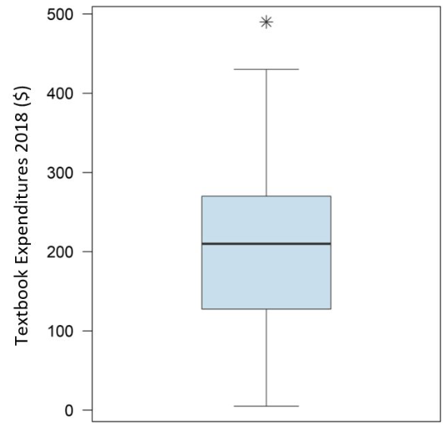

# STAT 121 Lesson 9 - Numerical Measures of Distribution Part 2

## 5 Number Summary
1. $\text{minimum}$
2. $Q_1$ (1st quarter)
3. $Q_2$ (2nd quarter, $\text{median}$)
4. $Q_3$ (3rd quarter)
5. $\text{maximum}$

## Boxplot
<u>Purpose:</u>
* High density of data between $Q_1$ and $Q_3$
* Low density between $\text{min}$ and $Q_1$
* Low density between $Q_3$ and $\text{max}$
* represent density by thickness of box
	* for simplicity, 2 densities/thicknesses
* **MAJOR ADVANTAGE**:
	* Easy comparison of several distributions using side-by-side boxplots

<u>Instructions:</u>
1. central box spans interquartile range
2. line in box marks median
3. right whisker extends from box to largest *non-flagged* value
4. left whisker extends from box to smallest *non-flagged* value
5. **flagged** value represented by asterisks
	* i.e. an anomaly
6. boxplot can be horizontal or vertical

e.g.

## Measures of Spread (cont.)
### Standard Deviation
#### OVERVIEW
Standard deviation is a single measure that responds to **both** aspects of spread:
* overall spread
* clustering

Quantifies the spread of a distribution by measuring how far the observations are from their mean $\bar{x}$.

<u>Instructions:</u>
$$
\begin{aligned}
\text{Standard Deviation} =\sigma &= \sqrt{ \frac{ \sum^n_{i=0}( x_i - \bar{x})^2 }{ n-1 } }\\
\text{Variance} = \sigma^2 &= \frac{ \sum( x_i - \bar{x})^2 }{ n-1 }
\end{aligned}
$$
1. compute mean
2. compute deviation from mean for all values
3. square deviations
4. sum squared deviations
5. average squared deviations (divide $\text{sum}$ by $n-1$)
6. take square root of average squared deviation

## Learning Outcomes
* Obtain the 5-number summary of a given data set
* Construct a boxplot for a given data set
* Determine shape of associated histogram for a given boxplot
* Interpret side-by-side boxplots by comparing shape, center and spread
* Explain what the standard deviation measures
* State the properties of the standard deviation
