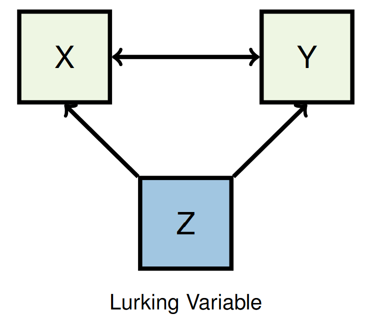

|Term|Definition|
|----|----------|
|Population|The entire group of individuals that is the target of our interest.|
|Individual|An entity that is observed. E.g. a student, person, rat, classroom, etc...|
|Variable|Characteristic that is measured on each individual.|
|Quantitative Variable|Variable whose possible values are meaningful numbers.|
|Categorical Variable|Variable whose possible values are non-Quantitative categories.|
|Measurement|Value of a variable for an individual.|
|Data|Measurements for a set of individuals. Data are numbers with a context. i.e. who? What? Why?|
|Data Set|Data identified with contextual information.|
|Parameter|numerical fact about the variable in the population.|
|Statistic|corresponding numerical fact in the sample.|
|Bias|A sample that produces data that is not representative because of the systematic under- or over-estimation of the values of the variable of interest is called **biased**|

# For Experiments
| Term | Definition |
|------|------------|
| Subject | individual to which treatment is applied |
| Factor | planned explanatory variable |
| Treatment | the condition or conditions applied to a subject or individual in an experiment |
| Response variable | characteristic measured on each subject; outcome of interest |
|Lurking variables| variables that affect both explanatory and response variables but no measures are included in planned factors.  |
|Control| An effort to reduce the effects of lurking variables. |
|Confounding| situation in which effects of lurking variables cannot be distinguished from effects of factors |
